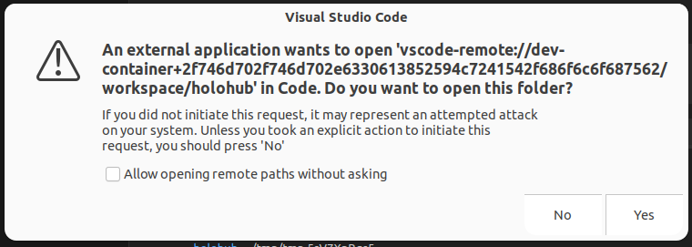
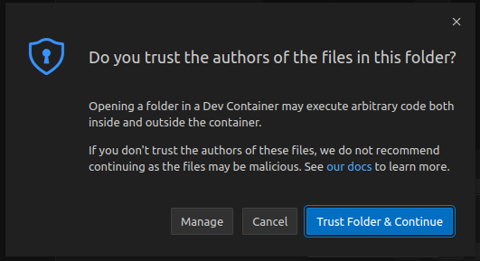
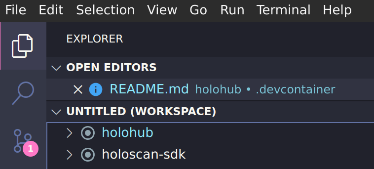

# Holohub Dev Containers

Holohub uses [Development Containers](https://containers.dev/) to provide consistent and convenient development environments for [Holoscan](https://developer.nvidia.com/holoscan-sdk) and [Holohub](https://github.com/nvidia-holoscan/holohub). This guide covers using the Holohub Dev Container with [Visual Studio Code](https://code.visualstudio.com/).

> 💡 Note: This guide is specific to the Linux development environment and is tested on Ubuntu 22.04 LTS.

> 💡 Note: This Dev Container does not support [Github Codespaces](https://github.com/features/codespaces) and does not support the *Open Folder in Dev Container* feature from VS Code. Please use the following guide to start the Holohub Dev Container.

## Prerequisites

- [NVIDIA CUDA Toolkit](https://developer.nvidia.com/cuda-downloads)
- [Docker](https://docs.docker.com/engine/install/)
- [NVIDIA Container Toolkit](https://docs.nvidia.com/datacenter/cloud-native/container-toolkit/latest/install-guide.html)
- [VS Code](https://code.visualstudio.com/) with the [Dev Container Extension Pack](https://marketplace.visualstudio.com/items?itemName=ms-vscode-remote.remote-containers)
  - Install [Dev Container Extension Pack](https://marketplace.visualstudio.com/items?itemName=ms-vscode-remote.remote-containers) via the command line
 ```bash
 code --install-extension ms-vscode-remote.remote-containers
 ```

### Steps

1. Clone the Repository
   ```bash
   git clone git@github.com:nvidia-holoscan/holohub.git
   ```
2. Open the cloned directory in the terminal.

3. Launch a Dev Container with the `./dev_container` script as follows:

   ```bash
   ./dev_container vscode
   ```

   The above command starts a new Dev Container for Holohub using the default [Dockerfile](../Dockerfile).


4. VS Code will build and initialize the selected Dev Container. This can take a few minutes for the first time.

5. Once initialized, a new VS Code window will open with the following prompts. Click **Yes** and **Trust Folder & Continue** to continue the Dev Container build process.

    

6. When ready, the Holohub directory is mirrored into the container under `/workspace/holohub` to preserve any changes.

> 💡 Note: VS Code creates a new container image for each Dev Container instance. To clean up the container images, run the following command in the terminal:
> ```bash
> docker images --format '{{.Repository}}:{{.Tag}}' | grep '^vsc-holohub' | xargs -r docker rmi
> ```


### Debugging Holohub Applications

Most Holohub applications are pre-configured with one or more launch profiles. Click the **Run & Debug** tab and select the application you want to run/debug from the dropdown.

> 💡 Note: Some applications requires special instructions for debugging. Please refer to the [Application-Specific Dockerfile](#application-specific-dockerfile) for more information.

#### Debugging Multi-Fragment Applications

To debug multi-fragment applications, find and locate launch profiles prefixed with `(compound)`.

For example, the [Distributed Endoscopy Tool Tracking](../applications/distributed/ucx/ucx_endoscopy_tool_tracking/) application is configured with `(compound) ucx_endoscopy_tool_tracking/cpp` and `(compound) ucx_endoscopy_tool_tracking/python` launch profiles.

Each of these compound launch profiles links to three pre-configured launch profiles, one for each fragment (`video_in`, `inference`, and `viz`):

- `(compound) ucx_endoscopy_tool_tracking/cpp`
  - `(gdb) ucx_endoscopy_tool_tracking/cpp - video_in fragment`
  - `(gdb) ucx_endoscopy_tool_tracking/cpp - inference fragment`
  - `(gdb) ucx_endoscopy_tool_tracking/cpp - viz fragment`
- `(compound) ucx_endoscopy_tool_tracking/python`
  - `(gdb) ucx_endoscopy_tool_tracking/python - video_in fragment`
  - `(gdb) ucx_endoscopy_tool_tracking/python - inference fragment`
  - `(gdb) ucx_endoscopy_tool_tracking/python - viz fragment`

When you start debugging with one of these compound launch profiles, VS Code starts three terminals to build the application, one terminal per fragment. After each terminal completes the build process, VS Code launches another terminal to start the fragment. This compound task feature lets us launch and debug all three fragments simultaneously.

> 💡 Tip: If VS Code does not launch all three debugger terminals, close all terminals first, then start the compound launch profile again. If the problem persists, try adjusting the start-up delays in the [tasks.json](../.vscode/tasks.json) file. Refer to the [troubleshooting](#troubleshooting) section for more information.


> 💡 Note: Launch profiles prefixed with `(compound)` for Python applications default to `debugpy` debugger, which only allows debugging of Python code. To debug both Python and C++ code, modify the  compound launch profile in the [launch.json](../.vscode/launch.json) and change `(debugpy)` to `(pythoncpp)`.


#### Step into Holoscan Source Code

The Holohub Dev Container derives from the [Holoscan NGC Container](https://catalog.ngc.nvidia.com/orgs/nvidia/teams/clara-holoscan/containers/holoscan), which supports debugging of Holoscan source code in C++ and Python. To simplify the process, add the Holoscan source code to the workspace by clicking the **Add Folder to Workspace** menu item from the **File** menu.. Enter `/workspace/holoscan-sdk/` in the **Add Folder to Workspace** dialog box. If VS Code prompts you to reload the window, please do so. Expect to see both the *holohub* and *holoscan-sdk* folders appear under the Explorer tab.



**Let's give it a try:**

Expand the **holoscan-sdk** folder and open `application.cpp` file from `src/core/` directory.
Please scroll down to find the `void Application::run()` function and set a breakpoint inside the function.

With any launch profile prefixed with `gdb` or `pythoncpp`, hit F5 to start a new debugging session. Expect the debugger to hit the breakpoint in the `Application::run()` function.

> 💡 Important: [Holoscan NGC Container](https://catalog.ngc.nvidia.com/orgs/nvidia/teams/clara-holoscan/containers/holoscan) version 2.3.0 or later version is required to enable debugging of Holoscan source code.

> ⚠️ Warning: Build error may occur when switching between building inside and outside the Dev Container. When this happens, execute the following command to clear the build cache:
>
> ```bash
> ./run clear_cache
> ```

> ⚠️ Warning: Build error may occur if an application provides its own Dockerfile with additional dependencies. In this case, refer to the [Application-Specific Dockerfile](#application-specific-dockerfile) section to launch a new Dev Container session with the appropriate Docker image.

### Holoscan Flow Benchmarking

[Holoscan Flow Benchmarking](./../benchmarks/holoscan_flow_benchmarking/README.md) is a tool to evaluate the performance of an Holoscan application. The VSCode setup provides a task to automatically build, run and analyze an application. From the menu, select **View->Command Palette...->Tasks: Run Task** and then the **Holoscan Flow Benchmarking** task. There will be a prompt asking for the application name. Enter the name, for example **multiai_ultrasound** and press return.

The application executable will now be patched, compiled, executed, the results will be anaalyzed and displayed in the terminal.

## Advanced Options

### Application-Specific Dockerfile

For Holohub applications that bundle with a Dockerfile with additional dependencies and tools, pass the application's name to the `./dev_container` script.

**Usage:**

```bash
./dev_container vscode <application_name> [--language [cpp|python]]
```

Take the [endoscopy_depth_estimation](../applications/endoscopy_depth_estimation) application as an example. The command will launch a Dev Container using [applications/endoscopy_depth_estimation/Dockerfile](../applications/endoscopy_depth_estimation/Dockerfile) as the base image that builds `OpenCV`:

```bash
./dev_container vscode endoscopy_depth_estimation
```

The `language` argument is optional with `cpp` as default. This argument allows you to use a language-specific Dockerfile when available.


### Custom Base Image/Dockerfile

The `./dev_container vscode` script can launch a Dev Container using a custom base image and/or Dockerfile.

**Usage:**

```bash
./dev_container vscode --base_img <image>
```

For example, if an application is designed for Holoscan 1.0 on NVIDIA IGX Orin with integrated GPU, you may want to use Holsocan 1.0.3 as the base image with iGPU support:

```bash
./devcontainer vscode --base_img nvcr.io/nvidia/clara-holoscan/holoscan:v1.0.3-igpu
```

In addition, if you have a custom Dockerfile that you would like to use on top of the base image, you may pass it to the `./dev_container` script as follows:


```bash
./devcontainer vscode --base_img nvcr.io/nvidia/clara-holoscan/holoscan:v1.0.3-igpu --docker_file /path/to/my/Dockerfile
```

Refer to the [Add a Custom Dockerfile](#add-a-custom-dev-container) section if you have your own Dockerfile.

```Dockerfile
ARG BASE_IMAGE

FROM ${BASE_IMAGE} AS base
```

### Additional Options

Use the `-h` or `--help` option to see all available options for the `./dev_container` script:

```bash
$ ./dev_container vscode -h

Launch VSCode in DevContainer

Launch a VSCode instance in a Docker container with the development environment.
    Usage: ./dev_container vscode <application_name> [options]

Options:
  application_name: Name of an existing Holohub application found in the applications folder.
      If specified and exists: the application-provided DevContainer configuration is used.
      Otherwise, the top-level DevContainer configuration.
  --base_img: Fully qualified base image name, e.g. holoscan-sdk-dev:latest
  --docker_file: Path to Dockerfile to use for building container.
      Defaults to:
      - Application-provided "Dockerfile", if it exists;
      - Otherwise the top-level HoloHub "Dockerfile"
  --language : Specify the app language implementation to run.
      Some applications provide both `cpp` and `python` implementations.
  --docker_opts : Additional options to pass to the Docker launch
```

## Contributing

> 💡 Note: See [CONTRIBUTING.md](../CONTRIBUTING.md) for details on how to contribute to Holohub. This section describes adding a custom Dockerfile and Dev Container for a Holohub application.

### Add a Custom Dockerfile

The following steps allow the `./devcontainer vscode` script to find your custom `Dockerfile`:

- Create a new `Dockerfile` in your application's root directory or a language-specific directory:

```bash
applications/my_application/
├── Dockerfile   # option 1: put the Dockefile in the root of the application's directory
├── cpp
│   └── Dockerfile # option 2: put the Dockerfile in a language-specific directory
└── python
    └── Dockerfile # option 2: same as above
```
- Include the following at the top of your custom `Dockerfile`:

```Dockerfile
ARG BASE_IMAGE
FROM ${BASE_IMAGE} as base
```

### Add a Custom Dev Container

Using the following steps enables the `./devcontainer vscode` script to find your custom Dev Container:

- Create a new directory in the `.devcontainer/` directory (same directory as this README file) with a name that matches the name of your application.
- Create `devcontainer.json` and `Dockerfile` in the new directory:

```bash
.devcontainer/
│   └── my_application/
│       ├── devcontainer.json
│       └── Dockerfile
└── applications/
    └── my_application/

```

## Troubleshooting

### Compound Launch Profile Issues

A compound launch profile may not launch all the linked launch profiles. For an example, look at the `(compound) ucx_endoscopy_tool_tracking/python` launch profile.

This profile links to three launch profiles, one for each fragment: `inference`, `inference`, and `viz`.

1. `(debugpy) ucx_endoscopy_tool_tracking/python - video_in fragment`
2. `(debugpy) ucx_endoscopy_tool_tracking/python - inference fragment`
3. `(debugpy) ucx_endoscopy_tool_tracking/python - viz fragment`

The second launch profile, the `inference` fragment, has `preLaunchTask` configured with the `Build ucx_endoscopy_tool_tracking (delay 3s)` task, which can be found in the [tasks.json](../.vscode/tasks.json) file. This task depends on another task called `Delay Task (3s)` with a bash command `sleep 3` via the `dependsOn` property. This delay task allows the `Build ucx_endoscopy_tool_tracking (delay 3s)` task to put a delay before building the application and enable VS Code to start a terminal session properly. Similarly, the `viz` fragment has a delay of 5 seconds configured. These default values may not work in all scenarios; adjust the sleep value to match your needs.

### Build Errors

When switching between Dev Container and other build environments, the build may fail with the following error:

```bash
CMake Error: The current CMakeCache.txt directory /workspace/holohub/build/ucx_endoscopy_tool_tracking/CMakeCache.txt is different than the directory /home/host/github/holohub/build/ucx_endoscopy_tool_tracking where CMakeCache.txt was created.
```

When this error occurs, run the clear cache command in the terminal or from VS Code Command Palette:

Terminal: `./run clear_cache`
VS Code Command Pallette (`CTRL+SHIFT+P`): `Tasks: Run Task` -> `Clear Build Cache`.


## Resources

- [Developing inside a Container](https://code.visualstudio.com/docs/devcontainers/containers)
- [containers.dev](https://containers.dev/)
- [NVIDIA Holoscan Containers](https://catalog.ngc.nvidia.com/orgs/nvidia/teams/clara-holoscan/containers/holoscan)
- [Debugging in Visual Studio Code](https://code.visualstudio.com/docs/editor/debugging)
