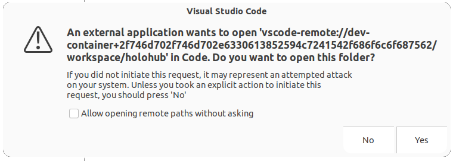

# Holohub Dev Containers

Holohub uses [Development Containers](https://containers.dev/) to provide consistent and convenient development environments for Holoscan & Holohub. This guide covers the usage of Holohub Dev Container using [Visual Studio Code](https://code.visualstudio.com/).

> 💡 Note: This guide is specific to the Linux development environment and is tested on Ubuntu 22.04 LTS.

> 💡 Note: This Dev Container does not support [Github Codespaces](https://github.com/features/codespaces) and does not support the *Open Folder in Dev Container* feature from VS Code. Please use the following guide to start Holohub Dev Container.

## Prerequisites

- [NVIDIA CUDA Toolkit](https://developer.nvidia.com/cuda-downloads)
- [Docker](https://docs.docker.com/engine/install/)
- [NVIDIA Container Toolkit](https://docs.nvidia.com/datacenter/cloud-native/container-toolkit/latest/install-guide.html)
- [VS Code](https://code.visualstudio.com/) with the [Dev Container Extension Pack](https://marketplace.visualstudio.com/items?itemName=ms-vscode-remote.remote-containers)
  - Install [Dev Container Extension Pack](https://marketplace.visualstudio.com/items?itemName=ms-vscode-remote.remote-containers) via the command line
 ```bash
 code --install-extension ms-vscode-remote.remote-containers
 ```

### Steps

1. Clone the Repository
 ```bash
 git clone git@github.com:nvidia-holoscan/holohub.git
 ```
2. Open the cloned directory in the terminal.

3. Launch a Dev Container with the `./dev_container` script as follows:

 ```bash
 ./dev_container vscode
 ```
 The above command starts a new Dev Container for Holohub using the default [Dockerfile](../Dockerfile).


4. VS Code will build and initialize the selected Dev Container. This can take a few minutes the first time.

5. Once initialized, a new VS Code window will open with the following prompts. Click **Yes** and **Trust Folder & Continue** to continue the Dev Container build process.




6. When ready, the Holohub directory is mirrored into the container under `/workspace/holohub` to preserve any changes.


### Debugging Holohub Applications

Most Holohub applications are pre-configured with one or more launch profiles. Click the **Run & Debug** tab and select the application you want to run/debug from the dropdown.

#### Debugging Multi-Fragment Applications

To debug multi-fragment applications, find and locate launch profiles prefixed with `(compound)`.

For example, the [Distributed Endoscopy Tool Tracking](../applications/endoscopy_tool_tracking_distributed/) application is configured with `(compound) endoscopy_tool_tracking_distributed/cpp` and `(compound) endoscopy_tool_tracking_distributed/python` launch profiles.
These launch profiles start three debugging sessions, one for each fragment (`video_in`, `inference`, and `viz`), and enable debugging of all three processes at once.

> 💡 Note: Launch profiles prefixed with `(compound)` for Python applications default to `debugpy` debgguer which only allows debugging of Python code.  To debug both Python and C++ code, modify the  compound launch profile in the [launch.json](../.vscode/launch.json) and change `(debugpy)` to `(pythoncpp)`.


#### Step into Holoscan Source Code

The Holohub Dev Container derives from the [Holoscan NGC Container](https://catalog.ngc.nvidia.com/orgs/nvidia/teams/clara-holoscan/containers/holoscan), which supports debugging of Holoscan source code in C++ and Python. Add the Holoscan source code to the workspace to simplify the process by clicking the **Add Folder to Workspace** menu item from the **File** menu. Enter `/workspace/holoscan-sdk/` in the **Add Folder to Workspace** dialog box. If VS Code prompts you to reload the window, please do so. Expect to see both the *holohub* and *holoscan-sdk* folders appear under the Explorer tab.


**Let's give it a try:**

Expand the **holoscan-sdk** folder and open `application.cpp` file from `src/core/` directory.
Scroll down to find the `void Application::run()` function, and set a breakpoint inside the function.

With any launch profile prefixed with `gdb` or `pythoncpp`, hit F5 to start a new debugging session. Expect the debugger to hit the breakpoint in the `Application::run()` function.

> 💡 Important: [Holoscan NGC Container](https://catalog.ngc.nvidia.com/orgs/nvidia/teams/clara-holoscan/containers/holoscan) version 2.3.0 or later version is required to enable debugging of Holoscan source code.

> ⚠️ Warning: Build error may occur when switching between building inside and outside the Dev Container. When this happens, execute the following command to clear the build cache:
>
> ```bash
> ./run clear_cache
> ```

> ⚠️ Warning: Build error may occur if an application provides its own Dockerfile with additional dependencies. In this case, refer to the [Application-Specific Dockerfile](#application-specific-dockerfile) section to launch a new Dev Container session with the appropriate Docker image.

## Advanced Options

### Application-Specific Dockerfile

For Holohub applications that bundle with a Dockerfile with additional dependencies and tools, pass the application's name to the `./dev_container` script.
Take the [endoscopy_depth_estimation](../applications/endoscopy_depth_estimation) application as an example, the command will launch a Dev Container using [applications/endoscopy_depth_estimation/Dockerfile](../applications/endoscopy_depth_estimation/Dockerfile) as the base image that builds `OpenCV`:

```bash
./dev_container vscode endoscopy_depth_estimation
```

**Usage:**

```bash
./dev_container vscode <application_name> [--language [cpp|python]]
```

The `languge` argument is optional with `cpp` as default. This argument allows you to use a language-specific Dockerfile when available.


### Custom Base Image/Dockerfile

The `./dev_container vscode` script can launch a Dev Container using a custom base image and/or Dockerfile.

For example, if an application is designed for Holoscan 1.0 on NVIDIA IGX Orin with integrated GPU, you may want to use Holsocan 1.0.3 as the base image with iGPU support:

```bash
./devcontainer vscode --base_img nvcr.io/nvidia/clara-holoscan/holoscan:v1.0.3-igpu
```

**Usage:**

```bash
./dev_container vscode --base_img <image>
```

In addition, if you have a custom Dockerfile that you would like to use on top of the base image, you may pass it to the `./dev_container` script as follows:


```bash
./devcontainer vscode --base_img nvcr.io/nvidia/clara-holoscan/holoscan:v1.0.3-igpu --docker_file /path/to/my/Dockerfile
```

To use a custom Dockerfile, include the following lines at the top of your Dockerfile:

```Dockerfile
ARG BASE_IMAGE

FROM ${BASE_IMAGE} AS base
```

### Additional Options:

```bash
$ ./dev_container vscode -h

Launch VSCode in DevContainer

Launch a VSCode instance in a Docker container with the development environment.
    Usage: ./dev_container vscode <application_name> [options]

Options:
  application_name: Name of an existing Holohub application found in the applications folder.
      If specified and exists: the application-provided DevContainer configuration is used.
      Otherwise, the top-level DevContainer configuration.
  --base_img: Fully qualified base image name, e.g. holoscan-sdk-dev:latest
  --docker_file: Path to Dockerfile to use for building container.
      Defaults to:
      - Application-provided "Dockerfile", if it exists;
      - Otherwise the top-level HoloHub "Dockerfile"
  --language : Specify the app language implementation to run.
      Some applications provide both `cpp` and `python` implementations.
  --docker_opts : Additional options to pass to the Docker launch
```

## Contributing

> 💡 Note: See [CONTRIBUTING.md](../CONTRIBUTING.md) for details on how to contribute to Holohub. This section describes how to add a custom Dockerfile and Dev Container for a Holohub application.

### Add a Custom Dockerfile

The following steps allows the `./devcontainer vscode` script to find your custom `Dockerfile`:

- Create a new `Dockerfile` in your application's root directory or a language specific directory:

```bash
applications/my_application/
├── Dockerfile   # option 1: put the Dockefile in the root of the application's directory
├── cpp
│   └── Dockerfile # option 2: put the Dockerfile in a language specific directory
└── python
    └── Dockerfile # option 2: same as above
```
- Include the following in the top of your custom `Dockerfile`:

```Dockerfile
ARG BASE_IMAGE
FROM ${BASE_IMAGE} as base
```

### Add a Custom Dev Container

Using the following steps enables the `./devcontainer vscode` script to find your custom Dev Container:

- Create a new directory in the `.devcontainer/` directory (same directory as this README.md file) with a name that matches the name of your application.
- Create `devcontainer.json` and `Dockerfile` in the new directory:

```bash
.devcontainer/
│   └── my_application/
│       ├── devcontainer.json
│       └── Dockerfile
└── applications/
    └── my_application/

```

## Resources

- [Developing inside a Container](https://code.visualstudio.com/docs/devcontainers/containers)
- [containers.dev](https://containers.dev/)
- [NVIDIA Holoscan Containers](https://catalog.ngc.nvidia.com/orgs/nvidia/teams/clara-holoscan/containers/holoscan)