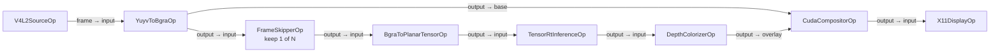
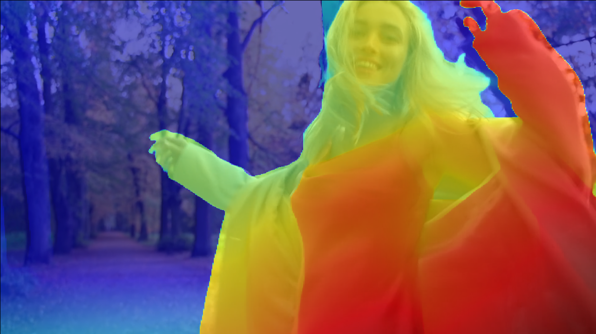

# Holoscan 5.0 EA Samples

Applications and reusable operators written against the native Holoscan SDK 5.x API.

| Application | Purpose |
| --- | --- |
| `v4l2_depth` | Live YUYV camera capture with CUDA preprocessing, Depth Anything V2 TensorRT inference, a latched depth overlay, and X11 output |

The applications are C++-only because the SDK 5.0 early-access Python bindings do not yet expose
the APIs used here.

## V4L2 depth

`v4l2_depth` sends every converted frame to the base-video path and decimates only the expensive
inference branch. Latest-value queues keep both branches bounded and may discard stale frames under
backpressure instead of delaying the display. The CUDA compositor latches the latest overlay, so a
new depth map is reused until the next one is ready.



The diagram names the ports at both ends of every connection. The camera-to-converter connection
uses a blocking queue of depth two; every other connection keeps only the latest value in a
depth-one queue. An overlay-only compositor activation refreshes the latch without emitting. A base
activation emits immediately, using a transparent overlay before the first depth result and the
latest latched overlay thereafter.



The image above was captured from the documented V4L2 loopback path on an NVIDIA GB10, including
the application's CUDA conversion, TensorRT inference, compositor, device-to-host copy, and X11
rendering.

All intermediate payloads are native SDK 5.x `Tensor` values in plan-owned CUDA device pools.
Transfers are explicit: the V4L2 source performs the required H2D copy and the X11 sink performs
the only steady-state D2H copy. There are no GXF entities, private pipeline types, or automatic
host/device bridges.

The inference-mode CMake builds download a pinned, SHA-256-verified Apache-2.0 Depth Anything V2
Small checkpoint and export it as a static `[1,3,518,518]` ONNX model under
`data/v4l2_depth/models`; model artifacts are not stored in the container image. On the first
inference launch, `TensorRtInferenceOp` builds a TensorRT engine for the current GPU and caches it
under `data/v4l2_depth`; later launches reuse that engine.
The companion `.model-id` file fingerprints both the ONNX descriptor and its `.onnx.data` weights;
a missing or stale identity causes the engine to be rebuilt instead of silently reusing a cache
created from different model contents.
Supplying a custom `--model` disables the application's default cache; supply a matching
`--engine-cache` explicitly only for a self-contained model or one using the same sibling
`<model>.data` convention.
Serialized TensorRT plans are deliberately not committed because they are specific to the target
TensorRT version and GPU.

### Runtime requirements

- A Holoscan SDK 5.0.0 installation and matching development image
- Docker with the NVIDIA Container Runtime
- An NVIDIA CUDA GPU supported by that SDK and TensorRT
- A single-plane streaming V4L2 camera that provides exact-resolution, progressive, limited-range
  BT.601-compatible YUYV for `live`, or `/dev/video42` configured with `v4l2loopback` for `loopback`
- An accessible X11 display for visualization; without one, the display operator drains frames
  without rendering
- Network access during the first `live` or `loopback` container build to fetch and export the
  model

Defaults are `/dev/video0`, `640x480` at 30 FPS, inference on every second frame, and CUDA device
zero.

## Build the SDK

Run the build from the Holoscan SDK checkout root, which contains the `run` script:

```bash
cd /path/to/holoscan-sdk
./run build \
    --build-python false \
    --build-benchmarks false \
    --config "-DHOLOSCAN_BUILD_TESTS=OFF -DHOLOSCAN_BUILD_EXAMPLES=OFF -DHOLOSCAN_DOWNLOAD_DATASETS=OFF"
```

This produces `install-$(uname -m)` under the SDK checkout root. The installation must
contain `lib/cmake/holoscan/holoscan-config.cmake`.

## Run

When the SDK and samples repositories are sibling checkouts, the wrapper auto-discovers
`../holoscan-sdk/install-$(uname -m)`. Otherwise, set the installation once:

```bash
export HOLOSCAN_SDK_INSTALL_DIR=/path/to/holoscan-sdk/install-$(uname -m)
```

The default mode builds the application and validates the complete graph without opening a camera,
model, or display:

```bash
./holohub run v4l2_depth
```

Its validation container omits model acquisition, so a cold default build does not fetch the model
repository or weights. The metadata therefore sets `V4L2_DEPTH_PREPARE_MODEL=OFF` for `validate`
and `ON` for `live` and `loopback`; model preparation is required for inference and its
output-based CMake rule skips the export when all expected artifacts already exist.

This is equivalent to selecting the validation mode explicitly:

```bash
./holohub run v4l2_depth validate
```

Select `live` on a host with the required camera and X11 display:

```bash
./holohub run v4l2_depth live
```

The wrapper builds the application-specific container, compiles the selected C++ target, mounts
available `/dev/video*` devices and the display, and runs the selected metadata command. Press `q`,
Escape, or Ctrl-C to stop a live run.

Override capture settings or the CUDA device with `--run-args`:

```bash
./holohub run v4l2_depth live \
    --run-args="--device /dev/video2 --width 640 --height 480 --fps 30 --skip 3 --cuda-device 0"
```

Run `./holohub run v4l2_depth live --run-args="--help"` for every application option.
The C++ application derives its default model and engine-cache paths from the metadata-provided
`--data-dir`; the launch command does not need a separate defaults wrapper.

### Run with the video loopback mode

A prerecorded H.264 MP4 can exercise the real V4L2 capture path without a physical camera.
Install the host-side loopback driver and the `setfacl` utility once:

```bash
sudo apt-get update
sudo apt-get install \
    acl \
    v4l2loopback-dkms
```

The `v4l2-depth-loopback` container target installs its own GStreamer H.264 decoder, conversion
elements, Python bindings, and V4L2 user-space utilities; no additional host multimedia packages
are required.

Load one exclusive-capabilities loopback device and grant the current login temporary access:

```bash
sudo modprobe v4l2loopback \
    video_nr=42 card_label="Holoscan Loopback" exclusive_caps=1 max_buffers=4
sudo setfacl -m "u:${USER}:rw" /dev/video42
```

With Secure Boot enabled, the first DKMS installation can require enrolling its Machine Owner Key
and rebooting before `modprobe` succeeds. Adding the user permanently to the `video` group is an
alternative to `setfacl`, but it requires logging out and back in.

The repository does not redistribute the test video. Download the 1920x1080, 25 FPS H.264 MP4
rendition of the
[Pexels Depth Anything V2 video](https://www.pexels.com/video/a-woman-running-on-a-pathway-5823544/)
to this exact path:

```bash
data/v4l2_depth/5823544-hd_1920_1080_25fps.mp4
```

Run the complete loopback test with one command:

```bash
./holohub run v4l2_depth loopback
```

The mode owns both processes: it starts the feeder, waits until its GStreamer pipeline reaches
`PLAYING`, runs `v4l2_depth`, and stops the feeder whenever the application exits. The feeder keeps
one producer open and seeks to the first frame at end-of-file, avoiding a device disconnect between
loops. For the documented Pexels file, it scales 1920x1080 to 1280x720 at the source's native 25 FPS
and publishes progressive YUYV frames. Both sizes are 16:9, and
`videoscale add-borders=false` disables letterboxing; consequently, this specific conversion has
neither padding nor aspect-ratio distortion. The input contract is deliberately fixed to
`/dev/video42`; attempts to override `--device`, `--width`, `--height`, or `--fps` are rejected
rather than creating a feeder/application mismatch.

Application options that do not change the input contract remain available. For example:

```bash
./holohub run v4l2_depth loopback \
    --run-args="--duration 30 --skip 3 --cuda-device 0"
```

Run `./holohub run v4l2_depth loopback --run-args="--help"` for the application options. Press `q`,
Escape, or Ctrl-C to stop; either exit path also cleans up the managed feeder. This mode covers V4L2
capability and format negotiation, MMAP streaming, dequeue/requeue behavior, timestamp handling,
the host-to-CUDA copy, preprocessing, TensorRT inference, compositing, and X11 display. Loading the
kernel module remains a one-time host responsibility because containers cannot install or enroll a
Secure Boot kernel module.

The model branch preprocesses each frame retained for inference independently to its required
518x518 tensor. That internal inference size neither resizes nor pads the displayed video path.

## Build and test separately

```bash
./holohub build v4l2_depth

./holohub test v4l2_depth
```

`build` and `run` also accept `--local-sdk-root` as an explicit per-command override. The current
CLI `test` command does not, so use `HOLOSCAN_SDK_INSTALL_DIR` when auto-discovery is unavailable.
The flag is not required after the wrapper discovers the sibling install or the environment
variable above is set.

## Demo capture and profiling

Use a fixed-duration live run to capture a repeatable demo or benchmark trace:

```bash
./holohub run v4l2_depth live \
    --nsys-profile \
    --run-args="--duration 30"
```

During that run, capture the `Holoscan V4L2 Depth` window with the host's normal screenshot or
screen-recording tool. Camera throughput, inference cadence, and display behavior depend on the
selected V4L2 mode, GPU, and display server, so published artifacts and benchmark results should
identify the camera mode, GPU, SDK/driver versions, `--skip` value, and display server. Only check
in media captured from a real or loopback V4L2 run so it represents the actual pipeline.

The repository wrapper maps Docker’s `amd64`/`arm64` architecture names to the SDK image and
installation names `x86_64`/`aarch64`, pins the compatible Holoscan CLI, and selects CUDA 13 by
default. See [DEVELOPER.md](DEVELOPER.md) for implementation and validation details.

## License

The sample code is Apache-2.0; see [LICENSE](LICENSE). The live build uses the Apache-2.0 Depth
Anything V2 Small model. The larger Depth Anything V2 checkpoints are not substituted because their
terms are non-commercial. Model and exporter attribution is recorded in
[THIRD_PARTY_NOTICES.md](applications/v4l2_depth/THIRD_PARTY_NOTICES.md).
