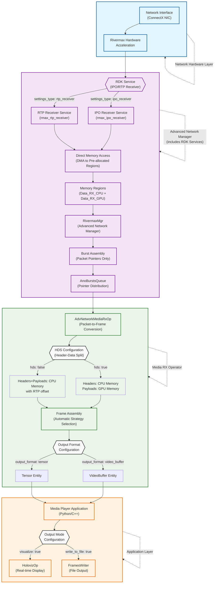

# Advanced Networking Media Player

The Advanced Networking Media Player is a high-performance application for receiving and displaying media streams over advanced network infrastructure using NVIDIA's Rivermax SDK. This application demonstrates real-time media streaming capabilities with ultra-low latency and high throughput.

## Overview

This application showcases professional-grade media streaming over IP networks, utilizing NVIDIA's advanced networking technologies. It receives media streams using the SMPTE 2110 standard and can either display them in real-time or save them to disk for further processing.

### Key Features

- **High-Performance Streaming**: Receive media streams with minimal latency using Rivermax SDK
- **SMPTE 2110 Compliance**: Industry-standard media over IP protocol support
- **Flexible Output**: Choose between real-time visualization or file output
- **GPU Acceleration**: Leverage GPUDirect for zero-copy operations
- **Multiple Format Support**: RGB888, YUV420, NV12, and other common video formats
- **Header-Data Split**: Optimized memory handling for improved performance

### Application Architecture

The Advanced Networking Media Player implements a sophisticated multi-layer architecture for high-performance media streaming with hardware acceleration and zero-copy optimizations.

#### Complete Application Data Flow



#### Simplified Application Pipeline

```
┌─────────────────┐    ┌─────────────────┐    ┌──────────────────┐    ┌─────────────────┐
│ Network Hardware│ -> │ Advanced Network│ -> │ Media RX Operator│ -> │   Application   │
│     Layer       │    │ Manager + RDK   │    │     Layer        │    │     Layer       │
└─────────────────┘    └─────────────────┘    └──────────────────┘    └─────────────────┘
```

#### Layered Architecture Overview

The application implements a 4-layer architecture for high-performance media streaming, with clear separation of concerns:

**🌐 Network Hardware Layer**
- ConnectX NIC with Rivermax hardware acceleration
- Direct memory access and hardware-based packet processing

**🔄 Advanced Network Manager Layer**
- **RDK Services Context**: IPO/RTP receivers run within this layer
- Protocol handling and memory management via integrated RDK services
- Pre-allocated memory regions (CPU + GPU)
- Rivermax manager coordination and service orchestration
- Burst assembly and packet pointer management
- Queue distribution for operator consumption

**🎬 Media RX Operator Layer**
- `AdvNetworkMediaRxOp`: Packet-to-frame conversion
- Automatic HDS detection and strategy optimization
- Frame assembly with GPU acceleration

**📱 Application Layer**
- Media Player application (Python/C++)
- Output configuration (visualization or file storage)
- User interface and control logic

**Key Features:**
- **Automatic Optimization**: Each layer automatically configures for optimal performance
- **Zero-Copy Operations**: GPU memory management minimizes data movement
- **Error Recovery**: Robust handling across all layers
- **Scalable Design**: Clean interfaces enable easy extension and testing

## Requirements

### Hardware Requirements
- Linux system (x86_64 or aarch64)
- NVIDIA NIC with ConnectX-6 or later chip
- NVIDIA GPU (for visualization and GPU acceleration)
- Sufficient network bandwidth for target media streams

### Software Requirements
- NVIDIA Rivermax SDK
- NVIDIA GPU drivers
- MOFED drivers (5.8-1.0.1.1 or later)
- DOCA 2.7 or later (if using DOCA backend)
- System tuning as described in the [High Performance Networking tutorial](../../tutorials/high_performance_networking/README.md)

## Build Instructions

### Build Docker Image

Build the Docker image and application with Rivermax support:

**C++ version:**
```bash
./holohub build adv_networking_media_player --build-args="--target rivermax" --configure-args="-D ANO_MGR:STRING=rivermax" --language cpp
```

**Python version:**
```bash
./holohub build adv_networking_media_player --build-args="--target rivermax" --configure-args="-D ANO_MGR:STRING=rivermax" --language python
```

### Launch Container

Launch the Rivermax-enabled container:

**C++ version:**
```bash
./holohub run-container adv_networking_media_player --build-args="--target rivermax" --docker-opts="-u root --privileged -e DISPLAY=:99 -v /opt/mellanox/rivermax/rivermax.lic:/opt/mellanox/rivermax/rivermax.lic -w /workspace/holohub/build/adv_networking_media_player/applications/adv_networking_media_player/cpp"
```

**Python version:**
```bash
./holohub run-container adv_networking_media_player --build-args="--target rivermax" --docker-opts="-u root --privileged -e DISPLAY=:99 -v /opt/mellanox/rivermax/rivermax.lic:/opt/mellanox/rivermax/rivermax.lic -w /workspace/holohub/build/adv_networking_media_player/applications/adv_networking_media_player/python"
```

## Running the Application

### Prerequisites

Before running, ensure your environment is properly configured:

```bash
# Update PYTHONPATH for Python applications
# Note: Run this command from the container's working directory
# (as set by -w flag in run-container command)
export PYTHONPATH=${PYTHONPATH}:/opt/nvidia/holoscan/python/lib:$PWD/../../../python/lib:$PWD

# Ensure proper system configuration (run as root if needed)
# See High Performance Networking tutorial for system tuning
```

### Running on Headless Servers

To run the application on a headless server and preview the video via VNC, start a virtual X server and VNC server:

```bash
# Start virtual X server on display :99
Xvfb :99 -screen 0 1920x1080x24 -ac &

# Start VNC server for remote access
x11vnc -display :99 -forever -shared -rfbport 5900 -nopw -bg
```

After starting these services, you can connect to the server using any VNC client (e.g., TigerVNC, RealVNC) at `<server-ip>:5900` to view the video output.

**Note**: The `-nopw` flag disables password authentication. For production environments, consider setting a password using the `-passwd` option for security.

### C++ Application

```bash
./adv_networking_media_player adv_networking_media_player.yaml
```

### Python Application

```bash
python3 ./adv_networking_media_player.py adv_networking_media_player.yaml
```

## Configuration

The application uses a YAML configuration file that defines the complete data flow pipeline. The configuration has three main sections:

1. **Advanced Network Manager Configuration**: Network interfaces, memory regions, and RDK services
2. **Media RX Operator Configuration**: Video format, frame dimensions, and output settings
3. **Application Configuration**: Visualization and file output options

> **📁 Example Configuration Files**:
> - `applications/adv_networking_media_player/adv_networking_media_player.yaml`

> **For detailed configuration parameter documentation**, see:
> - [Advanced Network Operator Configuration](../../operators/advanced_network/README.md) - Network settings, memory regions, Rivermax RX/TX settings
> - [Advanced Network Media RX Operator Configuration](../../operators/advanced_network_media/README.md) - HDS configuration, memory architecture, copy strategies, output formats

### Quick Reference: Key Parameters That Must Match

Critical parameters must be consistent across configuration sections to ensure proper operation:

| Parameter Category | Section 1 | Section 2 | Example Values | Required Match |
|-------------------|-----------|-----------|----------------|----------------|
| **Video Format** | `advanced_network_media_rx.video_format` | `media_player_config.input_format` | RGB888 / rgb888 | ✓ Must be compatible |
| **Interface** | `advanced_network_media_rx.interface_name` | `advanced_network.interfaces.address` | cc:00.1 | ✓ Must match exactly |
| **Queue ID** | `advanced_network_media_rx.queue_id` | `advanced_network.interfaces.rx.queues.id` | 0 | ✓ Must match exactly |
| **Memory Location** | `advanced_network_media_rx.memory_location` | Memory region types (`host`/`device`) | device | ✓ Should be consistent |
| **HDS Mode** | `advanced_network_media_rx.hds` | Memory region configuration | true/false | ✓ Must align with regions |
| **Frame Dimensions** | `advanced_network_media_rx.frame_width/height` | Sender configuration | 3840x2160 | ⚠️ Must match sender |

> **⚠️ IMPORTANT: Configuration Parameter Consistency**
>
> Parameters across the three configuration sections must be consistent and properly matched:
> - **Video Format Matching**: `video_format` (Media RX) must match `input_format` (Application)
> - **Memory Buffer Sizing**: `buf_size` in memory regions depends on video format, resolution, and packet size
>   - RTP headers: ~20 bytes per packet (CPU memory region)
>   - Payload size: ~1440 bytes per packet for typical SMPTE 2110 streams (GPU memory region)
>   - Buffer count (`num_bufs`): Must accommodate all packets for multiple frames in flight
> - **Memory Location**: `memory_location` (Media RX) should match the memory region types configured (`host` vs `device`)
> - **HDS Configuration**: When `hds: true`, ensure both CPU and GPU memory regions are configured
> - **Interface Matching**: `interface_name` (Media RX) must match the interface address/name in Advanced Network config
>
> Mismatched parameters will result in runtime errors or degraded performance.

### Configuration File Structure

The application configuration consists of three main sections:

#### 1. Advanced Network Manager Configuration

Configures network interfaces, memory regions, and Rivermax RX settings. See [Advanced Network Operator documentation](../../operators/advanced_network/README.md) for detailed parameter descriptions.

```yaml
advanced_network:
  cfg:
    version: 1
    manager: "rivermax"
    master_core: 6
    debug: 1
    log_level: "error"
    memory_regions:
    - name: "Data_RX_CPU"
      kind: "host"
      affinity: 0
      access:
        - local
      num_bufs: 432000
      buf_size: 20
    - name: "Data_RX_GPU"
      kind: "device"
      affinity: 0
      access:
        - local
      num_bufs: 432000
      buf_size: 1440
    interfaces:
    - name: data1
      address: cc:00.1
      rx:
        queues:
        - name: "Data"
          id: 0
          cpu_core: "12"
          batch_size: 4320
          output_port: "bench_rx_out_1"
          memory_regions:
          - "Data_RX_CPU"
          - "Data_RX_GPU"
          rivermax_rx_settings:
            settings_type: "ipo_receiver"
            memory_registration: true
            verbose: true
            max_path_diff_us: 10000
            ext_seq_num: true
            sleep_between_operations_us: 0
            local_ip_addresses:
              - 2.1.0.12
            source_ip_addresses:
              - 2.1.0.12
            destination_ip_addresses:
              - 224.1.1.2
            destination_ports:
              - 50001
            stats_report_interval_ms: 3000
            send_packet_ext_info: true
```

**Key Rivermax RX Settings**:
- `settings_type: "ipo_receiver"` - Uses IPO (Inline Packet Ordering) for high-throughput streams; alternatively use `"rtp_receiver"` for standard RTP
- `memory_registration: true` - Registers memory with Rivermax for DMA operations
- `local_ip_addresses` - Local interface IP addresses for receiving streams
- `source_ip_addresses` - Expected source IP addresses (can match local for loopback testing)
- `destination_ip_addresses` - Destination IP addresses (multicast: 224.0.0.0 - 239.255.255.255)
- `destination_ports` - UDP ports to receive streams on
- `ext_seq_num: true` - Enables extended sequence number support for SMPTE 2110
- `send_packet_ext_info: true` - Provides extended packet information to operators

**Memory Regions for HDS (Header-Data Split)**:
- `Data_RX_CPU` (kind: host) - CPU memory for RTP headers (20 bytes per packet)
- `Data_RX_GPU` (kind: device) - GPU memory for video payloads (1440 bytes per packet for 1080p RGB)

#### 2. Media RX Operator Configuration

Configures video format, frame dimensions, HDS, and output settings. See [Advanced Network Media RX Operator documentation](../../operators/advanced_network_media/README.md) for detailed parameter descriptions.

```yaml
advanced_network_media_rx:
  interface_name: cc:00.1      # Must match Advanced Network interface address
  queue_id: 0                  # Must match Advanced Network queue ID
  video_format: RGB888         # Video pixel format (RGB888, YUV420, NV12)
  frame_width: 1920            # Frame width in pixels (must match sender)
  frame_height: 1080           # Frame height in pixels (must match sender)
  bit_depth: 8                 # Color bit depth (8, 10, 12, 16)
  hds: true                    # Enable Header-Data Split for optimal GPU performance
  output_format: tensor        # Output as tensor (alternative: video_buffer)
  memory_location: device      # Process in GPU memory (alternative: host)
```

**Key Media RX Operator Settings**:
- `interface_name` - Must match the interface address in Advanced Network configuration
- `queue_id` - Must match the queue ID in Advanced Network RX queue configuration
- `video_format` - Must be compatible with sender format and `media_player_config.input_format`
- `frame_width` / `frame_height` - Must match sender configuration (example shows 1080p: 1920x1080)
- `hds: true` - Enables Header-Data Split: headers in CPU, payloads in GPU (requires both CPU and GPU memory regions)
- `output_format: tensor` - Optimized for GPU post-processing; use `video_buffer` for compatibility with standard operators
- `memory_location: device` - Process frames in GPU memory for maximum performance

#### 3. Application Configuration

Configures output options for the media player application:

```yaml
media_player_config:
  write_to_file: false    # Enable file output (saves frames to disk)
  visualize: true         # Enable real-time display via HolovizOp
  input_format: "rgb888"  # Must be compatible with advanced_network_media_rx.video_format
```

**Key Application Settings**:
- `write_to_file` - When true, saves received frames to disk (configure path in `frames_writer` section)
- `visualize` - When true, displays frames in real-time using HolovizOp (requires X11/display)
- `input_format` - Must be compatible with Media RX Operator `video_format` (e.g., RGB888 → rgb888)

## Output Options

### Real-time Visualization

When `visualize: true` is set in the configuration:
- Received media streams are displayed in real-time using HolovizOp
- Supports format conversion for optimal display
- Minimal latency for live monitoring applications

### File Output

When `write_to_file: true` is set in the configuration:
- Media frames are saved to disk for later analysis
- Configure output path and number of frames in the `frames_writer` section
- Supports both host and device memory sources

## Supported Video Formats

- **RGB888**: 24-bit RGB color
- **YUV420**: 4:2:0 chroma subsampling
- **NV12**: Semi-planar YUV 4:2:0

## Troubleshooting

### Common Issues

1. **Permission Errors**: Run with appropriate privileges for network interface access
2. **Network Configuration**: Verify IP addresses, ports, and interface names
3. **Memory Issues**: Adjust buffer sizes based on available system memory
4. **Performance**: Check system tuning and CPU isolation settings

### Debug Options

Enable debug logging by setting `log_level: "debug"` in the advanced_network configuration section.

### Git Configuration (if needed)

If you encounter Git-related issues during build:

```bash
git config --global --add safe.directory '*'
```

## Performance Optimization

### Configuration Optimization

For optimal performance, configure the following based on your use case:

1. **HDS Configuration**: Enable `hds: true` for GPU-accelerated processing with optimal memory layout
2. **Memory Location**: Set `memory_location: device` to process frames in GPU memory for maximum performance
3. **Output Format**: Use `output_format: tensor` for GPU-based post-processing pipelines
4. **Memory Regions**: Size buffers appropriately for your frame rate and resolution

> **For detailed optimization strategies and implementation details**, see:
> - [Advanced Network Media RX Operator Documentation](../../operators/advanced_network_media/README.md) - Processing strategies, HDS optimization, memory architecture
> - [Advanced Network Operator Documentation](../../operators/advanced_network/README.md) - Memory region configuration, queue settings

### System-Level Tuning

Ensure your system is properly configured for high-performance networking:

- **CPU Isolation**: Isolate CPU cores for network processing
- **Memory Configuration**: Configure hugepages and memory allocation
- **GPU Configuration**: Ensure sufficient GPU memory for frame buffering
- **Network Tuning**: Configure interrupt mitigation and CPU affinity

> **For detailed system tuning guidelines**, see the [High Performance Networking Tutorial](../../tutorials/high_performance_networking/README.md)

### Performance Monitoring

Monitor these key metrics for optimal performance:
- **Frame Rate**: Consistent frame reception without drops
- **Processing Efficiency**: Verify the operator is selecting optimal processing strategies
- **GPU Utilization**: Monitor GPU memory usage and processing efficiency
- **Network Statistics**: Track packet loss, timing accuracy, and throughput
- **Memory Usage**: Monitor both CPU and GPU memory consumption
- **Error Recovery**: Track frequency of network issues and recovery events

## Related Documentation

### Operator Documentation
For detailed implementation information and advanced configuration:
- **[Advanced Network Media RX Operator](../../operators/advanced_network_media/README.md)**: Comprehensive operator documentation and configuration options
- **[Advanced Network Operators](../../operators/advanced_network/README.md)**: Base networking infrastructure and setup

### Additional Resources
- **[High Performance Networking Tutorial](../../tutorials/high_performance_networking/README.md)**: System tuning and optimization guide
- **[Advanced Networking Media Sender](../adv_networking_media_sender/README.md)**: Companion application for media transmission
