# Advanced Networking Media Player

The Advanced Networking Media Player is a high-performance application for receiving and displaying media streams over advanced network infrastructure using NVIDIA's Rivermax SDK. This application demonstrates real-time media streaming capabilities with ultra-low latency and high throughput.

## Overview

This application showcases professional-grade media streaming over IP networks, utilizing NVIDIA's advanced networking technologies. It receives media streams using the SMPTE 2110 standard and can either display them in real-time or save them to disk for further processing.

### Key Features

- **High-Performance Streaming**: Receive media streams with minimal latency using Rivermax SDK
- **SMPTE 2110 Compliance**: Industry-standard media over IP protocol support
- **Flexible Output**: Choose between real-time visualization or file output
- **GPU Acceleration**: Leverage GPUDirect for zero-copy operations
- **Multiple Format Support**: RGB888, YUV420, NV12, and other common video formats
- **Header-Data Split**: Optimized memory handling for improved performance

### Application Architecture

The Advanced Networking Media Player implements a sophisticated multi-layer architecture for high-performance media streaming with hardware acceleration and zero-copy optimizations.

#### Complete Application Data Flow

```mermaid
graph TD
    %% Network Hardware Layer
    A["Network Interface<br/>(ConnectX NIC)"] --> B["Rivermax Hardware<br/>Acceleration"]

    %% RDK Service Layer
    B --> C{{"RDK Service<br/>(IPO/RTP Receiver)"}}
    C -->|settings_type: ipo_receiver| D["IPO Receiver Service<br/>(rmax_ipo_receiver)"]
    C -->|settings_type: rtp_receiver| E["RTP Receiver Service<br/>(rmax_rtp_receiver)"]

    %% Memory Management
    D --> F["Direct Memory Access<br/>(DMA to Pre-allocated Regions)"]
    E --> F
    F --> G["Memory Regions<br/>(Data_RX_CPU + Data_RX_GPU)"]

    %% Advanced Network Manager
    G --> H["RivermaxMgr<br/>(Advanced Network Manager)"]
    H --> I["Burst Assembly<br/>(Packet Pointers Only)"]
    I --> J["AnoBurstsQueue<br/>(Pointer Distribution)"]

    %% Media RX Operator
    J --> K["AdvNetworkMediaRxOp"]
    K --> L["Burst Processor<br/>(burst_processor)"]
    L --> M{{"HDS Configuration<br/>(Header-Data Split)"}}

    %% HDS Memory Layout
    M -->|hds: true| N["Headers: CPU Memory<br/>Payloads: GPU Memory"]
    M -->|hds: false| O["Headers+Payloads: CPU Memory<br/>with RTP offset"]

    %% Strategy Detection & Processing
    N --> P["PacketsToFramesConverter<br/>(Strategy Detection)"]
    O --> P
    P --> Q{{"Memory Layout<br/>Analysis"}}
    Q -->|Contiguous| R["ContiguousStrategy<br/>cudaMemcpy()"]
    Q -->|Strided| S["StridedStrategy<br/>cudaMemcpy2D()"]

    %% Frame Assembly
    R --> T["Frame Assembly<br/>(Single Copy Operation)"]
    S --> T
    T --> U{{"Output Format<br/>Configuration"}}
    U -->|output_format: video_buffer| V["VideoBuffer Entity"]
    U -->|output_format: tensor| W["Tensor Entity"]

    %% Application Layer
    V --> X["Media Player Application<br/>(Python/C++)"]
    W --> X
    X --> Y{{"Output Mode<br/>Configuration"}}

    %% Output Options
    Y -->|visualize: true| Z["HolovizOp<br/>(Real-time Display)"]
    Y -->|write_to_file: true| AA["FramesWriter<br/>(File Output)"]

    %% Styling
    classDef networkLayer fill:#e1f5fe
    classDef rdkLayer fill:#e3f2fd
    classDef managerLayer fill:#f3e5f5
    classDef operatorLayer fill:#e8f5e8
    classDef appLayer fill:#fff3e0
    classDef configDecision fill:#f9f9f9,stroke:#333,stroke-width:2px
    classDef hdsPath fill:#e8f5e8
    classDef memoryOpt fill:#ffebee

    class A,B networkLayer
    class C,D,E,F,G rdkLayer
    class H,I,J managerLayer
    class K,L,P,R,S,T operatorLayer
    class X,Z,AA appLayer
    class M,Q,U,Y configDecision
    class N,O hdsPath
    class R,S,T memoryOpt
```



#### Simplified Application Pipeline

```
Network → RDK Services → AdvNetworkMediaRxOp → Application → Display/File
```

## Requirements

### Hardware Requirements
- Linux system (x86_64 or aarch64)
- NVIDIA NIC with ConnectX-6 or later chip
- NVIDIA GPU (for visualization and GPU acceleration)
- Sufficient network bandwidth for target media streams

### Software Requirements
- NVIDIA Rivermax SDK
- NVIDIA GPU drivers
- MOFED drivers (5.8-1.0.1.1 or later)
- DOCA 2.7 or later (if using DOCA backend)
- System tuning as described in the [High Performance Networking tutorial](../../tutorials/high_performance_networking/README.md)

## Build Instructions

### Build Docker Image

Build the Docker image with Rivermax support:

```bash
./dev_container build --docker_file operators/advanced_network/Dockerfile --img holohub:rivermax --build-args "--target rivermax"
```

### Launch Container

Launch the Rivermax-enabled container:

```bash
./operators/advanced_network/run_rivermax.sh
```

### Build Application

Inside the container, build the application:

```bash
# For C++ version
./run build adv_networking_media_player --configure-args "-DANO_MGR=rivermax"
```

## Configuration

The application uses a YAML configuration file that defines the complete data flow pipeline. Understanding these configuration options is crucial for optimizing performance:

- **Network settings**: Interface configuration, IP addresses, ports, RDK service selection
- **Memory regions**: CPU and GPU buffer configurations affecting HDS and copy strategies
- **Video parameters**: Format, resolution, bit depth, frame rate for packet-to-frame conversion
- **Output options**: Visualization or file output settings with memory location control

### Key Configuration Parameters

#### RDK Service Selection
- **`settings_type: "ipo_receiver"`**: Uses IPO (Inline Packet Ordering) for high-throughput streams
- **`settings_type: "rtp_receiver"`**: Uses RTP receiver for standard compliance

#### Header-Data Split (HDS) Configuration
- **`hds: true`**: Enables optimal memory layout - headers in CPU, payloads in GPU memory
- **`hds: false`**: Traditional layout - headers and payloads together in CPU memory

#### Memory and Copy Strategy Optimization
- **`memory_location: "device"`**: Processes frames in GPU memory for maximum performance
- **`memory_location: "host"`**: Processes frames in CPU memory when GPU memory is limited
- **`output_format: "tensor"`**: Optimized for GPU-based post-processing
- **`output_format: "video_buffer"`**: Compatible with standard video processing operators

### Example Configuration Sections

#### Network Interface Configuration
```yaml
advanced_network:
  cfg:
    version: 1
    manager: "rivermax"
    master_core: 6              # Master CPU core
    debug: 1
    log_level: "error"

    memory_regions:
    - name: "Data_RX_CPU"
      kind: "host"
      affinity: 0
      access:
        - local
      num_bufs: 43200
      buf_size: 20
    - name: "Data_RX_GPU"
      kind: "device"
      affinity: 0
      access:
        - local
      num_bufs: 43200
      buf_size: 1440
    interfaces:
    - name: data1
      address:  cc:00.1
      rx:
        queues:
        - name: "Data"
          id: 0
          cpu_core:  "12"
          batch_size: 4320
          output_port: "bench_rx_out_1"
          memory_regions:
          - "Data_RX_CPU"
          - "Data_RX_GPU"
          rivermax_rx_settings:
            settings_type: "ipo_receiver"
            memory_registration: true
            #allocator_type: "huge_page_2mb"
            verbose: true
            max_path_diff_us: 10000
            ext_seq_num: true
            sleep_between_operations_us: 0
            local_ip_addresses:
              - 2.1.0.12
            source_ip_addresses:
              - 2.1.0.12
            destination_ip_addresses:
              - 224.1.1.2
            destination_ports:
              - 50001
            stats_report_interval_ms: 3000
            send_packet_ext_info: true
```

#### Video Format Configuration
```yaml
advanced_network_media_rx:
  interface_name: cc:00.1
  video_format: RGB888
  frame_width: 1920
  frame_height: 1080
  bit_depth: 8
  hds: true
  output_format: tensor #can be video_buffer
  memory_location: device
```

#### Output Configuration
```yaml
media_player_config:
  write_to_file: false    # Set to true for file output
  visualize: true         # Set to true for real-time display
  input_format: "rgb888"
```

## Running the Application

### Prerequisites

Before running, ensure your environment is properly configured:

```bash
# Update PYTHONPATH for Python applications
export PYTHONPATH=${PYTHONPATH}:/opt/nvidia/holoscan/python/lib:$PWD/build/adv_networking_media_player/python/lib:$PWD

# Ensure proper system configuration (run as root if needed)
# See High Performance Networking tutorial for system tuning
```

### C++ Application

```bash
./build/adv_networking_media_player/applications/adv_networking_media_player/cpp/adv_networking_media_player adv_networking_media_player.yaml
```

### Python Application

```bash
python applications/adv_networking_media_player/python/adv_networking_media_player.py ../adv_networking_media_player.yaml
```

## Output Options

### Real-time Visualization

When `visualize: true` is set in the configuration:
- Received media streams are displayed in real-time using HolovizOp
- Supports format conversion for optimal display
- Minimal latency for live monitoring applications

### File Output

When `write_to_file: true` is set in the configuration:
- Media frames are saved to disk for later analysis
- Configure output path and number of frames in the `frames_writer` section
- Supports both host and device memory sources

## Supported Video Formats

- **RGB888**: 24-bit RGB color
- **YUV420**: 4:2:0 chroma subsampling
- **NV12**: Semi-planar YUV 4:2:0

## Troubleshooting

### Common Issues

1. **Permission Errors**: Run with appropriate privileges for network interface access
2. **Network Configuration**: Verify IP addresses, ports, and interface names
3. **Memory Issues**: Adjust buffer sizes based on available system memory
4. **Performance**: Check system tuning and CPU isolation settings

### Debug Options

Enable debug logging by setting `log_level: "debug"` in the advanced_network configuration section.

### Git Configuration (if needed)

If you encounter Git-related issues during build:

```bash
git config --global --add safe.directory '*'
```

## Performance Optimization

### Architecture-Aware Tuning

Understanding the data flow architecture enables targeted performance optimization:

#### Copy Strategy Optimization
The application automatically detects optimal copy strategies based on memory layout:
- **Contiguous Strategy**: Achieved with proper buffer alignment and HDS configuration
- **Strided Strategy**: Handles non-contiguous packet layouts with optimized `cudaMemcpy2D`
- **Adaptive Behavior**: Strategy can switch dynamically based on buffer wraparound conditions

#### HDS Configuration for Maximum Performance
```yaml
# Optimal HDS configuration for GPU-accelerated processing
advanced_network_media_rx:
  hds: true                    # Enable header-data split
  memory_location: device      # Process frames in GPU memory
  output_format: tensor        # Optimize for GPU post-processing

# Memory regions optimized for HDS
memory_regions:
- name: "Data_RX_CPU"         # Headers in CPU memory
  kind: "host"
  buf_size: 20                # RTP header size
- name: "Data_RX_GPU"         # Payloads in GPU memory
  kind: "device"
  buf_size: 1440              # Payload size per packet
```

### System-Level Tuning

- **CPU Isolation**: Isolate CPU cores for network processing (`cpu_core: "12"`)
- **Memory Configuration**: Tune buffer sizes based on frame rate and resolution
- **GPU Memory**: Ensure sufficient GPU memory for frame buffers
- **Network Settings**: Configure appropriate batch sizes and queue parameters (`batch_size: 4320`)
- **Interrupt Mitigation**: Use proper CPU affinity to reduce interrupt overhead

### Performance Monitoring

Monitor these key metrics for optimal performance:
- **Frame Rate**: Consistent frame reception without drops
- **Memory Copy Strategy**: Verify contiguous strategy is being used when possible
- **GPU Utilization**: Monitor GPU memory usage and copy operations
- **Network Statistics**: Track packet loss and timing accuracy

## Related Documentation

- [Advanced Network Operators](../../operators/advanced_network/README.md)
- [Advanced Network Media Operators](../../operators/advanced_network_media/README.md)
- [High Performance Networking Tutorial](../../tutorials/high_performance_networking/README.md)
- [Advanced Networking Media Sender](../adv_networking_media_sender/README.md)
