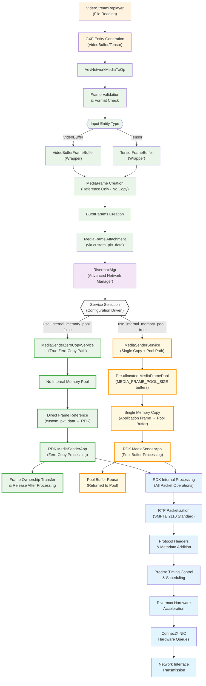
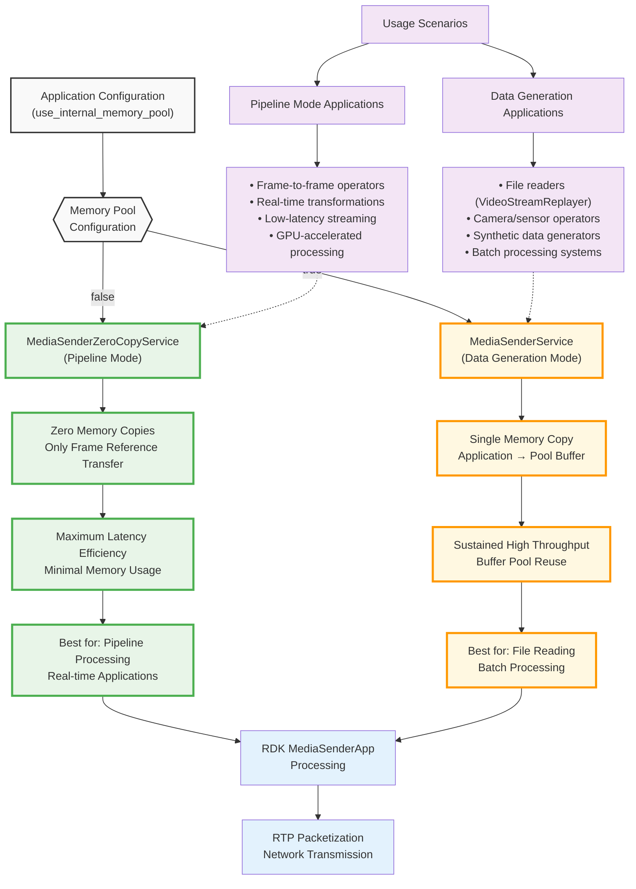

# Advanced Networking Media Sender

The Advanced Networking Media Sender is a high-performance application for transmitting media streams over advanced network infrastructure using NVIDIA's Rivermax SDK. This application demonstrates professional-grade media streaming capabilities with ultra-low latency and high throughput for broadcast and media production environments.

## Overview

This application showcases high-performance media transmission over IP networks, utilizing NVIDIA's advanced networking technologies. It reads media files from disk and transmits them as real-time streams using the SMPTE 2110 standard, making it ideal for professional broadcast applications.

### Key Features

- **High-Performance Streaming**: Transmit media streams with minimal latency using Rivermax SDK
- **SMPTE 2110 Compliance**: Industry-standard media over IP protocol support
- **File-based Source**: Read and stream media files with precise timing control
- **GPU Acceleration**: Leverage GPUDirect for zero-copy operations
- **Multiple Format Support**: RGB888, YUV420, NV12, and other common video formats
- **Real-time Playback**: Accurate frame rate control for live streaming applications

### Application Architecture

The Advanced Networking Media Sender implements a sophisticated frame-level processing architecture with configurable memory management strategies for optimal performance in different use cases.

#### Complete Application Data Flow



#### Service Selection Decision Flow



#### Simplified Application Pipeline

```
Video Files → VideoStreamReplayer → AdvNetworkMediaTxOp → RDK Services → Network
```

## Requirements

### Hardware Requirements
- Linux system (x86_64 or aarch64)
- NVIDIA NIC with ConnectX-6 or later chip
- NVIDIA GPU (for GPU acceleration)
- Sufficient network bandwidth for target media streams
- Storage with adequate throughput for media file reading

### Software Requirements
- NVIDIA Rivermax SDK
- NVIDIA GPU drivers
- MOFED drivers (5.8-1.0.1.1 or later)
- DOCA 2.7 or later (if using DOCA backend)
- System tuning as described in the [High Performance Networking tutorial](../../tutorials/high_performance_networking/README.md)

## Build Instructions

### Build Docker Image

Build the Docker image with Rivermax support:

```bash
./dev_container build --docker_file operators/advanced_network/Dockerfile --img holohub:rivermax --build-args "--target rivermax"
```

### Launch Container

Launch the Rivermax-enabled container:

```bash
./operators/advanced_network/run_rivermax.sh
```

### Build Application

Inside the container, build the application:

```bash
# For C++ version
./run build adv_networking_media_sender --configure-args "-DANO_MGR=rivermax"

```

## Configuration

The application uses a YAML configuration file that defines the complete transmission pipeline. Understanding these configuration options is crucial for optimizing performance and selecting the appropriate memory management strategy:

- **Network settings**: Interface configuration, IP addresses, ports, MediaSender service selection
- **Memory regions**: CPU and GPU buffer configurations affecting service selection and performance
- **Video parameters**: Format, resolution, bit depth, frame rate for RDK packetization
- **Source settings**: Media file path and playback options for VideoStreamReplayer
- **Service mode**: Memory pool configuration determining zero-copy vs single-copy behavior

### Critical Configuration Parameters

#### MediaSender Service Selection
```yaml
# Zero-Copy Mode (Pipeline Applications)
rivermax_tx_settings:
  use_internal_memory_pool: false    # Enables MediaSenderZeroCopyService

# Memory Pool Mode (Data Generation Applications)
rivermax_tx_settings:
  use_internal_memory_pool: true     # Enables MediaSenderService
```

#### Memory Pool Configuration (when enabled)
```yaml
# Memory pool settings affect sustained throughput
rivermax_tx_settings:
  memory_allocation: true            # Enable pool allocation
  memory_pool_location: "device"     # GPU memory for zero-copy to NIC
  num_of_packets_in_chunk: 144       # Chunk size for packetization
```

#### Performance-Critical Settings
```yaml
# Network timing and batching
rivermax_tx_settings:
  frame_rate: 60                     # Target transmission frame rate
  sleep_between_operations: false    # Disable for maximum performance
  stats_report_interval_ms: 1000     # Performance monitoring interval

# Memory regions for optimal DMA
memory_regions:
- name: "Data_TX_GPU"               # GPU memory for zero-copy transmission
  kind: "device"
  num_bufs: 43200                   # Buffer count for sustained throughput
  buf_size: 1440                    # Per-packet payload size
```

### Example Configuration Sections

#### Network Interface Configuration
```yaml
advanced_network:
  cfg:
    version: 1
    manager: "rivermax"
    master_core: 6              # Master CPU core
    debug: 1
    log_level: "debug"

    memory_regions:
    - name: "Data_TX_CPU"
      kind: "huge"
      affinity: 0
      num_bufs: 43200
      buf_size: 20
    - name: "Data_TX_GPU"
      kind: "device"
      affinity: 0
      num_bufs: 43200
      buf_size: 1440

    interfaces:
    - name: "tx_port"
      address: cc:00.1
      tx:
        queues:
        - name: "tx_q_1"
          id: 0
          cpu_core:  "12"
          batch_size: 4320
          output_port: "bench_tx_out_1"
          memory_regions:
          - "Data_TX_CPU"
          - "Data_TX_GPU"
          rivermax_tx_settings:
            settings_type: "media_sender"
            memory_registration: true
            memory_allocation: true
            memory_pool_location: "device"
            #allocator_type: "huge_page_2mb"
            verbose: true
            sleep_between_operations: false
            local_ip_address: 2.1.0.12
            destination_ip_address: 224.1.1.2
            destination_port: 50001
            stats_report_interval_ms: 1000
            send_packet_ext_info: true
            num_of_packets_in_chunk: 144
            video_format: RGB
            bit_depth: 8
            frame_width: 1920
            frame_height: 1080
            frame_rate: 60
            dummy_sender: false
```

#### Video Transmission Configuration
```yaml
advanced_network_media_tx:
  interface_name: cc:00.1
  video_format: RGB888
  frame_width: 1920
  frame_height: 1080
  bit_depth: 8
```

#### Source File Configuration
```yaml
replayer:
  directory: "/media/video"
  basename: "bunny"
  frame_rate: 60
  repeat: true      # Loop playback
  realtime: true    # Real-time playback
  count: 0          # 0 = no frame limit
```

#### Memory Configuration
```yaml
rmm_allocator:
  device_memory_initial_size: "1024 MB"
  device_memory_max_size: "1024 MB"
  host_memory_initial_size: "1024 MB"
  host_memory_max_size: "1024 MB"
  dev_id: 0
```

## Media File Preparation

### Supported Formats

The VideoStreamReplayerOp expects video data encoded as GXF entities, not standard video files. The application requires:
- **GXF Entity Format**: Video streams encoded as `.gxf_entities` and `.gxf_index` files
- **Directory structure**: GXF files should be organized in a directory
- **Naming convention**: `<basename>.gxf_entities` and `<basename>.gxf_index`

### Converting Media Files

To convert standard video files to the required GXF entity format, use the provided conversion script:

```bash
# Convert video file to GXF entities
# Script is available in /opt/nvidia/holoscan/bin or on GitHub
convert_video_to_gxf_entities.py --input input_video.mp4 --output_dir /media/video --basename bunny

# This will create:
# - /media/video/bunny.gxf_entities
# - /media/video/bunny.gxf_index
```

### Video Conversion Parameters

The conversion script supports various options:

```bash
# Basic conversion with custom resolution
convert_video_to_gxf_entities.py \
    --input input_video.mp4 \
    --output_dir /media/video \
    --basename bunny \
    --width 1920 \
    --height 1080 \
    --framerate 60

# For specific pixel formats
convert_video_to_gxf_entities.py \
    --input input_video.mp4 \
    --output_dir /media/video \
    --basename bunny \
    --pixel_format rgb24
```

## Running the Application

### Prerequisites

Before running, ensure your environment is properly configured:

```bash
# Update PYTHONPATH for Python applications
export PYTHONPATH=${PYTHONPATH}:/opt/nvidia/holoscan/python/lib:$PWD/build/adv_networking_media_sender/python/lib:$PWD

# Ensure proper system configuration (run as root if needed)
# See High Performance Networking tutorial for system tuning
```

### C++ Application

```bash
./build/adv_networking_media_sender/applications/adv_networking_media_sender/cpp/adv_networking_media_sender adv_networking_media_sender.yaml
```

### Python Application

```bash
python applications/adv_networking_media_sender/python/adv_networking_media_sender.py ../adv_networking_media_sender.yaml
```

## Configuration Parameters

### Source Configuration Options

- **`directory`**: Path to media files directory
- **`basename`**: Base name for media files (without frame numbers)
- **`frame_rate`**: Target frame rate for transmission
- **`repeat`**: Enable looping playback (true/false)
- **`realtime`**: Enable real-time playback timing (true/false)
- **`count`**: Number of frames to transmit (0 = unlimited)

### Network Configuration Options

- **`local_ip_address`**: Source IP address for transmission
- **`destination_ip_address`**: Target IP address (multicast supported)
- **`destination_port`**: Target UDP port
- **`frame_rate`**: Network transmission frame rate
- **`video_format`**: Video pixel format (RGB, YUV, etc.)
- **`bit_depth`**: Color bit depth (8, 10, 12, 16)

## Troubleshooting

### Common Issues

1. **File Not Found**: Verify media file paths and naming conventions
2. **Network Errors**: Check IP addresses, ports, and network connectivity
3. **Performance Issues**: Review system tuning and resource allocation
4. **Memory Errors**: Adjust buffer sizes and memory allocations

### Debug Options

Enable debug logging by setting `log_level: "debug"` in the advanced_network configuration section.

### Network Testing

Test network connectivity before running the application:

```bash
# Test multicast connectivity
ping 224.1.1.2

# Verify network interface configuration
ip addr show <interface_name>
```

## Performance Optimization

### Architecture-Aware Configuration

Understanding the service selection and data flow enables optimal configuration for your specific use case:

#### For VideoStreamReplayer Applications (Current Use Case)

The VideoStreamReplayer operator generates video data from files, making it a **data generation** application. For optimal performance:

```yaml
# Recommended configuration for VideoStreamReplayer
rivermax_tx_settings:
  use_internal_memory_pool: true      # Use MediaSenderService (memory pool)
  memory_allocation: true             # Enable internal pool allocation
  memory_pool_location: "device"      # GPU memory for optimal performance
  sleep_between_operations: false     # Maximum throughput mode
```

**Why Memory Pool Mode for VideoStreamReplayer:**
- **Sustained Throughput**: Pre-allocated buffers enable consistent high frame rates
- **Buffer Reuse**: Pool buffers are reused, reducing allocation overhead
- **File Reading Optimization**: Single copy from file data to pool buffer, then reuse
- **Production Stability**: Buffering provides resilience against variable file I/O timing

#### Service Selection Guidelines

```yaml
# Zero-Copy Mode (use_internal_memory_pool: false)
# Best for: Pipeline operators receiving MediaFrame/VideoBuffer/Tensor
# Performance: Absolute minimum latency, zero memory copies
# Use when: Processing data from previous operators in pipeline

# Memory Pool Mode (use_internal_memory_pool: true)
# Best for: Data generation from files, sensors, cameras, synthetic sources
# Performance: Single copy with sustained high throughput via buffer reuse
# Use when: Reading/generating original data (like VideoStreamReplayer)
```

#### Memory Configuration for Maximum Performance

```yaml
# GPU memory optimization for zero-copy transmission
memory_regions:
- name: "Data_TX_GPU"
  kind: "device"                     # GPU memory
  affinity: 0                        # GPU device ID
  num_bufs: 43200                    # High buffer count for sustained throughput
  buf_size: 1440                     # Optimized for packet payload size

# CPU memory for control data
- name: "Data_TX_CPU"
  kind: "huge"                       # Huge pages for optimal DMA
  num_bufs: 43200                    # Match GPU buffer count
  buf_size: 20                       # RTP header size
```

#### Frame Rate and Timing Optimization

```yaml
# VideoStreamReplayer timing configuration
replayer:
  frame_rate: 60                     # Match network transmission rate
  realtime: true                     # Enable precise timing control
  repeat: true                       # Loop for sustained streaming

# Network transmission timing
rivermax_tx_settings:
  frame_rate: 60                     # Must match replayer frame rate
  num_of_packets_in_chunk: 144       # Optimize for frame size
  stats_report_interval_ms: 1000     # Monitor performance
```

### Performance Monitoring

Monitor these key metrics for optimal VideoStreamReplayer performance:
- **Frame Transmission Rate**: Consistent 60fps without frame drops
- **Memory Pool Utilization**: Pool buffers are being reused effectively
- **GPU Memory Usage**: Sufficient GPU memory for sustained operation
- **Network Statistics**: Verify timing accuracy and packet delivery

## Example Use Cases

### Live Event Streaming
- Stream pre-recorded content as live feeds using VideoStreamReplayer
- Support for multiple concurrent streams with memory pool optimization
- Frame-accurate timing for broadcast applications

### Content Distribution
- Distribute media content across network infrastructure from file sources
- Support for multicast delivery to multiple receivers
- High-throughput content delivery networks with sustained file-to-network streaming

### Testing and Development
- Generate test streams for receiver development using loop playback
- Validate network infrastructure performance with realistic file-based sources
- Prototype media streaming applications with known video content

## Related Documentation

- [Advanced Network Operators](../../operators/advanced_network/README.md)
- [Advanced Network Media Operators](../../operators/advanced_network_media/README.md)
- [High Performance Networking Tutorial](../../tutorials/high_performance_networking/README.md)
- [Advanced Networking Media Player](../adv_networking_media_player/README.md)
