# Advanced Networking Media Sender

The Advanced Networking Media Sender is a high-performance application for transmitting media streams over advanced network infrastructure using NVIDIA's Rivermax SDK. This application demonstrates professional-grade media streaming capabilities with ultra-low latency and high throughput for broadcast and media production environments.

## Overview

This application showcases high-performance media transmission over IP networks, utilizing NVIDIA's advanced networking technologies. It reads media files from disk and transmits them as real-time streams using the SMPTE 2110 standard, making it ideal for professional broadcast applications.

### Key Features

- **High-Performance Streaming**: Transmit media streams with minimal latency using Rivermax SDK
- **SMPTE 2110 Compliance**: Industry-standard media over IP protocol support
- **File-based Source**: Read and stream media files with precise timing control
- **GPU Acceleration**: Leverage GPUDirect for zero-copy operations
- **Multiple Format Support**: RGB888, YUV420, NV12, and other common video formats
- **Real-time Playback**: Accurate frame rate control for live streaming applications

### Application Architecture

The Advanced Networking Media Sender implements a sophisticated frame-level processing architecture with configurable memory management strategies for optimal performance in different use cases.

#### Complete Application Data Flow


#### Service Selection Decision Flow

```mermaid
flowchart TD
    A["Application Configuration<br/>(use_internal_memory_pool)"] --> B{{"Memory Pool<br/>Configuration"}}

    B -->|false| C["MediaSenderZeroCopyService<br/>(Pipeline Mode)"]
    B -->|true| D["MediaSenderService<br/>(Data Generation Mode)"]

    %% Zero-Copy Path Details
    C --> E["Zero Memory Copies<br/>Only Frame Reference Transfer"]
    E --> F["Maximum Latency Efficiency<br/>Minimal Memory Usage"]
    F --> G["Best for: Pipeline Processing<br/>Real-time Applications"]

    %% Memory Pool Path Details
    D --> H["Single Memory Copy<br/>Application → Pool Buffer"]
    H --> I["Sustained High Throughput<br/>Buffer Pool Reuse"]
    I --> J["Best for: File Reading<br/>Batch Processing"]

    %% Common Processing
    G --> K["RDK MediaSenderApp<br/>Processing"]
    J --> K
    K --> L["RTP Packetization<br/>Network Transmission"]

    %% Usage Examples
    M["Usage Scenarios"] --> N["Pipeline Mode Applications"]
    M --> O["Data Generation Applications"]

    N --> P["• Frame-to-frame operators<br/>• Real-time transformations<br/>• Low-latency streaming<br/>• GPU-accelerated processing"]
    O --> Q["• File readers (VideoStreamReplayer)<br/>• Camera/sensor operators<br/>• Synthetic data generators<br/>• Batch processing systems"]

    P -.-> C
    Q -.-> D

    %% Styling
    classDef configNode fill:#f9f9f9,stroke:#333,stroke-width:2px
    classDef zeroCopyPath fill:#e8f5e8,stroke:#4caf50,stroke-width:3px
    classDef poolPath fill:#fff8e1,stroke:#ff9800,stroke-width:3px
    classDef rdkLayer fill:#e3f2fd
    classDef usageLayer fill:#f3e5f5

    class A,B configNode
    class C,E,F,G zeroCopyPath
    class D,H,I,J poolPath
    class K,L rdkLayer
    class M,N,O,P,Q usageLayer
```



#### Simplified Application Pipeline

```
Video Files → VideoStreamReplayer → AdvNetworkMediaTxOp → RDK Services → Network
```

## Requirements

### Hardware Requirements
- Linux system (x86_64 or aarch64)
- NVIDIA NIC with ConnectX-6 or later chip
- NVIDIA GPU (for GPU acceleration)
- Sufficient network bandwidth for target media streams
- Storage with adequate throughput for media file reading

### Software Requirements
- NVIDIA Rivermax SDK
- NVIDIA GPU drivers
- MOFED drivers (5.8-1.0.1.1 or later)
- DOCA 2.7 or later (if using DOCA backend)
- System tuning as described in the [High Performance Networking tutorial](../../tutorials/high_performance_networking/README.md)

## Build Instructions

### Build Docker Image

Build the Docker image and application with Rivermax support:

**C++ version:**
```bash
./holohub build adv_networking_media_sender --build-args="--target rivermax" --configure-args="-D ANO_MGR:STRING=rivermax" --language cpp
```

**Python version:**
```bash
./holohub build adv_networking_media_sender --build-args="--target rivermax" --configure-args="-D ANO_MGR:STRING=rivermax" --language python
```

### Launch Container

Launch the Rivermax-enabled container:

**C++ version:**
```bash
./holohub run-container adv_networking_media_sender --build-args="--target rivermax" --docker-opts="-u root --privileged -v /opt/mellanox/rivermax/rivermax.lic:/opt/mellanox/rivermax/rivermax.lic -v /media/video:/media/video/ -w /workspace/holohub/build/adv_networking_media_sender/applications/adv_networking_media_sender/cpp"
```

**Python version:**
```bash
./holohub run-container adv_networking_media_sender --build-args="--target rivermax" --docker-opts="-u root --privileged -v /opt/mellanox/rivermax/rivermax.lic:/opt/mellanox/rivermax/rivermax.lic -v /media/video:/media/video/ -w /workspace/holohub/build/adv_networking_media_sender/applications/adv_networking_media_sender/python"
```

## Running the Application

### Prerequisites

Before running, ensure your environment is properly configured:

```bash
# Update PYTHONPATH for Python applications
# Note: Run this command from the container's working directory
# (as set by -w flag in run-container command)
export PYTHONPATH=${PYTHONPATH}:/opt/nvidia/holoscan/python/lib:$PWD/../../../python/lib:$PWD

# Ensure proper system configuration (run as root if needed)
# See High Performance Networking tutorial for system tuning
```

### C++ Application

```bash
./adv_networking_media_sender adv_networking_media_sender.yaml
```

### Python Application

```bash
python3 ./adv_networking_media_sender.py adv_networking_media_sender.yaml
```

## Configuration

The application uses a YAML configuration file that defines the complete transmission pipeline. The configuration has four main sections:

1. **Advanced Network Manager Configuration**: Network interfaces, memory regions, and Rivermax TX settings
2. **Media TX Operator Configuration**: Video format, frame dimensions, and interface settings
3. **VideoStreamReplayer Configuration**: Source file path and playback options
4. **Memory Allocator Configuration**: GPU and host memory settings

> **📁 Example Configuration Files**:
> - `applications/adv_networking_media_sender/adv_networking_media_sender.yaml` - Standard 1080p configuration

> **For detailed configuration parameter documentation**, see:
> - [Advanced Network Operator Configuration](../../operators/advanced_network/README.md) - Network settings, memory regions, Rivermax TX settings
> - [Advanced Network Media TX Operator Configuration](../../operators/advanced_network_media/README.md) - Service selection, memory pool modes, TX data flow, performance characteristics

### Quick Reference: Key Parameters That Must Match

Critical parameters must be consistent across configuration sections to ensure proper operation:

| Parameter Category | Section 1 | Section 2 | Example Values | Required Match |
|-------------------|-----------|-----------|----------------|----------------|
| **Frame Rate** | `replayer.frame_rate` | `rivermax_tx_settings.frame_rate` | 60 | ✓ Must match exactly |
| **Frame Dimensions** | `advanced_network_media_tx.frame_width/height` | `rivermax_tx_settings.frame_width/height` | 1920x1080 | ✓ Must match exactly |
| **Video Format** | `advanced_network_media_tx.video_format` | `rivermax_tx_settings.video_format` | RGB888 / RGB | ✓ Must be compatible |
| **Bit Depth** | `advanced_network_media_tx.bit_depth` | `rivermax_tx_settings.bit_depth` | 8 | ✓ Must match exactly |
| **Interface** | `advanced_network_media_tx.interface_name` | `advanced_network.interfaces.address` | cc:00.1 | ✓ Must match exactly |
| **Memory Location** | `rivermax_tx_settings.memory_pool_location` | Memory region types (`host`/`device`) | device | ✓ Should be consistent |

> **⚠️ IMPORTANT: Configuration Parameter Consistency**
>
> Parameters across configuration sections must be consistent and properly matched:
> - **Video Format Matching**: `video_format` parameters must match across Media TX operator and Rivermax TX settings
> - **Frame Dimensions**: `frame_width` and `frame_height` must match between operator and RDK settings
> - **Frame Rate**: VideoStreamReplayer `frame_rate` must match Rivermax TX `frame_rate` for proper timing
> - **Memory Buffer Sizing**: `buf_size` in memory regions depends on video format, resolution, and packet size
>   - For RGB888 @ 1920x1080: Typical payload size is ~1440 bytes per packet
> - **Memory Location**: `memory_pool_location` should match memory region types configured (`host` vs `device`)
> - **Interface Matching**: `interface_name` (Media TX) must match the interface address/name in Advanced Network config
> - **Service Mode Selection**: `use_internal_memory_pool` determines MediaSender service behavior (see operator documentation)
>
> Mismatched parameters will result in runtime errors or degraded performance.

### Configuration File Structure

The application configuration consists of four main sections:

#### 1. Advanced Network Manager Configuration

Configures network interfaces, memory regions, and Rivermax TX settings. See [Advanced Network Operator documentation](../../operators/advanced_network/README.md) for detailed parameter descriptions.

```yaml
advanced_network:
  cfg:
    version: 1
    manager: "rivermax"
    master_core: 6              # Master CPU core
    debug: 1
    log_level: "debug"

    memory_regions:
    - name: "Data_TX_CPU"
      kind: "huge"
      affinity: 0
      num_bufs: 43200
      buf_size: 20
    - name: "Data_TX_GPU"
      kind: "device"
      affinity: 0
      num_bufs: 43200
      buf_size: 1440

    interfaces:
    - name: "tx_port"
      address: cc:00.1
      tx:
        queues:
        - name: "tx_q_1"
          id: 0
          cpu_core:  "12"
          batch_size: 4320
          output_port: "bench_tx_out_1"
          memory_regions:
          - "Data_TX_CPU"
          - "Data_TX_GPU"
          rivermax_tx_settings:
            settings_type: "media_sender"
            memory_registration: true
            memory_allocation: true
            memory_pool_location: "device"
            #allocator_type: "huge_page_2mb"
            verbose: true
            sleep_between_operations: false
            local_ip_address: 2.1.0.12
            destination_ip_address: 224.1.1.2
            destination_port: 50001
            stats_report_interval_ms: 1000
            send_packet_ext_info: true
            num_of_packets_in_chunk: 144
            video_format: RGB
            bit_depth: 8
            frame_width: 1920
            frame_height: 1080
            frame_rate: 60
            dummy_sender: false
```

**Key Rivermax TX Settings**:
- `settings_type: "media_sender"` - Uses MediaSender RDK service for file-based streaming
- `memory_pool_location: "device"` - Allocates memory pool in GPU memory for optimal performance
- `memory_allocation: true` - Enables internal memory pool allocation (recommended for VideoStreamReplayer)
- `local_ip_address` - Source IP address for transmission
- `destination_ip_address` - Target IP address (multicast supported: 224.0.0.0 - 239.255.255.255)
- `destination_port` - Target UDP port for stream delivery
- `frame_rate` - Network transmission frame rate (must match `replayer.frame_rate`)
- `video_format` - Video pixel format (RGB, YUV, etc.)
- `bit_depth` - Color bit depth (8, 10, 12, 16)
- `num_of_packets_in_chunk` - Number of packets per network transmission chunk

#### 2. Media TX Operator Configuration

Configures video format, frame dimensions, and interface settings. See [Advanced Network Media TX Operator documentation](../../operators/advanced_network_media/README.md) for detailed parameter descriptions.

```yaml
advanced_network_media_tx:
  interface_name: cc:00.1
  video_format: RGB888
  frame_width: 1920
  frame_height: 1080
  bit_depth: 8
```

#### 3. VideoStreamReplayer Configuration

Configures source file path and playback options. Files must be in GXF entity format (see [Media File Preparation](#media-file-preparation)):

```yaml
replayer:
  directory: "/media/video"        # Path to directory containing GXF entity files
  basename: "bunny"                # Base name matching converted files (bunny.gxf_entities, bunny.gxf_index)
  frame_rate: 60                   # Must match rivermax_tx_settings.frame_rate
  repeat: true                     # Loop playback (true/false)
  realtime: true                   # Real-time playback timing (true/false)
  count: 0                         # Number of frames to transmit (0 = unlimited)
```

**Key VideoStreamReplayer Settings**:
- `directory` - Path to media files directory containing `.gxf_entities` and `.gxf_index` files
- `basename` - Base name for media files (must match converted GXF entity file names)
- `frame_rate` - Target frame rate for transmission (must match `rivermax_tx_settings.frame_rate`)
- `repeat` - Enable looping playback for continuous streaming
- `realtime` - Enable real-time playback timing to maintain accurate frame rates
- `count` - Number of frames to transmit (0 = unlimited, useful for testing with specific frame counts)

#### 4. Memory Allocator Configuration

Configures GPU and host memory allocation:

```yaml
rmm_allocator:
  device_memory_initial_size: "1024 MB"
  device_memory_max_size: "1024 MB"
  host_memory_initial_size: "1024 MB"
  host_memory_max_size: "1024 MB"
  dev_id: 0
```

## Media File Preparation

### Supported Formats

The VideoStreamReplayerOp expects video data encoded as GXF entities, not standard video files. The application requires:
- **GXF Entity Format**: Video streams encoded as `.gxf_entities` and `.gxf_index` files
- **Directory structure**: GXF files should be organized in a directory
- **Naming convention**: `<basename>.gxf_entities` and `<basename>.gxf_index`

### Converting Media Files

To convert standard video files to the required GXF entity format, use the provided conversion script:

```bash
# Convert video file to GXF entities
# Script is available in /opt/nvidia/holoscan/bin or on GitHub
convert_video_to_gxf_entities.py --input input_video.mp4 --output_dir /media/video --basename bunny

# This will create:
# - /media/video/bunny.gxf_entities
# - /media/video/bunny.gxf_index
```

### Video Conversion Parameters

The conversion script supports various options:

```bash
# Basic conversion with custom resolution
convert_video_to_gxf_entities.py \
    --input input_video.mp4 \
    --output_dir /media/video \
    --basename bunny \
    --width 1920 \
    --height 1080 \
    --framerate 60

# For specific pixel formats
convert_video_to_gxf_entities.py \
    --input input_video.mp4 \
    --output_dir /media/video \
    --basename bunny \
    --pixel_format rgb24
```

## Troubleshooting

### Common Issues

1. **File Not Found**: Verify media file paths and naming conventions
2. **Network Errors**: Check IP addresses, ports, and network connectivity
3. **Performance Issues**: Review system tuning and resource allocation
4. **Memory Errors**: Adjust buffer sizes and memory allocations

### Debug Options

Enable debug logging by setting `log_level: "debug"` in the advanced_network configuration section.

### Network Testing

Test network connectivity before running the application:

```bash
# Test multicast connectivity
ping 224.1.1.2

# Verify network interface configuration
ip addr show <interface_name>
```

## Performance Optimization

### Configuration Optimization

For optimal performance, configure the following based on your use case:

#### For VideoStreamReplayer Applications (File-based Streaming)

This application uses VideoStreamReplayer which generates data from files, making it a **data generation** use case. Recommended configuration:

1. **Service Mode**: Set `use_internal_memory_pool: true` for MediaSenderService (memory pool mode)
2. **Memory Location**: Use `memory_pool_location: "device"` for GPU memory optimization
3. **Memory Allocation**: Enable `memory_allocation: true` for internal pool allocation
4. **Timing Control**: Set `sleep_between_operations: false` for maximum throughput
5. **Frame Rate Matching**: Ensure VideoStreamReplayer `frame_rate` matches Rivermax TX `frame_rate`
6. **Memory Buffer Sizing**: Size buffers appropriately for your frame rate and resolution

> **For detailed service selection, TX data flow, and optimization strategies**, see:
> - [Advanced Network Media TX Operator Documentation](../../operators/advanced_network_media/README.md) - Service selection, memory pool vs zero-copy modes, TX architecture, performance characteristics
> - [Advanced Network Operator Documentation](../../operators/advanced_network/README.md) - Memory region configuration, queue settings

### System-Level Tuning

Ensure your system is properly configured for high-performance networking:

- **CPU Isolation**: Isolate CPU cores for network processing
- **Memory Configuration**: Configure hugepages and memory allocation
- **GPU Configuration**: Ensure sufficient GPU memory for frame buffering
- **Network Tuning**: Configure interrupt mitigation and CPU affinity

> **For detailed system tuning guidelines**, see the [High Performance Networking Tutorial](../../tutorials/high_performance_networking/README.md)

### Performance Monitoring

Monitor these key metrics for optimal performance:
- **Frame Transmission Rate**: Consistent frame rate without drops
- **Memory Pool Utilization**: Pool buffers are being reused effectively
- **GPU Memory Usage**: Sufficient GPU memory for sustained operation
- **Network Statistics**: Verify timing accuracy and packet delivery

## Example Use Cases

### Live Event Streaming
- Stream pre-recorded content as live feeds using VideoStreamReplayer
- Support for multiple concurrent streams with memory pool optimization
- Frame-accurate timing for broadcast applications

### Content Distribution
- Distribute media content across network infrastructure from file sources
- Support for multicast delivery to multiple receivers
- High-throughput content delivery networks with sustained file-to-network streaming

### Testing and Development
- Generate test streams for receiver development using loop playback
- Validate network infrastructure performance with realistic file-based sources
- Prototype media streaming applications with known video content

## Related Documentation

### Operator Documentation
For detailed implementation information and advanced configuration:
- **[Advanced Network Media TX Operator](../../operators/advanced_network_media/README.md)**: Comprehensive operator documentation and configuration options
- **[Advanced Network Operators](../../operators/advanced_network/README.md)**: Base networking infrastructure and setup

### Additional Resources
- **[High Performance Networking Tutorial](../../tutorials/high_performance_networking/README.md)**: System tuning and optimization guide
- **[Advanced Networking Media Player](../adv_networking_media_player/README.md)**: Companion application for media reception
