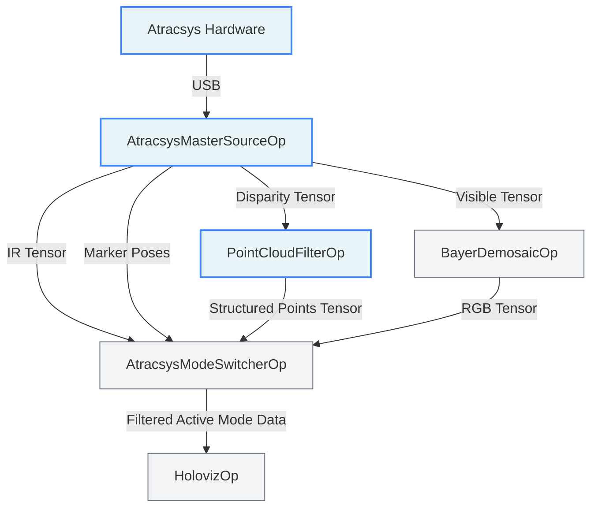

# Atracsys Visualizer

`atracsys_visualizer` is a replay-first HoloHub application for Atracsys visible, infrared,
structured-light, and tracking data. The default mode uses recorded streams so the visualization
stack can be built and exercised without proprietary live-camera dependencies.


## Visual Showcase

The animation above demonstrates the core imaging capabilities of the Atracsys spryTrack 300 camera: **Visible Mode**, **Infrared Mode**, and **Structured-Light Mode**, alongside its high-accuracy marker tracking.

When observing the different streams and enabling tracking (by pressing `4`), the visualizer behaves according to the camera's hardware constraints:

- **Infrared Mode + Tracking**: Since marker tracking natively utilizes the infrared sensors, both the IR video stream and the 3D marker overlay update simultaneously in real-time.
- **Visible & Structured-Light Modes + Tracking**: When tracking is activated during these modes, the last captured camera frame is frozen as a static background, while the real-time tracking of the registered marker is continuously rendered on top of it.

## Architecture



The application is split into:

- a required reusable `AtracsysModeSwitcherOp` operator
- an optional `atracsys_camera` operator package for live hardware input
- a single C++ application entrypoint with configuration via `atracsys_visualizer.yaml`

## SDK and Data Acquisition

### Getting the Atracsys SDKs

> **SDK status and usage notice:** This integration uses the engineering AArch64 version of the spryTrack SDK and S3DK for evaluation and development purposes only. The SDK libraries and headers are included solely to support this specific integration. Any extraction, reuse, redistribution, or separate use of these SDK/S3DK components outside this specific integration requires prior written approval. For a full-featured or production-ready integration, please contact the Wayland team.

The proprietary SDK components are not bundled in this repository. The AArch64 spryTrack SDK
and S3DK used by `live_camera` mode are integration-specific engineering versions, not certified
or officially supported Atracsys releases. Access and packaging are limited to this integration
and require prior written approval. Contact **<contact@wayland.io>** for a full-featured or
production-ready integration.

Replay mode remains the default public mode and does not require these proprietary live-camera
dependencies.

> **Note:** The S3DK SDK dynamically links against OpenCV. The provided wrapper and Dockerfile alias the `libopencv_world.so.4.10.0` library to `libopencv_world.so.410` based on the vendor's tested ABI compatibility with OpenCV 4.10. Ensure your S3DK version matches this requirement.

Recommended live SDK layout for HoloHub:

- Atracsys SDK config under `/opt/atracsys-4.9.0/cmake/Atracsys`
- S3DK root under `/opt/s3dk`

### Getting the Replay Dataset (High-Fidelity)

The application includes a CMake integration to fetch the required GXF datasets automatically. When you build or run the `replayer` mode, the dataset is automatically downloaded and extracted to `data/atracsys_visualizer` from the application's GitHub Release tag. No manual intervention is needed.

## Recording Your Own Data

If you have the physical hardware and wish to generate your own Replay GXF datasets, you can use the built-in [VideoStreamRecorderOp](https://docs.nvidia.com/holoscan/sdk-user-guide/operators/operators-and-extensions#videostreamrecorderop) and connect it to any of the camera ports in the `live_camera` mode.

## Marker Registration and Calibration

To track custom instruments with the spryTrack 300 camera, you must first register their geometry. The application includes a sample geometry file `geometry10.ini` representing a custom marker made of 4 reflective fiducials.

### Registration Procedure

1. Use the **Atracsys spryTrack GUI** to identify the raw fiducials.
2. Extract the fiducial coordinates and create a `.ini` file (see `geometry10.ini` for the format).
3. Perform the **Marker Recalibration** procedure to refine the geometry and ensure stable tracking.

For detailed instructions on registering new instruments and using the recalibration tool, please refer to the official **Atracsys SDK Documentation and Implementation Guide**.

## Build and run

> **Note:** The underlying dependencies (like OpenCV) currently require CUDA 12 to build successfully. Please append `--cuda 12` to your build and run commands.
>
> **Note:** The first container build compiles OpenCV 4.10 from source, so the initial `./holohub build` or `./holohub run` can take a significant amount of time. Subsequent runs should be faster once the container layers are cached.

Replay mode (Default):

```bash
./holohub build atracsys_visualizer --cuda 12
./holohub run atracsys_visualizer --cuda 12
```

Or, you can explicitly specify the mode:

```bash
./holohub build atracsys_visualizer replayer --cuda 12
./holohub run atracsys_visualizer replayer --cuda 12
```

Live mode:

```bash
./holohub build atracsys_visualizer live_camera --cuda 12
./holohub run atracsys_visualizer live_camera --cuda 12
```

## Controls

- `1`: Visible mode
- `2`: Infrared mode
- `3`: Structured-light mode
- `4`: Toggle tracking overlay on top of the current base mode (Visible/Infrared/Structured)
