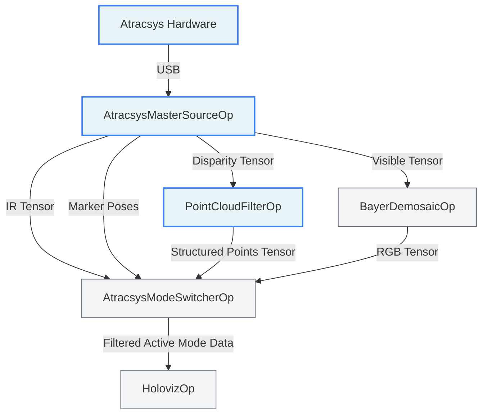

# Atracsys Visualizer

`atracsys_visualizer` is a replay-first HoloHub application for Atracsys visible, infrared,
structured-light, and tracking data. The default mode uses recorded streams so the visualization
stack can be built and exercised without proprietary live-camera dependencies.

## Architecture



The application is split into:
- a required reusable `AtracsysModeSwitcherOp` operator
- an optional `atracsys_camera` operator package for live hardware input
- a single C++ application entrypoint with configuration via `atracsys_visualizer.yaml`

## 📸 Visual Showcase
*(User Note: Insert your awesome GIFs/screenshots of the visualizer working here before merging the PR! To render properly, use ``)*

## SDK and Data Acquisition

### Getting the Atracsys SDKs
The Atracsys SDK and S3DK are proprietary hardware drivers and are **not** bundled in this repository. 
To run the `live_camera` mode, you must first obtain the SDKs directly from the vendor:
1. Contact Atracsys support for licensing and downloading the `atracsys-4.9.0` and `s3dk` toolchains.
2. Install them on your local machine.

Recommended live SDK layout for HoloHub:
- Atracsys SDK config under `/opt/atracsys-4.9.0/cmake/Atracsys`
- S3DK root under `/opt/s3dk`

### Getting the Replay Dataset (1GB High-Fidelity)
If you wish to test `replayer` mode using real hardware recordings instead of mocked test data, the complete 1GB 
GXF dataset can be requested:
1. Contact [Company Name] at [Contact Email/Link] to request the dataset zip file.
2. Extract the contents into `data/atracsys_visualizer/`.

## ⏺️ Recording Your Own Data

If you have the physical hardware and wish to generate your own Replay GXF datasets, you can attach the built-in [VideoStreamRecorderOp](https://docs.nvidia.com/holoscan/sdk-user-guide/holoscan_operators_extensions.html#videostreamrecorderop) to the `live_camera` mode!

```yaml
# Example YAML addition to record the Visible stream
recorder_visible:
  directory: "/tmp/my_recording"
  basename: "visible_base"
```
In `atracsys_visualizer.cpp`, instantiate the recorder and connect it to the `AtracsysMasterSourceOp`'s `visible_base` port:
```cpp
auto recorder = make_operator<holoscan::ops::VideoStreamRecorderOp>("recorder", from_config("recorder_visible"));
add_flow(camera_master, recorder, {{"visible_base", ""}});
```

## Build and run

Replay mode (Default):
```bash
# Important: On setups defaulting to CUDA 13+, you must explicitly specify --cuda 12 
# to avoid OpenCV compilation errors.
./holohub run atracsys_visualizer replayer --cuda 12
```

If you want to prebuild the application container and control the CUDA architecture used for the
OpenCV build, you can explicitly map your GPU's Compute Capability. This is crucial if HoloHub cannot perfectly auto-detect your exact NVIDIA driver.

Below is an example for Turing architecture (e.g., RTX 2080 uses `7.5`). You should pick the `CUDA_ARCH_BIN` that matches your local GPU:
- **Turing:** `7.5`
- **Ampere:** `8.6`
- **Ada Lovelace:** `8.9`
- **Jetson Orin:** `8.7`

```bash
./holohub build-container atracsys_visualizer \
  --cuda 12 \
  --build-args="--build-arg CUDA_ARCH_BIN=8.7"
```

Live mode follows the usual HoloHub pattern. However, if you explicitly pre-built the container with custom `--cuda` and `--build-args` overrides as shown above, you must append `--no-docker-build` to your daily `build` and `run` commands so Docker doesn't try to blindly rebuild the container ignoring your custom architecture!

```bash
./holohub build atracsys_visualizer live_camera --no-docker-build
./holohub run atracsys_visualizer live_camera --no-docker-build
```

If you prefer a local host/toolchain build instead of the container flow:
```bash
./holohub build atracsys_visualizer live_camera \
  --local \
  --build-with atracsys_camera \
  --configure-args="-DAtracsys_DIR=/opt/atracsys-4.9.0/cmake/Atracsys" \
  --configure-args="-DS3DK_ROOT=/opt/s3dk"
```

## Controls

- `1`: Visible mode
- `2`: Infrared mode
- `3`: Structured-light mode
- `4`: Tracking mode
