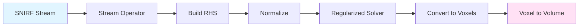
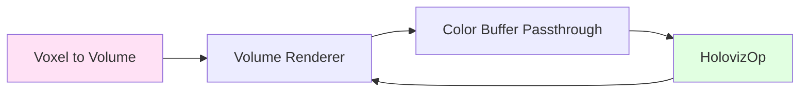

# Kernel Flow BCI Real-Time Reconstruction and Visualization

<p align="center">
  <br>
  <em>Example 3D visualization</em>
</p>

## Overview

This Holohub application demonstrates how to perform real-time source reconstruction and visualization of streaming functional brain data from the Kernel Flow 2 system. The application was developed and tested on an NVIDIA Jetson Thor paired with a Kernel Flow 2 headset. To lower the barrier to entry, we also provide recorded datasets and a data replayer, enabling developers to build and experiment with visualization and classification pipelines within the Holoscan framework without requiring access to the hardware.

This example processes streaming [moments from the distribution of time-of-flight histograms](https://doi.org/10.1117/1.NPh.10.1.013504). These moments can originate either from the [Kernel Flow SDK](https://docs.kernel.com/docs/kernel-sdk-install) when connected to the Kernel hardware, or from the included [shared near-infrared spectroscopy format (SNIRF)](https://github.com/fNIRS/snirf) replayer. The moments are then combined with the sensors' spatial geometry and an average anatomical head model to produce source-reconstructed outputs similar to what was [published in previous work](https://direct.mit.edu/imag/article/doi/10.1162/imag_a_00475/127769/A-Compact-Time-Domain-Diffuse-Optical-Tomography). 

To visualize the reconstructed 3D volumes, this application utilizes both the [VolumeRendererOp](../../operators/volume_renderer/) operator and HolovizOp for real-time 3D rendering and interactive visualization.

For optimal efficiency and smooth user experience, we employ an event-based scheduler that decouples the reconstruction and visualization pipelines. This allows each stage to run on separate threads, resulting in higher rendering quality and more responsive interaction.

## Background

Kernel Flow is a multimodal non-invasive brain measurement system. It combines the relatively high resolution of time-domain functional near-infrared spectroscopy (TD-fNIRS) with the fast temporal resolution of electroencephalography (EEG)
into a compact and scalable form factor that enables a new class of non-invasive Brain-Computer Interface (BCI) applications. 

The differentiating technology underlying the performance of the Kernel Flow system is the time-resolved detectors and high-speed laser drivers. Short (~100ps) pulses of near-infrared laser light (690nm & 905nm) are emitted into the user's head with a repetition rate of 20 MHz. The photons in these laser pulses scatter through the scalp, skull, and cerebrospinal fluid before reaching the brain and then scattering back out. When the photons emerge from
the scalp, we use single-photon sensitive detectors to timestamp exactly how much time the photon took to traverse through the head. The amount of time photons take to reach the detector is proportional to the path length traveled by the photon and the average depth it was able to reach. 

This simulation shows the relationship between photon scattering paths (black lines) and the measured time of flight (blue sections).  

<p align="center">
  <br>
  <em>The relationship between photon path lengths and measured time</em>
</p>

As you can see, later times correspond to photons that have travelled farther into the tissue. In a given second, we are timestamping over 10 billion individual photons, which generates an enormous amount of data. After compression, the data production rate of Kernel Flow is ~1GB/min.

As the photons scatter through the tissue, many of the photons are absorbed by cells and molecules in the tissue. In particular, the wavelengths we use are particularly sensitive to hemoglobin and its two states: oxyhemoglobin and deoxyhemoglobin, which allow us to follow the locations in the brain that are demanding and consuming oxygen and is an indirect measure of neuronal activity. These same biophysical principles are behind the pulse oximeters that are found in smart watches and finger-clip sensors! For more detailed information about the biophysics, [see this review article](https://www.mdpi.com/2076-3417/9/8/1612).

With the Kernel Flow headset we have combined 120 laser sources and 240 of our custom sensors to collect over 3000 measurement paths that criss-cross the head with a frame rate of 4.75Hz. When visualized, these paths resemble this:

<p align="center">
  <br>
  <em>The 3000+ measurements that are made with a Kernel Flow</em>
</p>

We call each of these measurement paths a "channel" and the measurement is made in "sensor space" (i.e. from the perspective of the detector). In order to have a more anatomical representation of the data, it is common to transform the
sensor-space data into source-space (i.e. where the changes in hemoglobin concentrations likely occurred in the brain, based on what was observed at the sensor) by solving an inverse problem, commonly called source reconstruction. This inverse problem requires complex modeling that is computationally expensive but highly parallelizable. 

In this Holohub application, we demonstrate a real-time source reconstruction pipeline that runs on a Jetson Thor at the native framerate of the Kernel Flow system (4.75 Hz) and visualizes the 3D data using volume rendering techniques.

## Requirements

This application was developed to run on an NVIDIA Jetson Thor Developer kit. Any Holoscan SDK supported platform should work. 

To run the application you need a streaming Kernel Flow data source. This can be either:
    
    * Kernel Flow hardware and SDK
    * Recorded `.snirf` files running with our data replayer.
    
## Quick Start

### 1. Download Required Data

The required data can be found on [Hugging Face](https://huggingface.co/datasets/KernelCo/holohub_bci_visualization/tree/main). The dataset includes:
- **SNIRF data file** (`data.snirf`): Recorded brain activity measurements. More recorded snirf file can be found on [OpenNeuro](https://openneuro.org/datasets/ds006545).
- **Anatomy masks** (`anatomy_labels_high_res.nii.gz`): Brain tissue segmentation (skin, skull, CSF, gray matter, white matter)
- **Reconstruction matrices**: Pre-computed Jacobian and voxel information

To prepare the required data for this application, download the dataset into `holohub/data/bci_visualization` as described in the [expected data folder structure](#expected-data-folder-structure).

From the `holohub` directory, use the following command:
```
hf download KernelCo/holohub_bci_visualization --repo-type dataset --local-dir data/bci_visualization
```


### Expected Data Folder Structure

Download the correct folder matching your device type along with the other files into `data/bci_visualization`. Your `data/bci_visualization` folder should have the following structure:

```
holohub/data/bci_visualization/
├── anatomy_labels_high_res.nii.gz      # Brain segmentation
├── data.snirf                          # SNIRF format brain activity data
├── extinction_coefficients_mua.csv     # Absorption coefficients for HbO/HbR
├── flow_channel_map.json               # Sensor-source channel mapping
├── flow_mega_jacobian.npy              # Pre-computed sensitivity matrix (channels → voxels)
└── voxel_info/                         # Voxel geometry and optical properties
    ├── affine.npy                      # 4x4 affine transformation matrix
    ├── idxs_significant_voxels.npy     # Indices of voxels with sufficient sensitivity
    ├── ijk.npy                         # Voxel coordinates in volume space
    ├── mua.npy                         # Absorption coefficient per voxel
    ├── musp.npy                        # Reduced scattering coefficient per voxel
    ├── resolution.npy                  # Voxel resolution (mm)
    ├── wavelengths.npy                 # Measurement wavelengths (690nm, 905nm)
    └── xyz.npy                         # Voxel coordinates in anatomical space (mm)
```

### 2. Run the Application

Stream moments from data.snirf
```bash
./holohub run bci_visualization
```

Stream moments from Flow headset via Kernel SDK
```bash
./holohub run bci_visualization --docker-opts="-e KERNEL_SDK=1 -v /etc/kernel.com/kortex.json:/etc/kernel.com/kortex.json"
```

## Pipeline Overview

The application consists of two main pipelines running on separate threads:

### Reconstruction Pipeline
Transforms sensor-space measurements into 3D brain activity maps:



**Key Steps:**
1. **Stream Operator**: Reads SNIRF data and emits time-of-flight moments
2. **Build RHS**: Constructs the right-hand side of the inverse problem from the streaming moments taking into account the channel mapping
3. **Normalize**: Normalizes the moments to hard-coded upper bounds
4. **Regularized Solver**: Solves the inverse problem
5. **Convert to Voxels**: Maps solution to 3D voxel coordinates with HbO/HbR conversion
6. **Voxel to Volume**: Resamples to match anatomy mask, applies adaptive normalization

### Visualization Pipeline
Renders 3D brain volumes with real-time interaction:



**Key Steps:**
1. **Volume Renderer**: GPU-accelerated ray-casting with ClaraViz (tissue segmentation + activation overlay)
2. **Color Buffer Passthrough**: Queue management with POP policy to prevent frame stacking
3. **HolovizOp**: Interactive 3D display with camera controls (bidirectional camera pose feedback)

## Volume Renderer Configuration

The `config.json` file in the data folder configures the ClaraViz volume renderer. For detailed documentation, see the [VolumeRenderer operator documentation](../../operators/volume_renderer/) and [ClaraViz proto definitions](https://github.com/NVIDIA/clara-viz/blob/main/src/protos/nvidia/claraviz/cinematic/v1/render_server.proto).

### Key Configuration Parameters

#### 1. Rendering Quality
```json
{
  "timeSlot": 100
}
```
- **`timeSlot`** (milliseconds): Rendering time budget per frame
  - Higher values = better quality
  - Lower values = faster rendering

#### 2. Transfer Functions
The transfer function maps voxel values to colors and opacity. This application uses **three components**.

##### Component 1: Brain Tissue Base (Gray/White Matter)
```json
{
  "activeRegions": [3, 4],
  "range": { "min": 0, "max": 1 },
  "opacity": 0.5,
  "opacityProfile": "SQUARE",
  "diffuseStart": { "x": 1, "y": 1, "z": 1 },
  "diffuseEnd": { "x": 1, "y": 1, "z": 1 }
}
```
- **`activeRegions`**: Tissue types to render
  - `0`: Skin, `1`: Skull, `2`: CSF, `3`: Gray matter, `4`: White matter, `5`: Air
  - Here: `[3, 4]` = gray and white matter only
- **`range`**: `[0, 1]` = full normalized value range
- **`opacity`**: `0.5` = semi-transparent base layer
- **`opacityProfile`**: `"SQUARE"` = constant opacity throughout range
- **`diffuseStart/End`**: `[1, 1, 1]` = white base color

##### Component 2: Negative Activation / Deactivation (Blue)
```json
{
  "activeRegions": [3, 4],
  "range": { "min": 0, "max": 0.4 },
  "opacity": 1.0,
  "opacityProfile": "SQUARE",
  "diffuseStart": { "x": 0.0, "y": 0.0, "z": 1.0 },
  "diffuseEnd": { "x": 0.0, "y": 0.0, "z": 0.5 }
}
```
- **`range`**: `[0, 0.4]` = lower 40% of normalized range (deactivation)
- **`opacity`**: `1.0` = fully opaque
- **`opacityProfile`**: `"SQUARE"` = constant opacity
- **`diffuseStart/End`**: `[0, 0, 1]` → `[0, 0, 0.5]` = bright blue to dark blue gradient

##### Component 3: Positive Activation (Red)
```json
{
  "activeRegions": [3, 4],
  "range": { "min": 0.6, "max": 1 },
  "opacity": 1.0,
  "opacityProfile": "SQUARE",
  "diffuseStart": { "x": 0.5, "y": 0.0, "z": 0.0 },
  "diffuseEnd": { "x": 1.0, "y": 0.0, "z": 0.0 }
}
```
- **`range`**: `[0.6, 1]` = upper 40% of normalized range (activation)
- **`opacity`**: `1.0` = fully opaque
- **`opacityProfile`**: `"SQUARE"` = constant opacity
- **`diffuseStart/End`**: `[0.5, 0, 0]` → `[1, 0, 0]` = dark red to bright red gradient

#### 3. Blending
```json
{
  "blendingProfile": "BLENDED_OPACITY"
}
```
- **`blendingProfile`**: How overlapping components combine
  
### Visualization Strategy

The three-component approach creates a layered visualization:

1. **Base layer** (white, 50% opacity): Shows overall brain structure (gray + white matter) throughout the full range [0, 1]
2. **Blue overlay** (100% opacity): Highlights low values [0, 0.4] representing decreased hemoglobin.
3. **Red overlay** (100% opacity): Highlights high values [0.6, 1] representing increased hemoglobin.
4. **Neutral range** [0.4, 0.6]: Only shows the white base layer (no significant change)