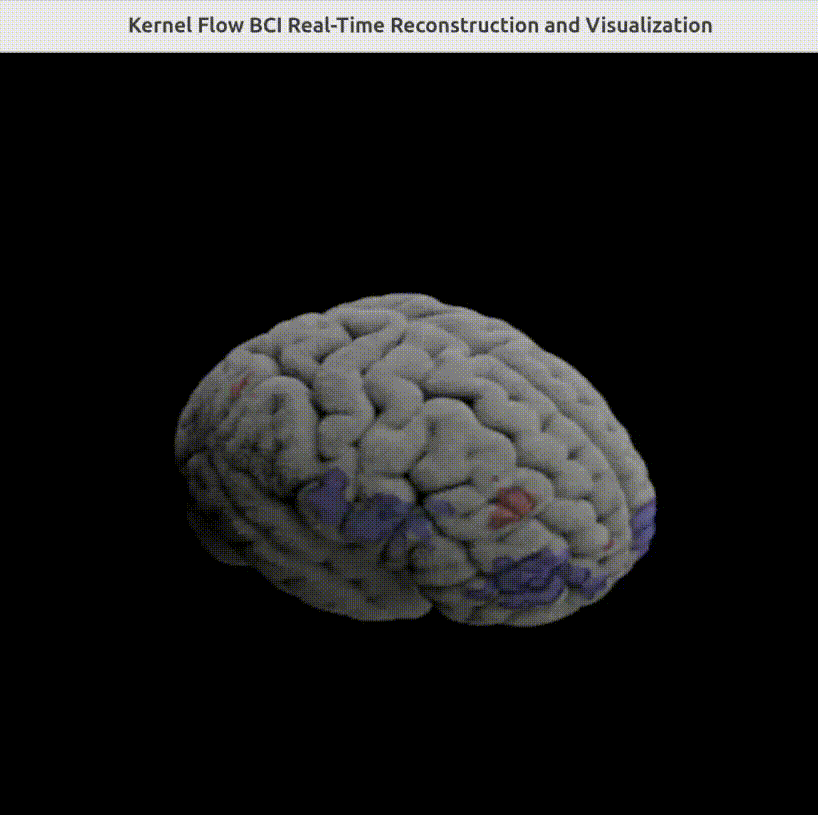
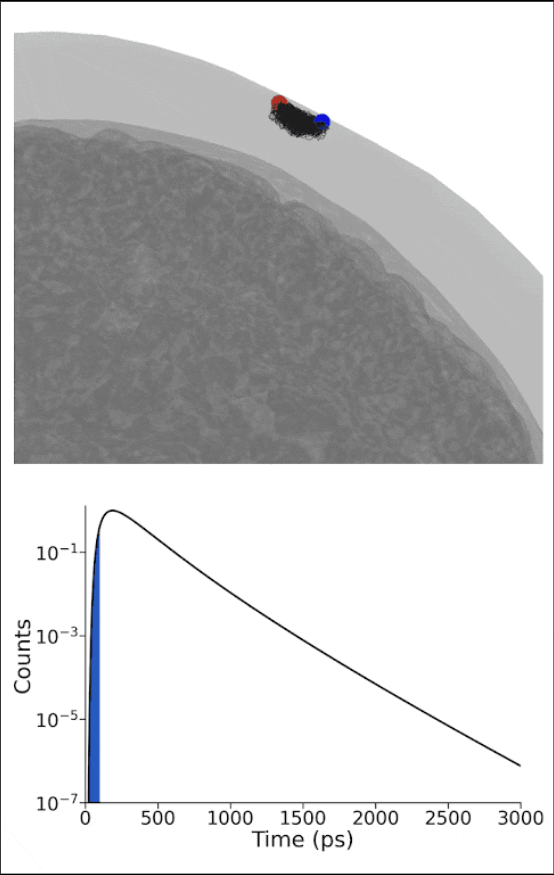
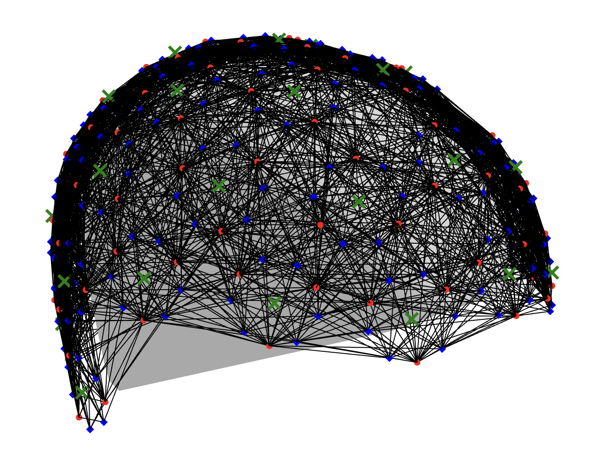

# Kernel Flow BCI Real-Time Reconstruction and Visualization

<p align="center">
  <br>
  <em>Example 3D visualization</em>
</p>

## Overview

This Holohub application demonstrates how to perform real-time source reconstruction and visualization of streaming functional brain data from the Kernel Flow 2 system. The application was developed and tested on an NVIDIA Jetson Thor paired with a Kernel Flow 2 headset. To lower the barrier to entry, we also provide recorded datasets and a data replayer, enabling developers to build and experiment with visualization and classification pipelines within the Holoscan framework without requiring access to the hardware.

This example processes streaming [moments from the distribution of time-of-flight histograms](https://doi.org/10.1117/1.NPh.10.1.013504). These moments can originate either from the [Kernel Flow SDK](https://docs.kernel.com/docs/kernel-sdk-install) when connected to the Kernel hardware, or from the included [shared near-infrared spectroscopy format (SNIRF)](https://github.com/fNIRS/snirf) replayer. The moments are then combined with the sensors' spatial geometry and an average anatomical head model to produce source-reconstructed outputs similar to what was [published in previous work](https://direct.mit.edu/imag/article/doi/10.1162/imag_a_00475/127769/A-Compact-Time-Domain-Diffuse-Optical-Tomography). The
resulting 3D volumes are displayed using the Holoviz framework.

## Background

Kernel Flow is a multimodal non-invasive brain measurement system. It combines the relatively high resolution of time-domain functional near-infrared spectroscopy (TD-fNIRS) with the fast temporal resolution of electroencephalography (EEG)
into a compact and scalable form factor that enables a new class of non-invasive Brain-Computer Interface (BCI) applications. 

The differentiating technology underlying the performance of the Kernel Flow system is the time-resolved detectors and high-speed laser drivers. Short (~100ps) pulses of near-infrared laser light (690nm & 905nm) are emitted into the user's head with a repetition rate of 20 MHz. The photons in these laser pulses scatter through the scalp, skull, and cerebrospinal fluid before reaching the brain and then scattering back out. When the photons emerge from
the scalp, we use single-photon sensitive detectors to timestamp exactly how much time the photon took to traverse through the head. The amount of time photons take to reach the detector is proportional to the path length traveled by the photon and the average depth it was able to reach. 

This simulation shows the relationship between photon scattering paths (black lines) and the measured time of flight (blue sections).  

<p align="center">
  <br>
  <em>The relationship between photon path lengths and measured time</em>
</p>

As you can see, later times correspond to photons that have travelled farther into the tissue. In a given second, we are timestamping over 10 billion individual photons, which generates an enormous amount of data. After compression, the data production rate of Kernel Flow is ~1GB/min.

As the photons scatter through the tissue, many of the photons are absorbed by cells and molecules in the tissue. In particular, the wavelengths we use are particularly sensitive to hemoglobin and its two states: oxyhemoglobin and deoxyhemoglobin, which allow us to follow the locations in the brain that are demanding and consuming oxygen and is an indirect measure of neuronal activity. These same biophysical principles are behind the pulse oximeters that are found in smart watches and finger-clip sensors! For more detailed information about the biophysics, [see this review article](https://www.mdpi.com/2076-3417/9/8/1612).

With the Kernel Flow headset we have combined 120 laser sources and 240 of our custom sensors to collect over 3000 measurement paths that criss-cross the head with a frame rate of 4.75Hz. When visualized, these paths resemble this:

<p align="center">
  <br>
  <em>The 3000+ measurements that are made with a Kernel Flow</em>
</p>

We call each of these measurement paths a "channel" and the measurement is made in "sensor space" (i.e. from the perspective of the detector). In order to have a more anatomical representation of the data, it is common to transform the
sensor-space data into source-space (i.e. where the changes in hemoglobin concentrations likely occurred in the brain, based on what was observed at the sensor) by solving an inverse problem, commonly called source reconstruction. This inverse problem requires complex modeling that is computationally expensive but highly parallelizable. 

In this Holohub application, we demonstrate a real-time source reconstruction pipeline that runs on a Jetson Thor at the native framerate of the Kernel Flow system (4.75 Hz) and visualizes the data in 3D using Holoviz. We did this by X, Y,
and Z (@Gabe or @Mimi to add high-level).

## Requirements

This application was developed to run on an NVIDIA Jetson Thor Developer kit. Any Holoscan SDK supported platform should work. 

To run the application you need a streaming Kernel Flow data source. This can be either:
    - Kernel Flow hardware and SDK
    - Downloaded `.snirf` files for use with the included data replayer. Example data can be found on [OpenNeuro](https://openneuro.org/datasets/ds006545) and copied locally to be run through the replayer. 
    
   ```bash
   wget -0 data/examples/data.snirf "https://s3.amazonaws.com/openneuro.org/ds006545/sub-bed8fefe/ses-1/nirs/sub-bed8fefe_ses-1_task-audio_nirs.snirf?versionId=sYFJNjlNNlf8xVOMsIde5hpWZE2clsiu"
   ```

## Running
1. Download data
   * Please download data from [here](https://drive.google.com/drive/folders/1RpQ6UzjIZAr90FdW9VIbtTFYR6-up7w2) and put everything under `data/bci_visualization`.
   * Includes an activation volume and a segmentation volume.
2. Run application
   ```bash
   ./holohub run bci_visualization
   ```
   This command will build the docker and run the application.

### Components

1. **VoxelStreamToVolumeOp** (`operators/voxel_stream_to_volume/voxel_stream_to_volume.py`): Bridge operator that converts sparse voxel data to dense volume
   - Inputs: `affine_4x4`, `hb_voxel_data`
   - Outputs: `volume`, `spacing`, `permute_axis`, `flip_axes`, `mask_volume`, `mask_spacing`, `mask_permute_axis`, `mask_flip_axes`

2. **VolumeRendererOp**: ClaraViz-based volume renderer
   - Renders the 3D volume with transfer functions
   - Supports interactive camera control

3. **HolovizOp**: Interactive visualization
   - Displays the rendered volume
   - Provides camera pose feedback


## Data Flow

```
Reconstruction → VoxelStreamToVolume → VolumeRenderer → Holoviz
                                             ↑               ↓
                                             └─── camera ────┘
```

## Volume Renderer Configuration
Here are some of the important config:
1. `timeSlot`: Rendering time in ms. The longer the better the quality.
2. `TransferFunction`

   a. `activeRegions`:  (0: SKIN, 1: SKULL, 2: CSF, 3: GRAY MATER, 4: WHITE MATTER, 5: AIR). Here, we select [3, 4] for our ROI. Set everything else as opacity=0 (default).
   
   b. `blendingProfile`: If there're overlapping components configured, how to blend.

   c. `range`: Volume's value within this range to be configured. 

   d. `opacityProfile`: How opacity is being applied within this range. Select `Square` for constant.

   e. `diffuseStart/End`: The component's color. Linear interpolation between start/end.

   Note: there are three components configured. First is for overall ROI, set color as white. Second is for positive activation, set as red. Third is for negative activation, set as blue.
