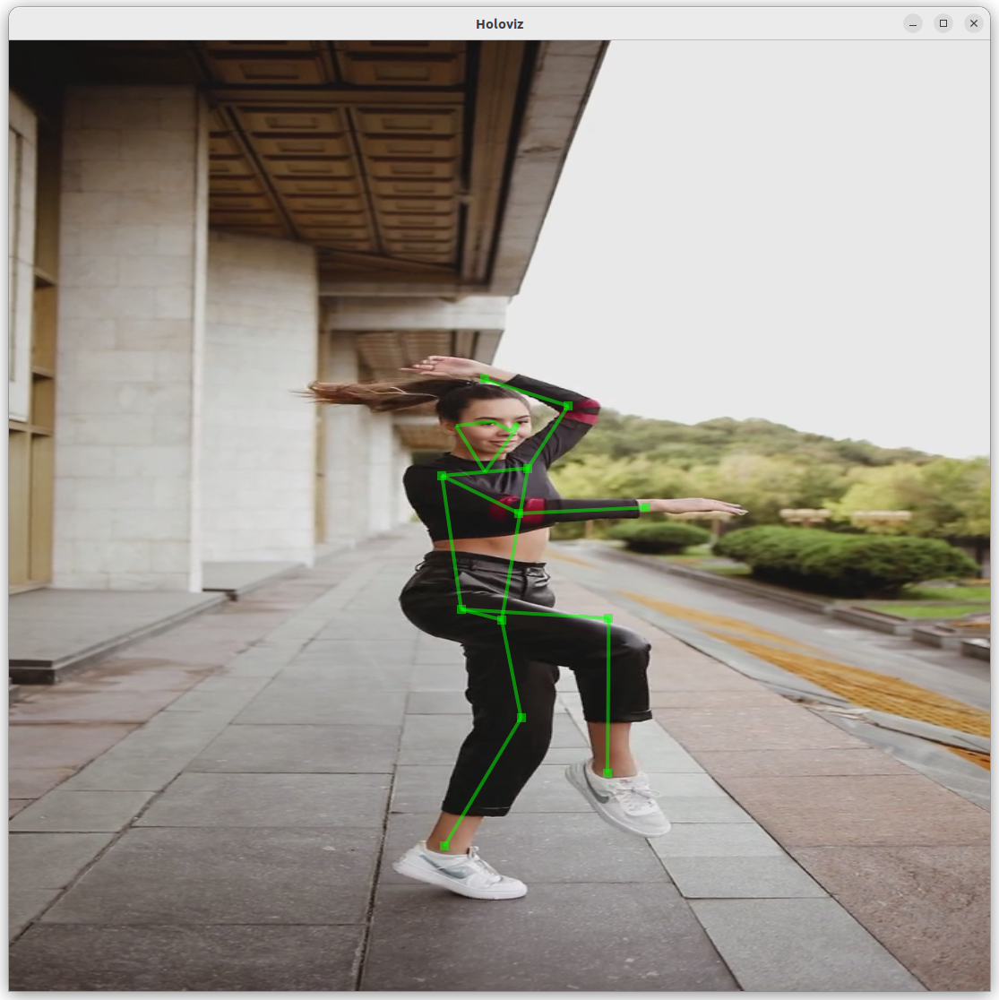
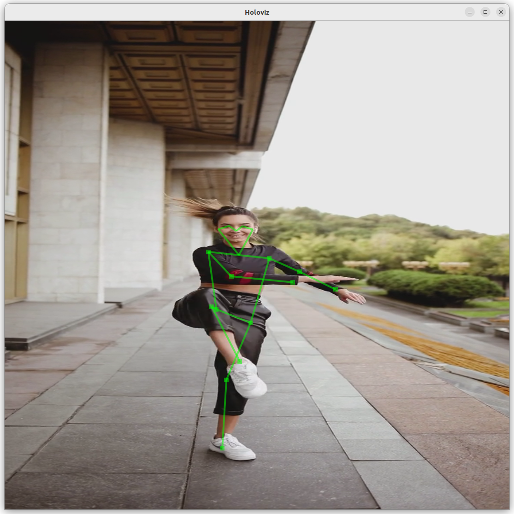
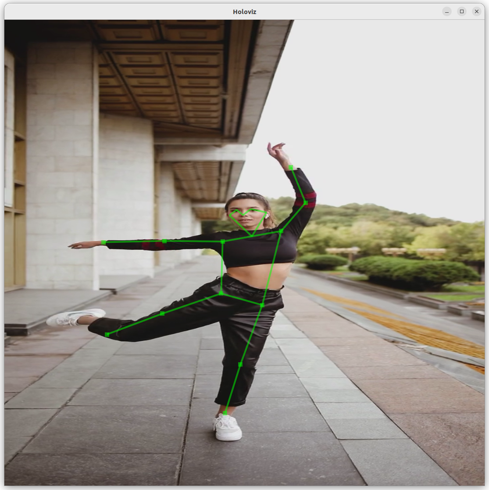

# Body Pose Estimation App
<div align="center">
    
    
    
</div>

Body pose estimation is a computer vision task that involves recognizing specific points on the human body in images or videos.
A model is used to infer the locations of keypoints from the source video which is then rendered by the visualizer. 

## Model

This application uses YOLOv8 pose model from [Ultralytics](https://docs.ultralytics.com/tasks/pose/) for body pose estimation.
The model is downloaded when building the application.

## Data

This application downloads a pre-recorded video from [Pexels](https://www.pexels.com/video/a-woman-showing-her-ballet-skill-in-turning-one-footed-5385885/) when the application is built for use with this application.  Please review the [license terms](https://www.pexels.com/license/) from Pexels.

> **_NOTE:_** The user is responsible for checking if the dataset license is fit for the intended purpose.

## Input

This app currently supports three different input options:

1. v4l2 compatible input device (default, see V4L2 Support below)
2. pre-recorded video (see Video Replayer Support below)
3. DDS video stream (see DDS Support below)

## Run Instructions

## V4L2 Support

This application supports v4l2 compatible devices as input.  To run this application with your v4l2 compatible device,
please plug in your input device and run:
```sh
./dev_container build_and_run body_pose_estimation
```

By default, this application expects the input device to be mounted at `/dev/video0`.  If this is not the case, please update
`applications/body_pose_estimation/body_pose_estimation.yaml` and set it to use the corresponding input device before
running the application.  You can also override the default input device on the command line by running:
```sh
./dev_container build_and_run body_pose_estimation --run_args "--video_device /dev/video0"
```

## Video Replayer Support

If you don't have a v4l2 compatible device plugged in, you may also run this application on a pre-recorded video.
To launch the application using the Video Stream Replayer as the input source, run:

```sh
./dev_container build_and_run body_pose_estimation --run_args "--source replayer"
```

## DDS Support

This application supports using a DDS video stream as the input as well as
publishing the output video stream back to DDS. To enable DDS, the application
must first be built with the DDS operators enabled. Only the subscriber or
publisher operators need to be enabled for the sake of input or output video
streams, respectively, but to enable both use the following:

```sh
./run build body_pose_estimation --with "dds_video_subscriber;dds_video_publisher"
```

Note that building these operators requires [RTI Connext](https://content.rti.com/l/983311/2024-04-30/pz1wms)
be installed. See the [DDS Operator Documentation](../../operators/dds/README.md)
for more information on how to build the operators. If using a development
container, see the [additional instructions below](#using-a-development-container-with-dds-support).

To use a DDS video stream as the input to the application, use the `-s=dds`
argument when running the application:

```sh
./run launch body_pose_estimation --extra_args -s=dds
```

To publish the output result to DDS, edit the `body_pose_estimation.yaml`
configuration file so that the `dds_publisher` `enable` option is `true`:

```yaml
dds_publisher:
  enable: true
```

Note that the default DDS video stream IDs use by the application are `0` for
the input and `1` for the output. These can be changed using the `stream_id`
settings in the `dds_source` and `dds_publisher` sections of the configuration
file, respectively.

To produce the DDS input stream or to view the output stream generated by this
application, the [dds_video](../dds_video/README.md) application can be used.
For example, the following will use the `dds_video` application to capture
video from the default V4L2 device and publish it to DDS so that it can be
received as input by this application:

```sh
./run build dds_video
./run launch dds_video --extra_args "-p -i 0"
```

And the following will use the `dds_video` application to receive and render
the output published by this application:


```sh
./run launch dds_video --extra_args "-s -i 1"
```

### Using a Development Container with DDS Support

Installing RTI Connext into the development container is not currently
supported, so enabling DDS support with this application requires RTI Connext
be installed onto the host and then mounted into the container at runtime.
To mount RTI Connext into the container, ensure that the `NDDSHOME` environment
variable is set to the path of the RTI Connext installation on the host and
then use the following:

```sh
./dev_container launch --img holohub:bpe --docker_opts "-v $NDDSHOME:/opt/dds -e NDDSHOME=/opt/dds"
```
