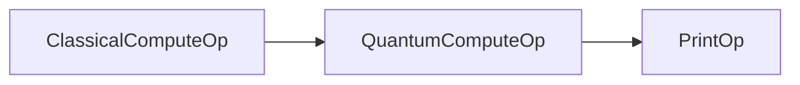

# CUDA Quantum Variational Quantum Eigensolver (VQE)

## Variational Quantum Eigensolver (VQE)
The Variational Quantum Eigensolver (VQE) is a quantum algorithm designed to approximate the ground state energy of quantum systems. This energy, represented by what is called the Hamiltonian of the system, is central to multiple disciplines, including drug discovery, material science, and condensed matter physics. The goal of VQE is to find the state that minimizes the expectation value of this Hamiltonian, which corresponds to the ground state energy.

At its core, VQE is a lighthouse example of the synergy between classical and quantum computing, requiring them both to tackle problems traditionally deemed computationally intractable. Even in the current landscape where fault-tolerant quantum computing—a stage where quantum computers are resistant to errors—is not yet realized, VQE is seen as a practical tool. This is due to its design as a 'near-term' algorithm, built to operate on existing noisy quantum hardware. 

## Key Components of VQE
1. **Hamiltonian**: This represents the total energy of the quantum system, which is known ahead of time. In VQE, we aim to find the lowest eigenvalue (ground state energy) of this Hamiltonian.
  
2. **Ansatz (or trial wavefunction)**: The ansatz is the initial guess for the state of the quantum system, represented by a parameterized quantum circuit. It's crucial for this state to be a good representation, as the quality of the ansatz can heavily influence the final results. VQE iteratively refines the parameters of this ansatz to approximate the true ground state of the Hamiltonian.

## VQE Mechanism
The VQE operates by employing a hybrid quantum-classical approach:

1. **Quantum Circuit Parameterization**: VQE begins with a parameterized quantum circuit, effectively serving as an initial guess or representation of the system's state.
2. **Evaluation and Refinement**: The quantum system's energy is evaluated using the current quantum circuit parameters. Classical optimization algorithms then adjust these parameters in a quest to minimize the energy.
3. **Iterative Process**: The combination of quantum evaluation and classical refinement is iterative. Over multiple cycles, the parameters are tuned to get increasingly closer to the true ground state energy.

## Integration with Holoscan and CUDA Quantum
- **NVIDIA Holoscan SDK**: The Holoscan SDK is designed for efficient handling of high-throughput, low-latency GPU tasks. Within the context of VQE, the Holoscan SDK facilitates the rapid classical computations necessary for parameter adjustments and optimization. The `ClassicalComputeOp` in the provided code sample is an example of this SDK in action, preparing the quantum circuits efficiently.
- **CUDA Quantum**: CUDA Quantum is a framework that manages hybrid quantum-classical workflows. For VQE, CUDA Quantum processes quantum data and executes quantum operations. The `QuantumComputeOp` operator in the code uses the cuQuantum simulator backend, but the user may optionally switch out the simulator for a real quantum cloud backend provided by either IonQ or Quantinuum ([see CUDA Quantum backend documentation](https://nvidia.github.io/cuda-quantum/latest/using/hardware.html#)).

Holoscan ensures swift and efficient classical computations, while CUDA Quantum manages the quantum components with precision.

## Usage

To run the application, you need to have CUDA Quantum, Qiskit, and Holoscan installed. You also need an IBM Quantum account to use their quantum backends.

1. Clone the repository and navigate to the `cuda_quantum` directory containing.

2. Install the requirements `pip install -r requirements.txt`

3. Either use or replace the `'hamiltonian'` in `cuda_quantum.yaml` dependent on the physical system you wish to model.

4. Run the application with the command `python cuda_quantum.py`.

## Operators

The application uses three types of operators:

- `ClassicalComputeOp`: This operator performs classical computations. It also creates a quantum kernel representing the initial ansatz, or guess of the state of the system, and a Hamiltonian.

- `QuantumComputeOp`: This operator performs quantum computations. It uses the quantum kernel and Hamiltonian from `ClassicalComputeOp` to iterate towards the ground state energy and parameter using VQE.

- `PrintOp`: This operator prints the result from `QuantumComputeOp`.

## Operator Connections

The operators are connected as follows:



`ClassicalComputeOp` sends the quantum kernel and Hamiltonian to `QuantumComputeOp`, which computes the energy and parameter and sends the result to `PrintOp`.

## Dev Container

To start the the Dev Container, run the following command from the root directory of Holohub:

```bash
./holohub vscode cuda_quantum
```

### VS Code Launch Profiles

There are two launch profiles configured for this application:

1. **(debugpy) cuda_quantum/python**: Launch cuda_quantum using a launch profile that enables debugging of Python code.
2. **(pythoncpp) cuda_quantum/python**: Launch cuda_quantum using a launch profile that enables debugging of Python and C++ code.

Note: to adjust the arguments of the application, open [launch.json](../../.vscode/launch.json), find the launch profile named `(debugpy) cuda_quantum/python`, and adjust the `args` field as needed.
