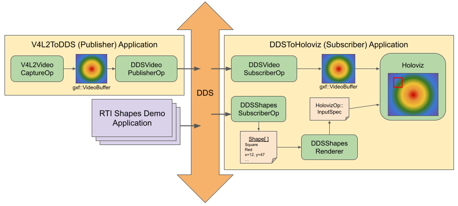

# DDS Video: Real-time Video Streaming with RTI Connext

Before running this application, read the
[RTI Connext DDS Module overview](../../../modules/holoscan-connext-dds/README.md)
for the supported versions, container requirements, and license setup.

The DDS Video application publishes or subscribes to video frames through an
RTI Connext DDS databus. DDS is always part of the data path: the publisher
writes the [`VideoFrame`](../../../operators/dds/video/VideoFrame.idl) topic and
the subscriber reads that topic.

The publisher can use either a V4L2 camera or an animated 640x480 RGBA test
pattern with RTI white, blue, and orange bands. The synthetic source makes it
possible to validate the complete DDS path on systems without a camera.

The subscriber normally renders video with Holoviz and overlays shapes received
from the RTI Shapes Demo. With `--no-display`, it instead validates received
frames and periodically reports their count and dimensions. This mode is useful
on headless systems and in CI.



## Prerequisites

- Docker and the HoloHub prerequisites.
- A valid RTI Connext license. You can request or download the license used by
  this repository with:

  ```sh
  curl -fL 'https://content.rti.com/l/983311/2025-07-25/q6729c' -o rti_license.dat
  ```

- A V4L2-compatible camera only when using the camera publisher. No camera is
  required for the synthetic example.

RTI Connext DDS 7.7.0 and its native C++ code generator are installed in the
application container by the Dockerfile declared in HoloHub metadata. Nothing
from Connext needs to be installed on the host.

## Headless end-to-end example

Build through HoloHub from the repository root:

```sh
./holohub build dds_video --language cpp
```

Open two terminals. Start the subscriber first:

```sh
./holohub run --no-local-build dds_video \
  --run-args='--subscriber --no-display' \
  --docker-opts="-v ${PWD}/rti_license.dat:/opt/rti.com/rti_connext_dds-7.7.0/rti_license.dat:ro"
```

Then start the synthetic publisher:

```sh
./holohub run --no-local-build dds_video \
  --run-args='--publisher --synthetic' \
  --docker-opts="-v ${PWD}/rti_license.dat:/opt/rti.com/rti_connext_dds-7.7.0/rti_license.dat:ro"
```

The subscriber confirms the DDS path with messages similar to:

```text
Received 1 DDS video frames (640x480)
Received 30 DDS video frames (640x480)
Received 60 DDS video frames (640x480)
```

To save the first frame reconstructed by the subscriber from DDS, mount a
temporary output directory and use `--screenshot`:

```sh
mkdir -p /tmp/holohub-dds-capture
./holohub run --no-local-build dds_video \
  --run-args='--subscriber --no-display --screenshot=/capture/dds_rx.ppm' \
  --docker-opts="-v ${PWD}/rti_license.dat:/opt/rti.com/rti_connext_dds-7.7.0/rti_license.dat:ro -v /tmp/holohub-dds-capture:/capture"
```

After starting the publisher, the received image is available at
`/tmp/holohub-dds-capture/dds_rx.ppm`. The screenshot is written by the RX
pipeline after DDS deserialization, not by the synthetic source.

Both processes use DDS. `--no-display` replaces only visualization; it does not
bypass the DDS publisher or subscriber operators. When neither `DISPLAY` nor
`WAYLAND_DISPLAY` is available, subscriber mode also selects this headless path
automatically.

## Camera and display modes

To publish from `/dev/video0`, omit `--synthetic`:

```sh
./holohub run --no-local-build dds_video \
  --run-args='--publisher' \
  --docker-opts="-v ${PWD}/rti_license.dat:/opt/rti.com/rti_connext_dds-7.7.0/rti_license.dat:ro"
```

The application checks that `/dev/video0` is a usable capture device and selects
the first supported mode among 640x480, 1280x720, and 1920x1080. It exits with a
clear error instead of starting the graph when no compatible camera is present.

On a system with a forwarded graphical display, omit `--no-display` to render
the DDS video stream with Holoviz:

```sh
./holohub run --no-local-build dds_video \
  --run-args='--subscriber' \
  --docker-opts="-v ${PWD}/rti_license.dat:/opt/rti.com/rti_connext_dds-7.7.0/rti_license.dat:ro"
```

Use `--domain=ID` and `--id=ID` on both processes to select another DDS domain
or video stream. The publisher and subscriber can run on the same system or on
different mutually discoverable systems.

The commands in this README use Bash syntax. In `tcsh`, replace `${PWD}` with
`${cwd}`.

## Network and QoS configuration

Communication between separate systems uses UDPv4. The supplied
`qos_profiles.xml` increases Connext socket buffers for video traffic. The host
kernel limits may therefore also need adjustment; see
`set_socket_buffer_sizes.sh` and the [RTI guide to improving DDS network
performance on Linux](https://community.rti.com/howto/improve-rti-connext-dds-network-performance-linux-systems).

The application QoS can be changed in `qos_profiles.xml`. Refer to the
[RTI Connext 7.7.0 documentation](https://community.rti.com/static/documentation/connext-dds/7.7.0/doc/manuals/connext_dds_professional/index.html)
for the QoS policy reference.

## Publishing shapes from RTI Shapes Demo

The [RTI Shapes Demo](https://www.rti.com/free-trial/shapes-demo) can publish
shapes that the graphical subscriber overlays on the video. Configure Shapes
Demo to use this application's QoS:

1. Open **Controls > Configuration** and stop the default participant.
2. Select **Manage QoS**, add this application's `qos_profiles.xml`, and close
   the dialog.
3. Select `HoloscanDDSTransport::SHMEM+LAN` as the participant profile.
4. Start the participant and publish `Square`, `Circle`, or `Triangle` samples.

Shapes are intentionally not created in `--no-display` mode because that mode
only verifies the DDS video stream.
