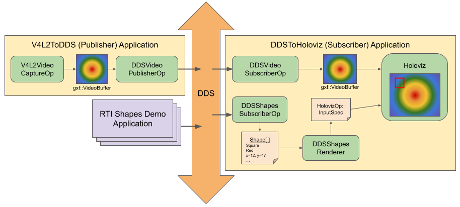

# DDS Video: Real-time Video Streaming with RTI Connext

The DDS Video application demonstrates how video frames can be written to or
read from a DDS databus in order to provide flexible integration between
Holoscan applications and other applications (using Holoscan or not) via DDS.

The application can be run as either a publisher or as a subscriber. In either case,
it will use the [VideoFrame](../../../operators/dds/video/VideoFrame.idl) data topic
registered by the `DDSVideoPublisherOp` or `DDSVideoSubscriberOp` operators in order
to write or read the video frame data to/from the DDS databus, respectively.

When run as a publisher, the source for the input video frames will come from an
attached V4L2-compatible camera via the `V4L2VideoCaptureOp` operator.

When run as a subscriber, the application will use Holoviz to render the received
video frames to the display. In addition to the video stream, the subscriber
application will also subscribe to the `Square`, `Circle`, and `Triangle` topics
as used by the [RTI Shapes Demo](https://www.rti.com/free-trial/shapes-demo).
Any shapes received by this subscriber will also be overlaid on top of the
Holoviz output.



## Prerequisites

- This application requires an installation of [RTI Connext Express](https://content.rti.com/l/983311/2025-07-08/q5x1n8) to provide access to the DDS domain.
To obtain a license/activation key, please [click here](https://content.rti.com/l/983311/2025-07-25/q6729c). Please see the [usage rules](https://www.rti.com/products/connext-express) for Connext Express.
- V4L2 capable device

> [!NOTE]  
> Instructions below are based on the `.run' installer from RTI Connext. Refer to the
> [Linux installation](https://community.rti.com/static/documentation/developers/get-started/full-install.html)
> for details.


## Quick Start

```bash
# Start the publisher
./holohub run dds_video --docker-opts="-v $HOME/rti_connext_dds-7.3.0:/opt/rti.com/rti_connext_dds-7.3.0/" --run-args="-p"

# Start the subscriber
./holohub run dds_video --docker-opts="-v $HOME/rti_connext_dds-7.3.0:/opt/rti.com/rti_connext_dds-7.3.0/" --run-args="-s"
```


## Building the Application

To build on an IGX devkit (using the `armv8` architecture), follow the
[instructions to build Connext DDS applications for embedded Arm targets](https://community.rti.com/kb/how-do-i-create-connext-dds-application-rti-code-generator-and-build-it-my-embedded-target-arm)
up to, and including, step 5 (Installing Java and setting JREHOME).

To build the application, the `RTI_CONNEXT_DDS_DIR` CMake variable must point to
the installation path for RTI Connext. This can be done automatically by setting
the `NDDSHOME` environment variable to the RTI Connext installation directory
(such as when using the RTI `setenv` scripts), or manually at build time, e.g.:

```sh
./holohub build --local dds_video --configure-args="-DRTI_CONNEXT_DDS_DIR=~/rti/rti_connext_dds-7.3.0"
```

### Building with a Container

Due to the license requirements of RTI Connext it is not currently supported to
install RTI Connext into a development container. Instead, Connext should be
installed onto the host as above and then the development container can be
launched with the RTI Connext folder mounted at runtime. To do so, ensure that
the `NDDSHOME` and `CONNEXTDDS_ARCH` environment variables are set (which can be
done using the RTI `setenv` script) and use the following:

```sh
# 1. Build and launch the container
./holohub run-container dds_video --docker-opts="-v $HOME/rti_connext_dds-7.3.0:/opt/rti.com/rti_connext_dds-7.3.0/"
# 3. Build the application
./holohub build dds_video
# Continue to the next section to run the application with the publisher. 
# Open a new terminal to repeat step #2 and launch a new container for the subscriber.
```


## Running the Application

Both a publisher and subscriber process must be launched to see the result of
writing to and reading the video stream from DDS, respectively.

To run the publisher process, use the `-p` option:

```sh
$ ./holohub run --no-local-build dds_video --run-args="-p"
```

To run the subscriber process, use the `-s` option:

```sh
$ ./holohub run --no-local-build dds_video --run-args="-s"
```

If running the application generates an error about `RTI Connext DDS No Source
for License information`, ensure that the RTI Connext license has either been
installed system-wide or the `NDDSHOME` environment variable has been set to
point to your user's RTI Connext installation path.

Note that these processes can be run on the same or different systems, so long as they
are both discoverable by the other via RTI Connext. If the processes are run on
different systems then they will communicate using UDPv4, for which optimizations have
been defined in the default `qos_profiles.xml` file. These optimizations include
increasing the buffer size used by RTI Connext for network sockets, and so the systems
running the application must also be configured to increase their maximum send and
receive socket buffer sizes. This can be done by running the `set_socket_buffer_sizes.sh`
script within this directory:

```sh
$ ./set_socket_buffer_sizes.sh
```

For more details, see the [RTI Connext Guide to Improve DDS Network Performance on Linux Systems](https://community.rti.com/howto/improve-rti-connext-dds-network-performance-linux-systems)

The QoS profiles used by the application can also be modified by editing the
`qos_profiles.xml` file in the application directory. For more information about modifying
the QoS profiles, see the [RTI Connext Basic QoS](https://community.rti.com/static/documentation/connext-dds/7.3.0/doc/manuals/connext_dds_professional/getting_started_guide/cpp11/intro_qos.html)
tutorial or the [RTI Connext QoS Reference Guide](https://community.rti.com/static/documentation/connext-dds/7.3.0/doc/manuals/connext_dds_professional/qos_reference/index.htm).

### Publishing Shapes from the RTI Shapes Demo

The [RTI Shapes Demo](https://www.rti.com/free-trial/shapes-demo) can be used to
publish shapes which are then read and overlaid onto the video stream by this
application. However, the domain participant QoS used by this application is not
compatible with the default DDS QoS settings, so the RTI Shapes Demo must be
configured to use the QoS settings provided by this application.  To do this,
follow these steps:

1. Launch the RTI Shapes Demo
2. Select `Controls`, then `Configuration` from the menu bar
3. Click `Stop` to disable the default domain participant
4. Click `Manage QoS`
5. Click `Add` then navigate to and select the `qos_profiles.xml` file in this
   application's directory.
6. Click `OK` to close the `Manage QoS` window.
7. In the `Choose the profile` drop-down, select `HoloscanDDSTransport::SHMEM+LAN`
8. Click `Start` to join the domain.

Once the Shapes Demo is running and has joined the domain of a running
`dds_video` subscriber, shapes published by the application should be
rendered on top of the subscriber's video stream.
