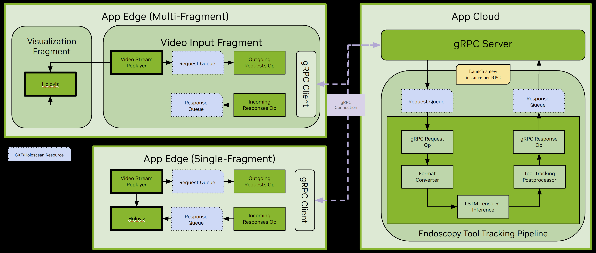

# Distributed Endoscopy Tool Tracking with gRPC Streaming

This application demonstrates how to offload heavy workloads to a remote Holoscan application using gRPC.

## Overview

In this sample application, we divided the Endoscopy Tool Tracking application into a server and client application where the two communicate via gRPC.

The client application inputs a video file and streams the video frames to the server application. The server application handles the heavy workloads of inferencing and post-processing of the video frames. It receives the video frames, processes each frame through the endoscopy tool tracking pipeline, and then streams the results to the client.


*Endoscopy Tool Tracking Application with gRPC*

From the diagram above, we can see that both the App Cloud (the server) and the App Edge (the client) are very similar to the standalone [Endoscopy Tool Tracking](../../../endoscopy_tool_tracking/) application. This section will only describe the differences; for details on inference and post-processing, please refer to the link above.

On the client side, we provided two examples, one using a single fragment and another one using two fragments. When comparing the client side to the standalone [Endoscopy Tool Tracking](../../../endoscopy_tool_tracking/) application, the differences are the queues and the gRPC client. We added the following:
- **Outgoing Requests** operator (`GrpcClientRequestOp`): It converts the video frames (GXF entities) received from the *Video Stream Replayer* operator into `EntityRequest` protobuf messages and queues each frame in the *Request Queue*.
- **gRPC Service & Client** (`EntityClientService` & `EntityClient`): The gRPC Service is responsible for controlling the life cycle of the gRPC client. The client connects to the remote gRPC server and then sends the requests found in the *Request Queue*. When it receives a response, it converts it into a GXF entity and queues it in the *Response Queue*.
- **Incoming Responses** operator (`GrpcClientResponseOp`): This operator is configured with an `AsynchronousCondition` condition to check the availability of the *Response Queue*. When notified of available responses in the queue, it dequeues each item and emits each to the output port.

The App Cloud (the server) application consists of a gRPC server and a few components for managing Holoscan applications. When the server receives a new remote procedure call in this sample application, it launches a new instance of the Endoscopy Tool Tracking application. This is facilitated by the `ApplicationFactory` used for application registration.

Under the hood, the Endoscopy Tool Tracking application here inherits a custom base class (`HoloscanGrpcApplication`) which manages the `Request Queue` and the `Response Queue` as well as the `GrpcServerRequestOp` and `GrpcServerResponseOp` operators for receiving requests and serving results, respectively. When the RPC is complete, the instance of the Endoscopy Tool Tracking application is destroyed and ready to serve the subsequent request.

## Requirements

### Data

[📦️ (NGC) Sample App Data for AI-based Endoscopy Tool Tracking](https://catalog.ngc.nvidia.com/orgs/nvidia/teams/clara-holoscan/resources/holoscan_endoscopy_sample_data)

The data is automatically downloaded when building the application.

## Building and Running gRPC Endoscopy Tool Tracking Application

### C++

```bash
# Start the gRPC Server
./holohub run grpc_endoscopy_tool_tracking --run-args="cloud" [--language=cpp]

# Start the gRPC Client
./holohub run grpc_endoscopy_tool_tracking --run-args="edge" [--language=cpp]
```

### Python

```bash
# Start the gRPC Server
./holohub run grpc_endoscopy_tool_tracking --language python --run-args="cloud"

# Start the gRPC Client
./holohub run grpc_endoscopy_tool_tracking --language python --run-args="edge"
```

### Configurations

The Edge application runs in a single-fragment mode by default. However, it can be configured to run in a multi-fragment mode, as in the picture above.

To switch to multi-fragment mode, edit the [endoscopy_tool_tracking.yaml](./cpp/endoscopy_tool_tracking.yaml) YAML file and change `multifragment` to `true`:

```yaml
application:
  multifragment: false
  benchmarking: false
```

> [!NOTE]
> The Python version of this application is only available in single-fragment mode with benchmarking turned on.

[Data Flow Tracking](https://docs.nvidia.com/holoscan/sdk-user-guide/flow_tracking.html) can also be enabled by editing the [endoscopy_tool_tracking.yaml](./cpp/endoscopy_tool_tracking.yaml) YAML file and changing `benchmarking` to `true`. This enables the built-in mechanism to profile the application and analyze the fine-grained timing properties and data flow between operators.

For example, on the server side, when a client disconnects, it will output the results for that session:

```bash
Data Flow Tracking Results:
Total paths: 1

Path 1: grpc_request_op,format_converter,lstm_inferer,tool_tracking_postprocessor,grpc_response_op
Number of messages: 663
Min Latency Message No: 249
Min end-to-end Latency (ms): 1.868
Avg end-to-end Latency (ms): 2.15161
Max Latency Message No: 371
Max end-to-end Latency (ms): 4.19

Number of source messages [format: source operator->transmitter name: number of messages]:
grpc_request_op->output: 683
```

Similarly, on the client side, when it completes playing the video, it will print the results:

```bash
Data Flow Tracking Results:
Total paths: 3

Path 1: incoming_responses,visualizer_op
Number of messages: 663
Min Latency Message No: 249
Min end-to-end Latency (ms): 0.214
Avg end-to-end Latency (ms): 0.374005
Max Latency Message No: 378
Max end-to-end Latency (ms): 2.751

Path 2: replayer,outgoing_requests
Number of messages: 663
Min Latency Message No: 379
Min end-to-end Latency (ms): 24.854
Avg end-to-end Latency (ms): 27.1886
Max Latency Message No: 142
Max end-to-end Latency (ms): 28.003

Path 3: replayer,visualizer_op
Number of messages: 663
Min Latency Message No: 372
Min end-to-end Latency (ms): 30.966
Avg end-to-end Latency (ms): 33.325
Max Latency Message No: 397
Max end-to-end Latency (ms): 35.479

Number of source messages [format: source operator->transmitter name: number of messages]:
incoming_responses->output: 683
replayer->output: 683
```

## Development Environment

### Dev Container

To start the Dev Container, run the following command from the root directory of Holohub:

```bash
./holohub vscode
```

### VS Code Launch Profiles

#### C++

The following launch profiles are available:

- **(compound) grpc_endoscopy_tool_tracking/cpp (cloud & edge)**: Launch both the gRPC server and the client.
- **(gdb) grpc_endoscopy_tool_tracking/cpp (cloud)**: Launch the gRPC server.
- **(gdb) grpc_endoscopy_tool_tracking/cpp (edge)**: Launch the gRPC client.

#### Python

The following launch profiles are available:

- **(compound) grpc_endoscopy_tool_tracking/python (cloud & edge)**: Launch both the gRPC server and the client.
- **(pythoncpp) grpc_endoscopy_tool_tracking/python (cloud)**: Launch the gRPC server with `pythoncpp`.
- **(pythoncpp) grpc_endoscopy_tool_tracking/python (edge)**: Launch the gRPC client with `pythoncpp`.
- **(debugpy) grpc_endoscopy_tool_tracking/python (cloud)**: Launch the gRPC server with `debugpy`.
- **(debugpy) grpc_endoscopy_tool_tracking/python (edge)**:Launch the gRPC client with `debugpy`.

> [!NOTE]
> The `compound` profile uses the `debugpy` extension due to a limitation that prevents launching
> the cloud and the edge apps together using `pythoncpp`.


## Limitations & Known Issues

### C++
1. Connection Timeout:
   - The connection between the server and client is controlled by `rpc_timeout`
   - Default timeout is 5 seconds, configurable in [endoscopy_tool_tracking.yaml](./cpp/endoscopy_tool_tracking.yaml)
   - Consider increasing this value on slower networks

2. Server Limitations:
   - Can only serve one request at a time
   - Subsequent calls receive `grpc::StatusCode::RESOURCE_EXHAUSTED` status

3. Debugging Issues:
   - When using the compound profile, the server may need additional startup time
   - If needed, adjust the sleep value in [tasks.json](../../../../.vscode/tasks.json) under `Build grpc_endoscopy_tool_tracking (delay 3s)`

4. Expected Exit Behavior:
   - The client will exit with the following expected error when the video completes:
     ```bash
     [error] [program.cpp:614] Event notification 2 for entity [video_in__outgoing_requests] with id [33] received in an unexpected state [Origin]
     ```

### Python
- The client may require manual termination (CTRL+C) if errors occur during execution

## Containerization

To containerize the application:

1. Install [Holoscan CLI](https://docs.nvidia.com/holoscan/sdk-user-guide/holoscan_packager.html)
2. Build the application:
   ```bash
   ./holohub install grpc_endoscopy_tool_tracking
   ```
3. Run the appropriate packaging script:
   - C++: [cpp/package-app.sh](./cpp/package-app.sh)
   - Python: [python/package-app.sh](./python/package-app.sh)
4. Follow the generated output instructions to package and run the application

For more information about packaging Holoscan applications, refer to the [Packaging Holoscan Applications](https://docs.nvidia.com/holoscan/sdk-user-guide/holoscan_packager.html) section in the [Holoscan User Guide](https://docs.nvidia.com/holoscan/sdk-user-guide/).
