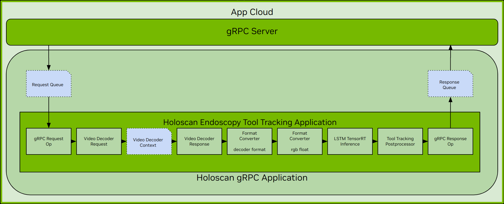

# H.264 Endoscopy Tool Tracking Application with gRPC

This application demonstrates how to offload heavy workloads to a remote Holoscan application using gRPC.

## Overview

In this sample application, we divided the h.264 Endoscopy Tool Tracking application into a server and client application where the two communicate via gRPC.

The client application reads a pre-recorded h.264 video file and streams the encoded video frames to the server application. The server application handles the heavy workloads of inferencing and post-processing of the video frames. It receives the video frames, processes each frame through the endoscopy tool tracking pipeline, and then streams the results to the client.


*h.264 Endoscopy Tool Tracking Application with gRPC*

From the diagram above, we can see that both the App Cloud (the server) and the App Edge (the client) are very similar to the standalone [Endoscopy Tool Tracking](../../../endoscopy_tool_tracking/) application. This section will only describe the differences; for details on inference and post-processing, please refer to the link above.

On the client side, the differences are the queues and the gRPC client. In the *Video Input Fragment*, we added the following:
- **Outgoing Requests** operator (`GrpcClientRequestOp`): It converts the video frames (GXF entities) received from the *Video Read Stream* operator into `EntityRequest` protobuf messages and queues each frame in the *Request Queue*.
- **gRPC Service & Client** (`EntityClientService` & `EntityClient`): The gRPC Service is responsible for controlling the life cycle of the gRPC client. The client connects to the remote gRPC server and then sends the requests found in the *Request Queue*. When it receives a response, it converts it into a GXF entity and queues it in the *Response Queue*.
- **Incoming Responses** operator (`GrpcClientResponseOp`): This operator is configured with an `AsynchronousCondition` condition to check the availability of the *Response Queue*. When notified of available responses in the queue, it dequeues each item and emits each to the output port.


*Details of App Cloud*

The App Cloud (the server) application consists of a gRPC server and a few components for managing Holoscan applications. When the server receives a new remote procedure call in this sample application, it launches a new instance of the Endoscopy Tool Tracking application. This is facilitated by the `ApplicationFactory` used for application registration.

 Under the hood, the Endoscopy Tool Tracking application here inherits a custom base class (`HoloscanGrpcApplication`) which manages the `Request Queue` and the `Response Queue` as well as the `GrpcServerRequestOp` and `GrpcServerResponseOp` operators for receiving requests and serving results, respectively. When the RPC is complete, the instance of the Endoscopy Tool Tracking application is destroyed and ready to serve the subsequent request.


## Requirements

This application is configured to use H.264 elementary stream from endoscopy sample data as input.

### Data

[📦️ (NGC) Sample App Data for AI-based Endoscopy Tool Tracking](https://catalog.ngc.nvidia.com/orgs/nvidia/teams/clara-holoscan/resources/holoscan_endoscopy_sample_data)

The data is automatically downloaded when building the application.

## Building and Running gRPC H.264 Endoscopy Tool Tracking Application

* Building and running the application from the top level Holohub directory:

### C++

```bash
# Start the gRPC Server
./dev_container build_and_run grpc_h264_endoscopy_tool_tracking --run_args cloud [--language cpp]

# Start the gRPC Client
./dev_container build_and_run grpc_h264_endoscopy_tool_tracking --run_args edge [--language cpp]
```

Important: on aarch64, applications also need tegra folder mounted inside the container and
the `LD_LIBRARY_PATH` environment variable should be updated to include
tegra folder path.

Open and edit the [Dockerfile](../../../h264//Dockerfile) and uncomment line 66:

```bash
# Uncomment the following line for aarch64 support
ENV LD_LIBRARY_PATH=$LD_LIBRARY_PATH:/usr/lib/aarch64-linux-gnu/tegra/
```


## Dev Container

To start the the Dev Container, run the following command from the root directory of Holohub:

```bash
./dev_container vscode h264
```

### VS Code Launch Profiles

#### C++

The following launch profiles are available:

- **(compound) grpc_h264_endoscopy_tool_tracking/cpp (cloud & edge)**: Launch both the gRPC server and the client.
- **(gdb) grpc_h264_endoscopy_tool_tracking/cpp (cloud)**: Launch the gRPC server.
- **(gdb) grpc_h264_endoscopy_tool_tracking/cpp (edge)**: Launch the gRPC client.


## Limitations & Known Issues

- The connection between the server and the client is controlled by `rpc_timeout`. If no data is received or sent within the configured time, it assumes the call has been completed and hangs up. The `rpc_timeout` value can be configured in the [endoscopy_tool_tracking.yaml](./cpp/endoscopy_tool_tracking.yaml) file with a default of 5 seconds. Increasing this value may help on a slow network.
- The server can serve one request at any given time. Any subsequent call receives a `grpc::StatusCode::RESOURCE_EXHAUSTED` status.
- When debugging using the compound profile, the server may not be ready to serve, resulting in errors with the client application. When this happens, open [tasks.json](../../../../.vscode/tasks.json), find `Build grpc_h264_endoscopy_tool_tracking (delay 3s)`, and adjust the `command` field with a higher sleep value.
- The client is expected to exit with the following error. It is how the client application terminates when it completes streaming and displays the entire video.
  ```bash
  [error] [program.cpp:614] Event notification 2 for entity [video_in__outgoing_requests] with id [33] received in an unexpected state [Origin]
  ```

