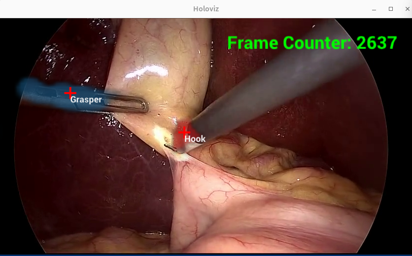

# UCXX Endoscopy Tool Tracking - Distributed Application

A distributed implementation of the [HoloHub Endoscopy Tool Tracking application](/applications/endoscopy_tool_tracking) using [UCXX](https://github.com/rapidsai/ucxx) (C++ interface to Unified Communication X) for high-performance network communication between nodes.

## Overview

This application demonstrates a distributed Holoscan pipeline that splits processing across multiple nodes:

- **Publisher node**: Processes endoscopy video with LSTM-based tool tracking, renders the result, and broadcasts frames
- **Subscriber node (Holoviz)**: Receives and displays the pre-rendered frames
- **Overlay node**: Receives original frames from publisher, adds an overlay onto each frame (frame-counter, simulating a per-frame processing application), and sends the overlay back to the publisher. The node can optionally display received frames with overlay.

Each node is a Holoscan application.



## Architecture

### Publisher Node (`publish`)

```text
┌─────────────────────────────────────────────┐
│       PUBLISHER NODE                        │
│                                             │
│  Video ──────────────► UCXX Sender (tag=1) ─┼──► Network (UCXX/UCX protocol) ─► Overlay Subscriber
│          │       │                          │    (port 50009, original frames)
│          │       ▼                          │
│          │    Format                        │
│          │    Converter                     │
│          │       │                          │
│          │       ▼                          │
│          │    LSTM                          │
│          │    Inference                     │
│    Attach        │                          │
│  frame_counter   ▼                          │
│          │    Postprocessor                 │
│          │       │                          │
│          │       ▼                          │
│          └──► Holoviz                       │
│               (Rendering)                   │
│                  │                          │
│                  ▼                          │
│               Format Converter              │
│                  │                          │
│                  ▼                          │
│               UCXX Sender (tag=1) ──────────┼──► Network (UCXX/UCX protocol) ─► Holoviz Subscriber
│                                             │    (port 50008)
│                                             │
│  UCXX Receiver (tag=2) ◄────────────────────┼─── Network (UCXX/UCX protocol) ◄─ Overlay Subscriber
│           │                                 │    (port 50009, frame-counter Overlay)
│           ▼                                 │
│   Update frame_counter                      │
│                                             │
└─────────────────────────────────────────────┘
```

### Holoviz Subscriber Node (`subscribe_holoviz`, default port 50008)

```text
┌─────────────────────────────────────┐
│    HOLOVIZ SUBSCRIBER NODE          │
│                                     │
│  Network ───► UCXX Receiver (tag=1) │
│  (port 50008)      │                │
│                    ▼                │
│                 Holoviz             │
│               (Display)             │
│                    │                │
│                    ▼                │
│           Optional Recorder         │
│                                     │
└─────────────────────────────────────┘
```

### Overlay Publisher + Subscriber Node (`overlay`, default port 50009)

```text
┌────────────────────────────────────────────────┐
│                OVERLAY NODE                    │
│                                                │
│  Network ───► UCXX Receiver (tag=1)            │
│  (port 50009)      │                           │
│        Compute frame_counter Overlay           │
│      ┌─────────────┴─────────────┐             │
│      │(optional)                 │             │
│      ▼                           ▼             │
│  Frame with Overlay           Overlay          │
│      │                           │             │
│      ▼                           ▼             │
│  Holoviz                 UCXX Sender (tag=2) ──┼──► Network (back to publisher)
│                                                │       (port 50009)
└────────────────────────────────────────────────┘
```

## Key Features

- **High-Performance Communication**: Uses UCXX/UCX for low-latency, high-bandwidth data transfer
- **GPU-Direct RDMA Support**: Efficient GPU-to-GPU communication when available
- **Automatic Reconnection**: Handles network disconnections gracefully. Unlike standard Holoscan distributed fragments,
  subscriber applications can dynamically disconnect and reconnect without killing the publisher application.
- **Optional Recording**: Can record received frames for validation
- **Headless Operation**: Supports headless mode for testing

## Requirements

### Software

- Holoscan SDK 3.9.0 or later
- UCXX 0.46 library (included with Holoscan)
- CUDA Toolkit >= 12
- CMake 3.20+

### Hardware

- NVIDIA GPU. Tested on:
  - IGX Orin with RTX 6000 Ada
  - x86 Ubuntu 22.04 with RTX Pro 6000 Blackwell Max-Q Edition
  - DGX Spark
- Network connectivity between publisher and subscriber nodes
- For optimal performance: RDMA-capable network hardware

### Data

- Endoscopy sample video dataset (automatically downloaded during build)

## Build and Run

### Build the Application

Clone the Holohub repository:

```bash
git clone https://github.com/nvidia-holoscan/holohub.git
```

Then, build and run the containerized application:

```bash
./holohub build ucxx_endoscopy_tool_tracking
```

### Run Publisher Node

Start the publisher on the machine with the video data and GPU for processing:

```bash
./holohub run ucxx_endoscopy_tool_tracking publish
```

**Publisher Options:**

- `--data <path>` - Path to endoscopy video data (required)
- `--hostname <host>` - Hostname to bind (default: 0.0.0.0 - all interfaces)
- `--port <port>` - Port to listen on (default: 50008)
- `--config <path>` - Optional custom configuration file

Modify these options by adding `--run-args='<options>'` to the `./holohub run` command.

### Run Subscriber Node

Start the holoviz subscriber to receive and display pre-rendered frames:

```bash
./holohub run ucxx_endoscopy_tool_tracking subscribe_holoviz \
    [--no-docker-build] [--no-local-build]
```

**Subscriber Options:**

- `--hostname <host>` - Publisher hostname/IP (default: 127.0.0.1)
- `--port <port>` - Publisher port (default: 50008)
- `--config <path>` - Optional custom configuration file

Modify these options by adding `--run-args='<options>'` to the `./holohub run` command.

### Run Overlay Node

Start the overlay node to receive original frames, add a frame-counter overlay, and send the overlay back to the publisher for display. Optional local visualization is controlled by `overlay.visualize` in the YAML.

```bash
./holohub run ucxx_endoscopy_tool_tracking overlay \
    [--no-docker-build] [--no-local-build]
```

**Overlay Options:**

- `--hostname <host>` - Publisher hostname/IP (default: 127.0.0.1)
- `--port <port>` - Publisher port (default: 50009)
- `--config <path>` - Optional custom configuration file

Modify these options by adding `--run-args='<options>'` to the `./holohub run` command.

### Example: Same Machine Testing

```bash
# Terminal 1: Start holohub container and publisher
./holohub run ucxx_endoscopy_tool_tracking publish

# Terminal 2: Start holohub container and holoviz subscriber
./holohub run ucxx_endoscopy_tool_tracking subscribe_holoviz

# Terminal 3: Start holohub container and overlay node
./holohub run ucxx_endoscopy_tool_tracking overlay
```

## Troubleshooting

### Subscriber can't connect to publisher

**Problem**: Subscriber logs "Attempting to reconnect" repeatedly

**Solutions**:

1. Verify publisher is running: `ps aux | grep ucxx_endoscopy`
2. Check network connectivity: `ping <publisher_ip>`
3. Verify port is not blocked: `telnet <publisher_ip> 50008`
4. Check firewall rules allow port 50008
5. Ensure both nodes use same port number
6. Try running applications within the same HoloHub container to minimize networking requirements:
```sh
# Terminal 1
./holohub run-container ucxx_endoscopy_tool_tracking
./holohub run ucxx_endoscopy_tool_tracking publish

# Terminal 2, same machine
docker exec -it $(docker ps -q | head -n 1) \
  ./holohub run ucxx_endoscopy_tool_tracking subscribe_holoviz

# Terminal 3, same machine
docker exec -it $(docker ps -q | head -n 1) \
  ./holohub run ucxx_endoscopy_tool_tracking overlay
```

### No frames displayed

**Problem**: Subscriber connects but no visualization appears

**Solutions**:

1. Check logs - are frames being received?
2. Verify subscriber is not in headless mode
3. Check GPU availability on subscriber node
4. Ensure display environment is properly configured

## Related Applications

- [**endoscopy_tool_tracking**](/applications/endoscopy_tool_tracking/README.md): Single-node version
- [**ucx_endoscopy_tool_tracking**](/applications/distributed/ucxx_endoscopy_tool_tracking/): Two-node implementation with Holoscan SDK Fragments
- [**holoviz**](/applications/holoviz/): Visualization examples
- [**ucxx_send_receive**](/operators/ucxx_send_receive/): UCXX operator examples


## References

- [Holoscan SDK Documentation](https://docs.nvidia.com/holoscan/)
- [UCXX Documentation](https://github.com/rapidsai/ucxx)
- [UCX Communication Framework](https://openucx.org/)
- [Endoscopy Tool Tracking Reference Application](/applications/endoscopy_tool_tracking/README.md)
