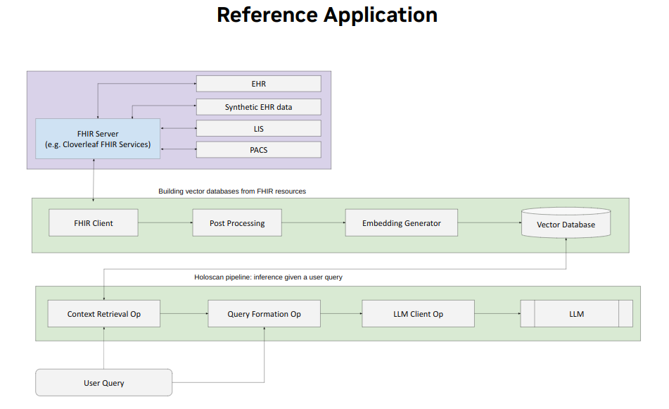

# Generative AI Application on Holoscan integrating with FHIR Services

This reference application demonstrates how Holoscan application developers can build healthcare Gen AI applications that easily interact with EHR systems without the need for per-hospital customization, accelerating the development of AI tools to help improve clinician efficiency and quality of patient care.

**_Note_**:
This application is NOT for clinical use.

As shown in the architecture diagram above, there are three main components in this application
- [FHIR](https://fhir.org/) service, for example provided by [Infor Cloverleaf](https://www.infor.com/products/cloverleaf), which consolidates and supports distributing patient electronic health records within and even among affiliated institutions. It handles various underlying healthcare informatics protocols while providing a consistent API and data content for the AI applications. This service can be hosted on-premise or on the cloud. A Cloverleaf instance hosted on AWS, populated with synthetic patient data, is used in testing this reference application.
- [FHIR Client](./domain_specific/fhir/README.md), developed on [Holoscan SDK](https://developer.nvidia.com/holoscan-sdk) [Version 2.5](https://docs.nvidia.com/holoscan/sdk-user-guide/index.html) for getting and posting patient health records as [FHIR Resources](https://www.hl7.org/fhir/resourcelist.html). It also validates and transforms the resources for consumption by the AI applications
- Generative AI application, developed on Holoscan SDK with fine-tuned open source Embedding and LLM models. It interacts with end users, prepares the patient records on user demand, builds the vector database, and generates answers on user query with an LLM. In the first phase of this reference application only language models are supported, and multi-modal support is on the roadmap.

## Requirements

- On one of [Holohub supported platforms](../../README.md#supported-platforms)
- Python 3.10+
- Nvidia GPU

## Models

Please see this [Readme](./lmm/README.md) for the latest version of models.

## Data

It is acknowledged that [Synthea](https://synthea.mitre.org/) was used to generate and/or download synthetic patient health records, which are needed to populate the FHIR server for testing this reference application. Such use is permitted by its [license](https://github.com/synthetichealth/synthea/blob/master/LICENSE).

## Run Instructions

All three components need to be started and running. Sequence to start them need not be enforced but FHIR Server and FHIR Client must be running when the AI application is asked to create the vector database. The following provides the most natural starting sequence:
- FHIR Server is started and ready to serve records of at least one known patient. Please consult the chosen FHIR server's guides
- Start the FHIR Client by following this [README](./domain_specific/fhir/README.md), either interactively in dev mode or as a Docker container
- Start the Gen AI application by following its [README](./lmm/README.md)

Open a Web browser at the URL presented by the Gen AI application and start asking questions!

**_Note_**

The main purpose of this reference application is to demonstrate how to build an Gen AI application using Holoscan SDK integrated with FHIR services, rather than state of the art fine-tuned AI models. Answers to queries are also limited by the available synthetic health records for the patient context.

