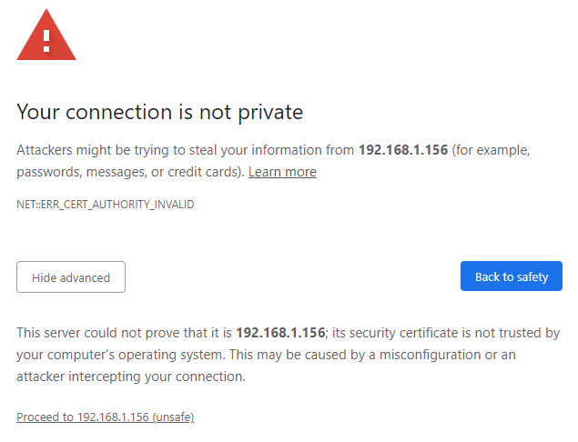
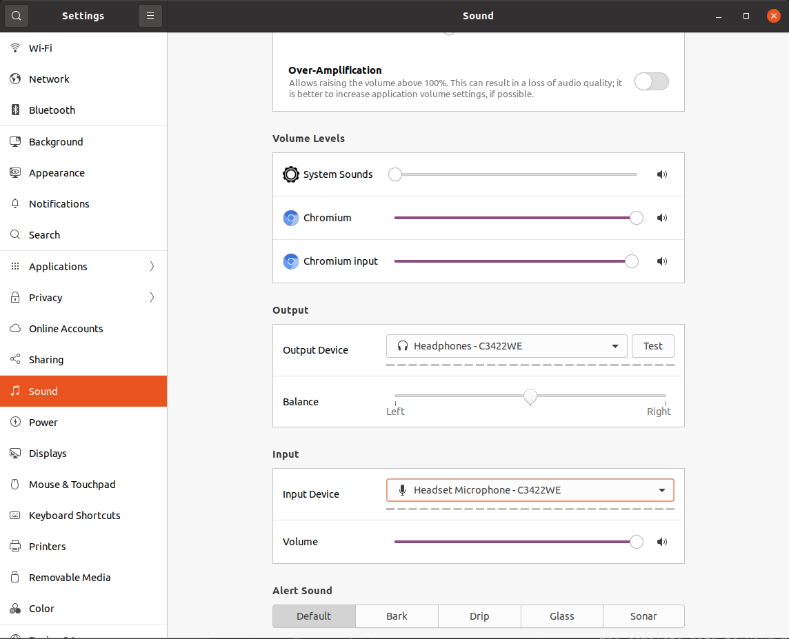

## EHR Agent Framework 

### Table of Contents
- [Setup Instructions](#setup-instructions)
- [Run Instructions](#run-instructions)
- [Offline Mode](#offline-mode)

## Setup Instructions

#### Speech pipeline

Note: NVIDIA Riva Version Compatibility : tested with v2.13.0 / v2.14.0

Adhere to the "Data Center" configuration specifications in the [Riva Quick Start guide](https://docs.nvidia.com/deeplearning/riva/user-guide/docs/quick-start-guide.html#data-center).

To optimize Riva installation footprint:
* Locate the `config.sh` file in the riva_quickstart_vX.XX.X directory.
* Modify the `service_enabled_*` variables as follows:

```bash
service_enabled_asr=true
service_enabled_nlp=false
service_enabled_tts=true
service_enabled_nmt=false
```

#### Model acquisition:

> It is recommended to create a directory called `/models` on your machine to download the LLM.

Download the [quantized Mistral 7B finetuned LLM](https://huggingface.co/TheBloke/openchat-3.5-0106-GGUF) from HugginFace.co:

```bash
wget -nc -P <your_model_dir> https://huggingface.co/TheBloke/openchat-3.5-0106-GGUF/resolve/main/openchat-3.5-0106.Q8_0.gguf
```

[Placeholder for the finetuned Bge-large-en embedding model]

Execute the following command from the Holohub root directory:

```bash
./dev_container build --docker_file applications/ehr_query_llm/lmm/Dockerfile --img ehr_query_llm:llm
```

## Run Instructions:

### Step 1: Enabling HTTPS/SSL (only required once)
⚠️ Note: This has only been tested with Chrome and Chromium

Browsers require HTTPS to be used in order to access the client's microphone.  Hence, you'll need to create a self-signed SSL certificate and key.

This key must be placed in `/applications/ehr_query_llm/lmm/ssl`

```bash
cd <holohub root>/applications/ehr_query_llm/lmm/
mkdir ssl
cd ssl
openssl req -x509 -newkey rsa:4096 -keyout key.pem -out cert.pem -sha256 -days 365 -nodes -subj '/CN=localhost'
```
When you first navigate your browser to a page that uses these self-signed certificates, it will issue you a warning since they don't originate from a trusted authority. Ignore this and proceed to the web app:



ehr_query_llm will use your default speaker and microphone. To change this go to your Ubuntu sound settings and choose the correct devices:



### Step 2: Ensure Riva server is running
The Riva server must be running to use the LLM pipeline. If it is already running you can skip this step.
```bash
cd <riva install dir>
bash riva_start.sh
```

### Step 3: Launch and Run the App

#### Step 3.1

Launch the `ehr_query_llm:llm` container:
```bash
sudo ./dev_container launch --img ehr_query_llm:llm --add-volume <your_model_dir>
```
* Note, if the parent directory of <your_model_dir> is not `/models` you must update the [asr_llm_tts.yaml](./asr_llm_tts.yaml) and [ehr.yaml](./agents_configs/ehr.yaml) files with the complete path to your model inside the container. You will also need to update the [run_lmm.sh](./run_lmm.sh) so the correct directory is exported in the `set_transformer_cache()` function. (You can determine these paths by looking in `/workspace/volumes` inside the launched container)

#### Step 3.2

Then run the application:
```bash
./applications/ehr_query_llm/lmm/run_lmm.sh
```
This command builds ehr_query_llm/lmm, starts an LLM api server, then launches the ehr_query_llm app.
Access the web interface at `https://127.0.0.1:8080`. Llama.cpp LLM server output is redirected to `./applications/ehr_query_llm/lmm/llama_cpp.log/`.

To interact with ehr_query_llm using voice input:

- Press and hold the space bar to activate the voice recognition feature.
- Speak your query or command clearly while maintaining pressure on the space bar.
- Release the space bar when you've finished speaking to signal the end of your input.
- ehr_query_llm will then process your speech and generate a response.

⚠️ Note: When running via VNC, you must have your keyboard focus on the VNC terminal that you are using to run ehr_query_llm in order to use the push-to-talk feature.

### Stopping Instructions
To stop the main app, simply use `ctrl+c`

To stop Riva server:
```bash
bash <Riva_install_dir>riva_stop.sh
```
### ASR_To_LLM Application arguments
The `asr_llm_tts.py` can receive the following **optional** cli argument:

`--sample-rate-hz`: The number of frames per second in audio streamed from the selected microphone.

## Offline mode:
To enable offline use (no internet connection required):
1. First run the complete application as-is (This ensures all relevant models are downloaded)
2. Uncomment `set_offline_flags` at [line 52 of run_lmm.sh](./run_lmm.sh)

## Troubleshooting

### Adding Agents:
An Agent is an LLM (or LMM) with a task specific "persona" - such as a EHRAgent, etc., each with their own specific task. They also have a specific prompt tailored to complete that task, pre-fix prompts specific to the model used, grammar to constrain output, as well as context length. 

The AgentFrameworkOp works by using a SelectorAgent to select which Agent should be called upon based on user input.

Adding a new "agent" for ehr_query_llm involves creating a new agent .py and YAML file in the `agents` directory, and in the new .py inheriting the Agent base class `agents/base_agent.py`.


When creating a new agent .py file, you will need to define:

**Agent name**: A class name which will also need to be added to the selector agent YAML, so it knows the agent is available to be called.
**process_request**: A runtime method describing the logic of how an agent should carry out its task and send a response. 


For the YAML file, the fields needed are:

**name**: This is the name of the agent, as well as what is used as the ZeroMQ topic when the agent  publishes its output. So you must make sure your listener is using this as the topic.

**user_prefix, bot_prefix, bot_rule_prefix, end_token:**: These are dependent on the particular llm or lmm being used, and help to set the correct template for the model to interact with. 

**agent_prompt**: This gives the agent its "persona" - how it should behave, and for what purpose. It should have as much context as possible.

**ctx_length**: Context length for the model. This determines how much output the agent is capable of generating. Smaller values lead to faster to first token time, but can be at the sacrifice of detail and verbosity.

**grammar:** This is the BNF grammar used to constrain the models output. It can be a bit tricky to write. ChatGPT is great at writing these grammars for you if you give an example JSON of what you want :). Also helpful, is the Llama.cpp [BNF grammar guide](https://github.com/ggerganov/llama.cpp/blob/master/grammars/README.md).

**publish:** The only important part of this field is the "args" sub-field. This should be a list of your arg names. This is important as this is used as the list of keys to pull the relevant args from the LMM's response, and thus ensure the relevant fields are complete for a given tool use.

With a complete YAML file, an agent should be able to use any new tool effectively. The only remaining step is ensure you have a ZeroMQ listener in the primary app with a topic that is the same as the tool's name.

### EHR RAG
To test new document formats for the database use [test_db.py](./rag/ehr/test_db.py)
This will start the current Vector database in `./rag/ehr/db` and allow you to test different queries via the CLI to see what documents are returned.

When changing the Vector DB, remove the previous database first:
```bash
rm -rf ./rag/ehr/db
```

### Riva - Can't find speaker to use:
This usually means that some process is using the speaker you wish to use. This could be a Riva process that didn't exit correctly, or even Outlook loaded in your browser using your speakers to play notification sounds.

First see what processes are using your speakers:
```bash
pactl list sink-inputs | grep -E 'Sink Input|application.name|client|media.name|sink: '
```
Sometimes that will give you all the information you need to kill the process responsible. If not, and the process has unfamiliar name such as "speech-dispatcher-espeak-ng" then find the responsible process ID:
```bash
pgrep -l -f <grep expression here (ex: 'speech')>
```
Once you know the PID's of the responsible process, kill them :)
```bash
kill <PID>
```