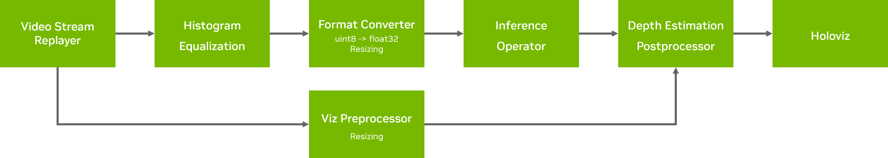

# Endoscopy Depth Estimation

This application demonstrates the use of custom components for depth estimation and its rendering using Holoviz with triangle interpolation.

### Requirements

- Python 3.8+
- OpenCV 4.8+

### Data

[📦️ (NGC) Sample App Data for Endoscopy](https://catalog.ngc.nvidia.com/orgs/nvidia/teams/clara-holoscan/resources/holoscan_endoscopy_sample_data)

The data is automatically downloaded and converted to the correct format when building the application.
If you want to manually convert the video data, please refer to the instructions for using the [convert_video_to_gxf_entities](https://github.com/nvidia-holoscan/holoscan-sdk/tree/main/scripts#convert_video_to_gxf_entitiespy) script.

### Model

[📦️ (NGC) App Model for AI-based Endoscopy Depth Estimation](https://catalog.ngc.nvidia.com/orgs/nvidia/teams/clara-holoscan/resources/holoscan_endoscopy_depth_estimation_sample_data)

The model is automatically downloaded to the same folder as the data in ONNX format.

### OpenCV-GPU

This application uses OpenCV with GPU acceleration during the preprocessing stage when it runs with Histogram Equalization (flag `--clahe` or `-c`).
Histogram equalization reduces the effect of specular reflections and improves the visual performance of the depth estimation overall. However,
using regular OpenCV datatypes leads to unnecessary I/O operations to transfer data from Holoscan Tensors to the CPU and back.
We show in this application how to blend together Holoscan Tensors and OpenCV's `GPUMat` datatype to get rid of this issue in the [`CUDACLAHEOp`](./endoscopy_depth_estimation.py#L163) operator. 
Compare it to [`CPUCLAHEOp`](./endoscopy_depth_estimation.py#L123) for reference.

To achieve an end-to-end GPU accelerated pipeline / application, the pre-processing operators shall support accessing the GPU memory (Holoscan Tensor) 
directly without memory copy / movement in Holoscan SDK. This means that only libraries which implement the [`__cuda_array_interface__`](https://numba.readthedocs.io/en/stable/cuda/cuda_array_interface.html) 
and [DLPack](https://dmlc.github.io/dlpack/latest/) standards allow conversion from/to Holoscan Tensor, such as [cuCIM](https://github.com/rapidsai/cucim).
OpenCV, however, does not implement neither the `__cuda_array_interface__` nor the standard DLPack, and a little work is needed yet to use this library.

First, we convert CuPy arrays to GPUMat using a fix in OpenCV only available from 4.8.0 on. More information [here](https://github.com/opencv/opencv/pull/23371).
This is done in the [`gpumat_from_cp_array`](./endoscopy_depth_estimation.py#L32) function. With a `GPUMat`, we can now use any [OpenCV-CUDA operations](https://docs.opencv.org/2.4/modules/gpu/doc/gpu.html).
Once the `GPUMat` processing has finished, we have to convert it back to a CuPy tensor with [`gpumat_to_cupy`](./endoscopy_depth_estimation.py#L53). 

<hr/>

**Important:** In order to run this application with CUDA acceleration, one must compile [OpenCV with CUDA support](https://docs.opencv.org/4.8.0/d2/dbc/cuda_intro.html).
We provide a sample [Dockerfile](./Dockerfile) to build a container based on Holoscan v2.1.0 with the latest version of OpenCV and CUDA support.
In case you use it, note that the variable [`CUDA_ARCH_BIN` ](./Dockerfile#L25) must be modified according to your specific GPU
configuration. Refer to [this site](https://developer.nvidia.com/cuda-gpus) to find out your NVIDIA GPU architecture.

<hr/>

### Workflows

This application can be run with or without Histogram Equalization (CLAHE) by toggling the label `--clahe`.

#### With CLAHE
<br>
Fig. 1 Depth Estimation Application with CLAHE enabled

The pipeline uses a recorded endoscopy video file (generated by `convert_video_to_gxf_entities` script) for input frames. Each input frame in the file is loaded by [Video Stream Replayer](https://docs.nvidia.com/clara-holoscan/sdk-user-guide/holoscan_operators_extensions.html#operators) and passed to the following two branches:
- In the first branch (top), the input frames are passed to the [`CUDACLAHEOp`](./endoscopy_depth_estimation.py#L163), 
then fed to the [Format Converter](https://docs.nvidia.com/clara-holoscan/sdk-user-guide/holoscan_operators_extensions.html#operators)
to convert their data type from `uint8` to `float32`, and finally fed to the [`InferenceOp`](https://docs.nvidia.com/holoscan/sdk-user-guide/holoscan_operators_extensions.html#operators).
The result is then ingested by the [`DepthPostProcessingOp`](./endoscopy_depth_estimation.py#L87), which converts the depth map
to `uint8` and reorders its dimensions for rendering with [Holoviz](https://docs.nvidia.com/clara-holoscan/sdk-user-guide/holoscan_operators_extensions.html#operators).
- In the second branch (bottom), the input frames are passed to a [Format Converter](https://docs.nvidia.com/clara-holoscan/sdk-user-guide/holoscan_operators_extensions.html#operators)
that resizes them. Its output is finally fed to the [`DepthPostProcessingOp`](./endoscopy_depth_estimation.py#L87) for 
rendering with [Holoviz](https://docs.nvidia.com/clara-holoscan/sdk-user-guide/holoscan_operators_extensions.html#operators).


#### Without CLAHE
<br>
Fig. 2 Depth Estimation Application with CLAHE disabled

The pipeline uses a recorded endoscopy video file (generated by `convert_video_to_gxf_entities` script) for input frames. Each input frame in the file is loaded by [Video Stream Replayer](https://docs.nvidia.com/clara-holoscan/sdk-user-guide/holoscan_operators_extensions.html#operators)
and passed to a branch that firstly converts its data type to `float32` and resizes it with a [Format Converter](https://docs.nvidia.com/clara-holoscan/sdk-user-guide/holoscan_operators_extensions.html#operators).
Then, the preprocessed frames are fed to the [`InferenceOp`](https://docs.nvidia.com/holoscan/sdk-user-guide/holoscan_operators_extensions.html#operators)
and mixed with the original video in the custom [`DepthPostProcessingOp`](./endoscopy_depth_estimation.py#L87) for
rendering with [Holoviz](https://docs.nvidia.com/clara-holoscan/sdk-user-guide/holoscan_operators_extensions.html#operators).


### Run Instructions

To run this application, you'll need to configure your PYTHONPATH environment variable to locate the
necessary python libraries based on your Holoscan SDK installation type.

You should refer to the [glossary](../../README.md#Glossary) for the terms defining specific locations within HoloHub.

If your Holoscan SDK installation type is:

* python wheels:

  ```bash
  export PYTHONPATH=$PYTHONPATH:<HOLOHUB_BUILD_DIR>/python/lib
  ```

* otherwise:
 
  ```bash
  export PYTHONPATH=$PYTHONPATH:<HOLOSCAN_INSTALL_DIR>/python/lib:<HOLOHUB_BUILD_DIR>/python/lib
  ```

This application should **be run in the build directory of Holohub** in order to load the GXF extensions.
Alternatively, the relative path of the extensions in the corresponding yaml file can be modified to match path of
the working directory.

Next, run the command to run the application:

```bash
cd <HOLOHUB_BUILD_DIR>
python3 <HOLOHUB_SOURCE_DIR>/applications/endoscopy_depth_estimation/endoscopy_depth_estimation.py --data=<DATA_DIR> --model=<MODEL_DIR> --clahe
```


### Container Build & Rud Instructions

Build container using Holoscan 2.0.0 NGC container as base image and built OpenCV with CUDA ARCH 8.6, 8.7 and 8.9 support for IGX Orin and AGX Orin iGPU and Ampere and Ada Lovelace Architecture dGPUs.

#### Change directory to Holohub source directory

```bash
cd <HOLOHUB_SOURCE_DIR>
```
#### Build container

```bash
./dev_container build --docker_file applications/endoscopy_depth_estimation/Dockerfile  --img  holohub:depth_estimation
```

#### Launch container

```bash
./dev_container  launch  --img holohub:depth_estimation
```

#### Build app

```bash
./run build endoscopy_depth_estimation
```

#### Launch app

```bash
python3 applications/endoscopy_depth_estimation/endoscopy_depth_estimation.py  --data=data/endoscopy --model=data/endoscopy_depth/
```

