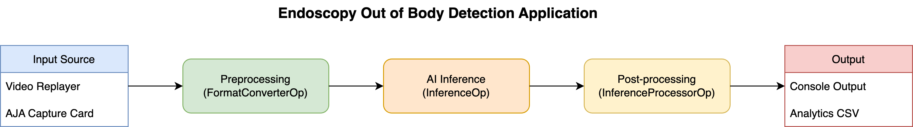

# Endoscopy Out of Body Detection



## Overview

This application performs real-time detection of whether an endoscope is inside or outside the body during endoscopic procedures. For each input frame, the application:

- Classifies the frame as either "in-body" or "out-of-body"
- Provides a confidence score for the classification
- Outputs either to the console or to a CSV file (when analytics is enabled)

__Note: This application does not include visualization components.__

## Quick Start

Run the following command to build and launch the application on a supported Holoscan platform:

```bash
./dev_container build_and_run endoscopy_out_of_body_detection --language cpp
```

## Prerequisites

- NVIDIA Holoscan SDK (version 0.5 or higher)
- [A supported Holoscan platform or workstation with a CUDA-capable NVIDIA GPU](https://docs.nvidia.com/holoscan/sdk-user-guide/sdk_installation.html)
- CMake build system
- FFmpeg (for data conversion)

## Data Requirements

### Model and Sample Data

The endoscopy detection model and sample datasets are available on [NGC](https://catalog.ngc.nvidia.com/orgs/nvidia/teams/clara-holoscan/resources/endoscopy_out_of_body_detection). The package includes:

- Pre-trained ONNX model for out-of-body detection: `out_of_body_detection.onnx`
- Sample endoscopy video clips (MP4 format): `sample_clip_out_of_body_detection.mp4`

### Data Preparation (optional)

The application requires the input videos to be converted to GXF tensor format. This conversion happens automatically during building, but manual conversion can be done following these steps:

1. Download and extract the data:

    ```bash
    unzip [NGC_DOWNLOAD].zip -d <data_dir>
    ```

2. Convert the video to GXF tensor format using the provided script:

    ```bash
    ffmpeg -i <INPUT_VIDEO_FILE> -fs 900M -pix_fmt rgb24 -f rawvideo pipe:1 | \
    python convert_video_to_gxf_entities.py --width 256 --height 256 --channels 3 --framerate 30
    ```

    Note: The conversion script (`convert_video_to_gxf_entities.py`) is available in the [Holoscan SDK repository](https://github.com/nvidia-holoscan/holoscan-sdk/tree/main/scripts).

3. Organize the data directory as follows:

    ```bash
    data/
    └── endoscopy_out_of_body_detection/
      ├── LICENSE.md
      ├── out_of_body_detection.onnx
      ├── sample_clip_out_of_body_detection.gxf_entities
      ├── sample_clip_out_of_body_detection.gxf_index
      └── sample_clip_out_of_body_detection.mp4
    ```

## Configuration

The application uses `endoscopy_out_of_body_detection.yaml` for configuration. Key settings include:

- Input video parameters in the `replayer` section
- Model parameters in the `inference` section
- Analytics settings for data export

## Building

```bash
./dev_container build
./dev_container launch
./run build endoscopy_out_of_body_detection cpp
./run launch endoscopy_out_of_body_detection cpp
```

For more information, see the Holohub [README.md](https://github.com/nvidia-holoscan/holohub/blob/main/README.md).

## Running the Application

### Basic Usage

From your build directory:

```bash
applications/endoscopy_out_of_body_detection/endoscopy_out_of_body_detection \
  --config endoscopy_out_of_body_detection.yaml \
  --data ../data/endoscopy_out_of_body_detection
```

### Analytics Mode

To enable analytics and export results to CSV:

1. Set `enable_analytics: true` in the configuration file:

  ```yaml
  # endoscopy_out_of_body_detection.yaml
  enable_analytics: true
  ```

2. Configure analytics output (optional):

  ```bash
  # Set output directory (default: current directory)
  export HOLOSCAN_ANALYTICS_DATA_DIRECTORY="/path/to/output"

  # Set output filename (default: data.csv)
  export HOLOSCAN_ANALYTICS_DATA_FILE_NAME="results.csv"
  ```

The application will create:

- A directory named after the application
- Subdirectories with timestamps for each run
- CSV files containing frame-by-frame classification results

## Output Format

- __Console Mode__: Displays "Likely in-body" or "Likely out-of-body" along with confidence scores for each frame.

- __Analytics Mode__: Outputs a CSV file with frame-by-frame classification results in the following format:

  ```csv
  In-body,Out-of-body,Confidence Score
  1,0,0.972432
  1,0,0.902066
  ```
