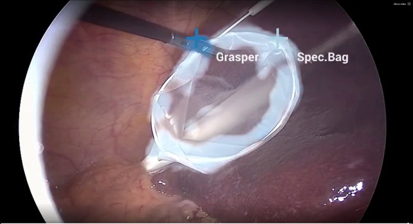
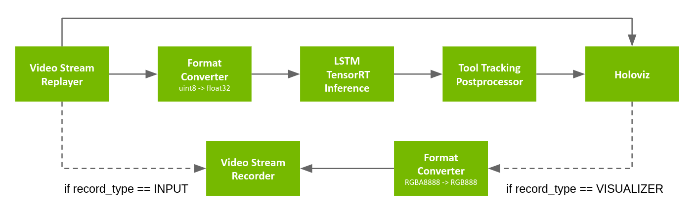
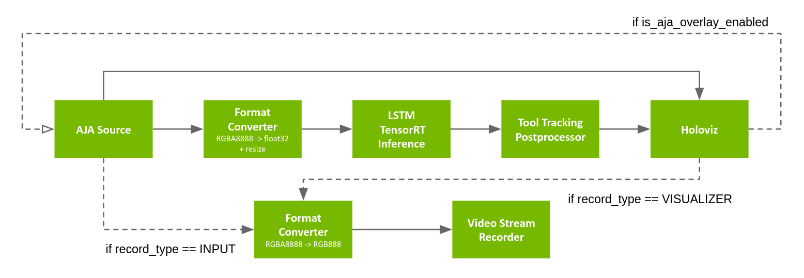

# Endoscopy Tool Tracking

This application demonstrates real-time AI-powered tool detection and tracking in endoscopic video streams.

## Overview

Digital endoscopy is a key technology for medical screenings and minimally invasive surgeries. Using real-time AI workflows to process and analyze the video signal produced by the endoscopic camera, this technology helps medical professionals with anomaly detection and measurements, image enhancements, alerts, and analytics.


_Fig. 1 Endoscopy (laparoscopy) image from a cholecystectomy (gallbladder removal surgery) showing AI-powered frame-by-frame tool identification and tracking. Image courtesy of Research Group Camma, IHU Strasbourg and the University of Strasbourg ([NGC Resource](https://catalog.ngc.nvidia.com/orgs/nvidia/teams/clara-holoscan/resources/holoscan_endoscopy_sample_data))_

The Endoscopy tool tracking application provides an example of how an endoscopy data stream can be captured and processed using the C++ or Python APIs on multiple hardware platforms.

### Video Stream Replayer Input


Fig. 2 Tool tracking application workflow with replay from file

The pipeline uses a recorded endoscopy video file (generated by `convert_video_to_gxf_entities` script) for input frames. Each input frame in the file is loaded by [Video Stream Replayer](https://docs.nvidia.com/holoscan/sdk-user-guide/holoscan_operators_extensions.html#operators) and passed to the following two branches:

- In the first branch, the input frames are directly passed to [Holoviz](https://docs.nvidia.com/holoscan/sdk-user-guide/holoscan_operators_extensions.html#operators) for rendering in the background.
- In the second branch, the frames go through the [Format Converter](https://docs.nvidia.com/holoscan/sdk-user-guide/holoscan_operators_extensions.html#operators) to convert the data type of the image from `uint8` to `float32` before it is fed to the tool tracking model (with [Custom TensorRT Inference](https://docs.nvidia.com/holoscan/sdk-user-guide/holoscan_operators_extensions.html#operators)). The result is then ingested by the [Tool Tracking Postprocessor](https://docs.nvidia.com/holoscan/sdk-user-guide/holoscan_operators_extensions.html#operators) which extracts the masks, points, and text from the inference output, before [Holoviz](https://docs.nvidia.com/holoscan/sdk-user-guide/holoscan_operators_extensions.html#operators) renders them as overlays.

The pipeline graph also defines an optional [Video Stream Recorder](https://docs.nvidia.com/holoscan/sdk-user-guide/holoscan_operators_extensions.html#stream-playback) that can be enabled to record the original video stream to disk (`record_type: 'input'`), or the final render by Holoviz (`record_type: 'visualizer'`) after going from `RGBA8888` to `RGB888` using a [Format Converter](https://docs.nvidia.com/holoscan/sdk-user-guide/holoscan_operators_extensions.html#operators). Recording is disabled by default (`record_type: 'none'`) in order to maximize performance.

### AJA Card input


Fig. 3 Tool tracking application workflow with input from AJA video source

The pipeline is similar to the one using the recorded video, with the exceptions below:

- the input source is replaced with [AJA Source](https://docs.nvidia.com/holoscan/sdk-user-guide/holoscan_operators_extensions.html#operators) (pixel format is `RGBA8888` with a resolution of 1920x1080)
- the [Format Converter](https://docs.nvidia.com/holoscan/sdk-user-guide/holoscan_operators_extensions.html#operators) in the inference pipeline is configured to also resize the image, and convert to `float32` from `RGBA8888`
- the [Format Converter](https://docs.nvidia.com/holoscan/sdk-user-guide/holoscan_operators_extensions.html#operators) in the recording pipeline is used for `record_type: INPUT` also

#### Building with AJA support

```bash
./holohub build --local endoscopy_tool_tracking --build-with="aja_source"
```

#### Hardware keying

For AJA cards that support Hardware Keying, you can use the `endoscopy_tool_tracking_aja_overlay.yaml` config file to overlay the segmentation results on the input video on the AJA card FPGA. The overlay layer is sent from [Holoviz](https://docs.nvidia.com/holoscan/sdk-user-guide/holoscan_operators_extensions.html#operators) back to the [AJA Source](https://docs.nvidia.com/holoscan/sdk-user-guide/holoscan_operators_extensions.html#operators) operator which handles the alpha blending and outputs it to a port of the the AJA card. The blended image is also sent back to the [Holoviz](https://docs.nvidia.com/holoscan/sdk-user-guide/holoscan_operators_extensions.html#operators) operator (instead of the input video only) for rendering the same image buffer.

### Deltacast VideoMaster input

The application supports live video capture using a [DELTACAST.TV VideoMaster](https://www.deltacast.tv/) SDI or HDMI capture card via the `holoscan-deltacast` external module. When built with Deltacast support, `VideoMasterSourceOp` replaces the replayer as the video source. The pipeline captures frames from the card, passes them through the same format conversion and LSTM inference stages, and renders the tool tracking overlay with Holoviz. An optional `VideoMasterTransmitterOp` is also instantiated and loops the annotated output back to the card's output port, enabling on-card compositing.

The key pipeline differences from the replayer mode are:

- the input source is `VideoMasterSourceOp` (pixel format `RGBA8888`, configurable resolution and frame rate via the `deltacast` section of the YAML config — defaults to 1920×1080 @ 25 fps)
- a dedicated `FormatConverterOp` (`format_converter_deltacast`) converts `RGBA8888` → `float32`, reorders channels from BGR to RGB, and resizes to 854×480 before LSTM inference
- when an output port is connected, `VideoMasterTransmitterOp` receives the Holoviz overlay, which is converted back to `RGBA8888` with channel reordering before output

#### Requirements

- **Hardware**: a DELTACAST.TV VideoMaster SDI or HDMI capture card installed in the host system
- **Deltacast SDK**: the VideoMaster SDK from DELTACAST.TV must be installed. Contact [DELTACAST.TV](https://www.deltacast.tv/) for access. The `holoscan-deltacast` module provides a mock SDK for development builds without a card.
- **Holoscan SDK** ≥ 4.3.0
- The `holoscan-deltacast` module is fetched automatically by the HoloHub CLI at build time; no manual checkout is required. See the Holoscan Deltacast external module repository for more details on Deltacast support for Holoscan-based development: <https://github.com/deltacasttv/holoscan-modules>

#### Build and Run with Deltacast support

**Real VideoMaster SDK (requires DELTACAST.TV hardware and SDK):**

Set `VIDEOMASTER_SDK_DIR` to the VideoMaster SDK installation path, then run:

```bash
export VIDEOMASTER_SDK_DIR=/path/to/videomaster/sdk

./holohub run endoscopy_tool_tracking deltacast[_mock] --language=[cpp/python]
```

**Mock SDK (development without real capture card or VideoMaster SDK):**

```bash
# C++
./holohub run endoscopy_tool_tracking cpp deltacast_mock
# Python
./holohub run endoscopy_tool_tracking python deltacast_mock
```

The CLI automatically mounts `$VIDEOMASTER_SDK_DIR` into the container at the same path and passes `-DVIDEOMASTER_SDK_DIR=$VIDEOMASTER_SDK_DIR` and `-DVIDEOMASTER_USE_MOCK:BOOL=OFF` to CMake.

Both modes use `endoscopy_tool_tracking_deltacast.yaml` (copied to the build directory automatically), which sets `source: deltacast` so the C++ application reads from the capture card rather than the replayer. The Python application is launched with `--source deltacast`.

Card selection, signal format, and output port are configured in the `deltacast` section of `endoscopy_tool_tracking_deltacast.yaml`.

### Using VTK for rendering

The tool tracking application can use the [VTK](https://vtk.org/) library to
render the tool tracking results on top of the endoscopy video frames. The VTK
library is a powerful open-source software system for 3D computer graphics,
image processing, and visualization. The VTK library provides a wide range of
functionalities for rendering, including 2D and 3D graphics, image processing,
and visualization. The tool tracking application uses VTK to render the tool
tracking results on top of the endoscopy video frames.

### How to build and run the Endoscopy Tool Tracking application with VTK

The following command builds and runs the Endoscopy Tool Tracking application with VTK:

```bash
# change the configuration to use VTK (vtk_renderer) as the default renderer
sed -i -e 's#^visualizer:.*#visualizer: "vtk"#' applications/endoscopy_tool_tracking/cpp/endoscopy_tool_tracking.yaml applications/endoscopy_tool_tracking/python/endoscopy_tool_tracking.yaml

# build and launch the application
# C++
./holohub run endoscopy_tool_tracking --build-with="vtk_renderer" --docker-file="operators/vtk_renderer/Dockerfile" --img holohub:endoscopy_tool_tracking_vtk --language="cpp"

# Python (see below for additional steps)
./holohub run endoscopy_tool_tracking --build-with="vtk_renderer" --docker-file="operators/vtk_renderer/Dockerfile" --img holohub:endoscopy_tool_tracking_vtk --language="python"
```

Arguments:

- `--build-with` : instructs the script to build the application with the `vtk_renderer` operator
- `--docker-file`: instructs the script to use the `operators/vtk_renderer/Dockerfile` that includes VTK libraries

## Containerize the application

To containerize the application using [Holoscan CLI](https://docs.nvidia.com/holoscan/sdk-user-guide/cli/cli.html), first build the application using `./holohub install endoscopy_tool_tracking`, run the `package-app.sh` script in the [cpp](./cpp/package-app.sh) or the [python](./python/package-app.sh) directory and then follow the generated output to package and run the application.

Refer to the [Packaging Holoscan Applications](https://docs.nvidia.com/holoscan/sdk-user-guide/holoscan_packager.html) section of the [Holoscan User Guide](https://docs.nvidia.com/holoscan/sdk-user-guide/) to learn more about installing the Holoscan CLI or packaging your application using Holoscan CLI.
