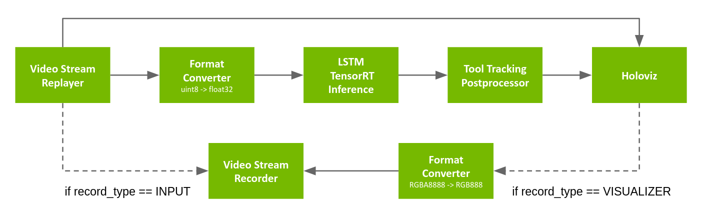

# Endoscopy Tool Tracking

This application demonstrates real-time AI-powered tool detection and tracking in endoscopic video streams.

## Overview

Digital endoscopy is a key technology for medical screenings and minimally invasive surgeries. Using real-time AI workflows to process and analyze the video signal produced by the endoscopic camera, this technology helps medical professionals with anomaly detection and measurements, image enhancements, alerts, and analytics.

  
_Fig. 1 Endoscopy (laparoscopy) image from a cholecystectomy (gallbladder removal surgery) showing AI-powered frame-by-frame tool identification and tracking. Image courtesy of Research Group Camma, IHU Strasbourg and the University of Strasbourg ([NGC Resource](https://catalog.ngc.nvidia.com/orgs/nvidia/teams/clara-holoscan/resources/holoscan_endoscopy_sample_data))_

The Endoscopy tool tracking application provides an example of how an endoscopy data stream can be captured and processed using the C++ or Python APIs on multiple hardware platforms.

### Video Stream Replayer Input

  
Fig. 2 Tool tracking application workflow with replay from file

The pipeline uses a recorded endoscopy video file (generated by `convert_video_to_gxf_entities` script) for input frames. Each input frame in the file is loaded by [Video Stream Replayer](https://docs.nvidia.com/holoscan/sdk-user-guide/holoscan_operators_extensions.html#operators) and passed to the following two branches:

- In the first branch, the input frames are directly passed to [Holoviz](https://docs.nvidia.com/holoscan/sdk-user-guide/holoscan_operators_extensions.html#operators) for rendering in the background.
- In the second branch, the frames go through the [Format Converter](https://docs.nvidia.com/holoscan/sdk-user-guide/holoscan_operators_extensions.html#operators) to convert the data type of the image from `uint8` to `float32` before it is fed to the tool tracking model (with [Custom TensorRT Inference](https://docs.nvidia.com/holoscan/sdk-user-guide/holoscan_operators_extensions.html#operators)). The result is then ingested by the [Tool Tracking Postprocessor](https://docs.nvidia.com/holoscan/sdk-user-guide/holoscan_operators_extensions.html#operators) which extracts the masks, points, and text from the inference output, before [Holoviz](https://docs.nvidia.com/holoscan/sdk-user-guide/holoscan_operators_extensions.html#operators) renders them as overlays.

The pipeline graph also defines an optional [Video Stream Recorder](https://docs.nvidia.com/holoscan/sdk-user-guide/holoscan_operators_extensions.html#stream-playback) that can be enabled to record the original video stream to disk (`record_type: 'input'`), or the final render by Holoviz (`record_type: 'visualizer'`) after going from `RGBA8888` to `RGB888` using a [Format Converter](https://docs.nvidia.com/holoscan/sdk-user-guide/holoscan_operators_extensions.html#operators). Recording is disabled by default (`record_type: 'none'`) in order to maximize performance.

### AJA Card input

  
Fig. 3 Tool tracking application workflow with input from AJA video source

The pipeline is similar to the one using the recorded video, with the exceptions below:

- the input source is replaced with [AJA Source](https://docs.nvidia.com/holoscan/sdk-user-guide/holoscan_operators_extensions.html#operators) (pixel format is `RGBA8888` with a resolution of 1920x1080)
- the [Format Converter](https://docs.nvidia.com/holoscan/sdk-user-guide/holoscan_operators_extensions.html#operators) in the inference pipeline is configured to also resize the image, and convert to `float32` from `RGBA8888`
- the [Format Converter](https://docs.nvidia.com/holoscan/sdk-user-guide/holoscan_operators_extensions.html#operators) in the recording pipeline is used for `record_type: INPUT` also
#### Building with AJA support
```bash
./run build endoscopy_tool_tracking --with aja_source
```
#### Hardware keying
For AJA cards that support Hardware Keying, you can use the `endoscopy_tool_tracking_aja_overlay.yaml` config file to overlay the segmentation results on the input video on the AJA card FPGA. The overlay layer is sent from [Holoviz](https://docs.nvidia.com/holoscan/sdk-user-guide/holoscan_operators_extensions.html#operators) back to the [AJA Source](https://docs.nvidia.com/holoscan/sdk-user-guide/holoscan_operators_extensions.html#operators) operator which handles the alpha blending and outputs it to a port of the the AJA card. The blended image is also sent back to the [Holoviz](https://docs.nvidia.com/holoscan/sdk-user-guide/holoscan_operators_extensions.html#operators) operator (instead of the input video only) for rendering the same image buffer.

### Using VTK for rendering

The tool tracking application can use the [VTK](https://vtk.org/) library to
render the tool tracking results on top of the endoscopy video frames. The VTK
library is a powerful open-source software system for 3D computer graphics,
image processing, and visualization. The VTK library provides a wide range of
functionalities for rendering, including 2D and 3D graphics, image processing,
and visualization. The tool tracking application uses VTK to render the tool
tracking results on top of the endoscopy video frames.

### How to build and run the Endoscopy Tool Tracking application with VTK

The following command builds and runs the Endoscopy Tool Tracking application with VTK:

```bash
# change the configuration to use VTK (vtk_renderer) as the default renderer
sed -i -e 's#^visualizer:.*#visualizer: "vtk"#' applications/endoscopy_tool_tracking/cpp/endoscopy_tool_tracking.yaml applications/endoscopy_tool_tracking/python/endoscopy_tool_tracking.yaml

# build and launch the application
# C++
./dev_container build_and_run endoscopy_tool_tracking --build_with vtk_renderer --docker_file operators/vtk_renderer/vtk.Dockerfile --language cpp

# Python (see below for additional steps)
./dev_container build_and_run endoscopy_tool_tracking --build_with vtk_renderer --docker_file operators/vtk_renderer/vtk.Dockerfile --language python
```

> 💡 Note: To enable VTK renderer in the Python version of the application, open [endoscopy_tool_tracking.py](./python/endoscopy_tool_tracking.py#L41) and uncomment the following lines:
>
> ```python
>  # Line 41
>  from holohub.vtk_renderer import VtkRendererOp
>  
>  # Lines 213-221
>  else:
>       visualizer = VtkRendererOp(
>           self,
>           name="vtk",
>           width=width,
>           height=height,
>           window_name="VTK (Kitware) Python",
>           **self.kwargs("vtk_op"),
>       )
> ```

Arguments:

- `--build_with` : instructs the script to build the application with the `vtk_renderer` operator
- `--docker_file`: instructs the script to use the `operators/vtk_renderer/vtk.Dockerfile` that includes VTK libraries

## Dev Container

To start the the Dev Container, run the following command from the root directory of Holohub:

```bash
./dev_container vscode
```

### VS Code Launch Profiles

#### C++

Use the `(gdb) endoscopy_tool_tracking/cpp` launch profile to start and debug the application.

#### Python

There are a two launch profiles configured for this application:

1. **(debugpy) endoscopy_tool_tracking/python**: This launch profile enables debugging of Python code.
2. **(pythoncpp) endoscopy_tool_tracking/python**: This launch profile enables debugging of Python and C++ code.

## Containerize the application

To containerize the application using [Holoscan CLI](https://docs.nvidia.com/holoscan/sdk-user-guide/cli/cli.html), first build the application using `./dev_container build_and_install endoscopy_tool_tracking`, run the `package-app.sh` script in the [cpp](./cpp/package-app.sh) or the [python](./python/package-app.sh) directory and then follow the generated output to package and run the application.

Refer to the [Packaging Holoscan Applications](https://docs.nvidia.com/holoscan/sdk-user-guide/holoscan_packager.html) section of the [Holoscan User Guide](https://docs.nvidia.com/holoscan/sdk-user-guide/) to learn more about installing the Holoscan CLI or packaging your application using Holoscan CLI.
