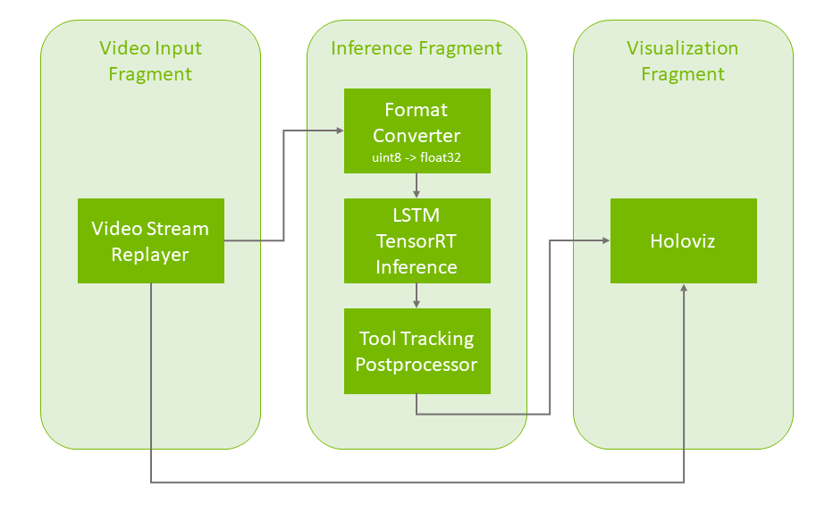

## Distributed Endoscopy Tool Tracking Application

Digital endoscopy is a key technology for medical screenings and minimally invasive surgeries. Using real-time AI workflows to process and analyze the video signal produced by the endoscopic camera, this technology helps medical professionals with anomaly detection and measurements, image enhancements, alerts, and analytics.

 
Fig. 1 Endoscopy (laparoscopy) image from a cholecystectomy (gallbladder removal surgery) showing AI-powered frame-by-frame tool identification and tracking. Image courtesy of Research Group Camma, IHU Strasbourg and the University of Strasbourg ([NGC Resource](https://catalog.ngc.nvidia.com/orgs/nvidia/teams/clara-holoscan/resources/holoscan_endoscopy_sample_data))

The Distributed Endoscopy Tool Tracking application provides an example of how an endoscopy data stream can be captured and processed using the C++ or Python APIs on multiple hardware platforms.

The Distributed Endoscopy Tool Tracking application is very similar to the [Endoscopy Tool Tracking application](../endoscopy_tool_tracking/) but divides all operators into three fragments as depicted below. 
This allows fragments to run on different systems. For example, one can run the *Video Input Fragment* and the *Visualization Fragment* on a radiology workstation while the *Inference Fragment* runs on a more powerful system with multiple GPUs. Refer to the [Holoscan SDK User Guide](https://docs.nvidia.com/holoscan/sdk-user-guide/holoscan_core.html) for more information on distributed applications.

### Video Stream Replayer Input
 
Fig. 2 Tool tracking application workflow with replay from file

The pipeline uses a recorded endoscopy video file (generated by `convert_video_to_gxf_entities` script) for input frames. Each input frame in the file is loaded by [Video Stream Replayer](https://docs.nvidia.com/clara-holoscan/sdk-user-guide/holoscan_operators_extensions.html#operators) and passed to the following two pipeline branches:
- In the first branch, the input frames are directly passed to [Holoviz](https://docs.nvidia.com/clara-holoscan/sdk-user-guide/holoscan_operators_extensions.html#operators) in the **Visualization Fragment** for rendering in the background.
- In the second branch, the frames go through the [Format Converter](https://docs.nvidia.com/clara-holoscan/sdk-user-guide/holoscan_operators_extensions.html#operators) in the **Inference Fragment** to convert the data type of the image from `uint8` to `float32` before it is fed to the tool tracking model (with [Custom TensorRT Inference](https://docs.nvidia.com/clara-holoscan/sdk-user-guide/holoscan_operators_extensions.html#operators)). The result is then ingested by the [Tool Tracking Postprocessor](https://docs.nvidia.com/clara-holoscan/sdk-user-guide/holoscan_operators_extensions.html#operators) which extracts the masks, points, and text from the inference output, before [Holoviz](https://docs.nvidia.com/clara-holoscan/sdk-user-guide/holoscan_operators_extensions.html#operators) renders them as overlays in the **Visualization Fragment** .

