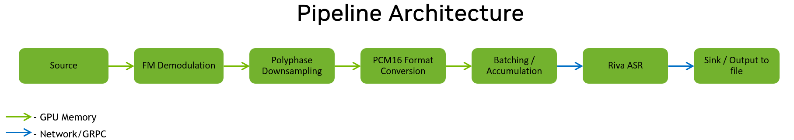
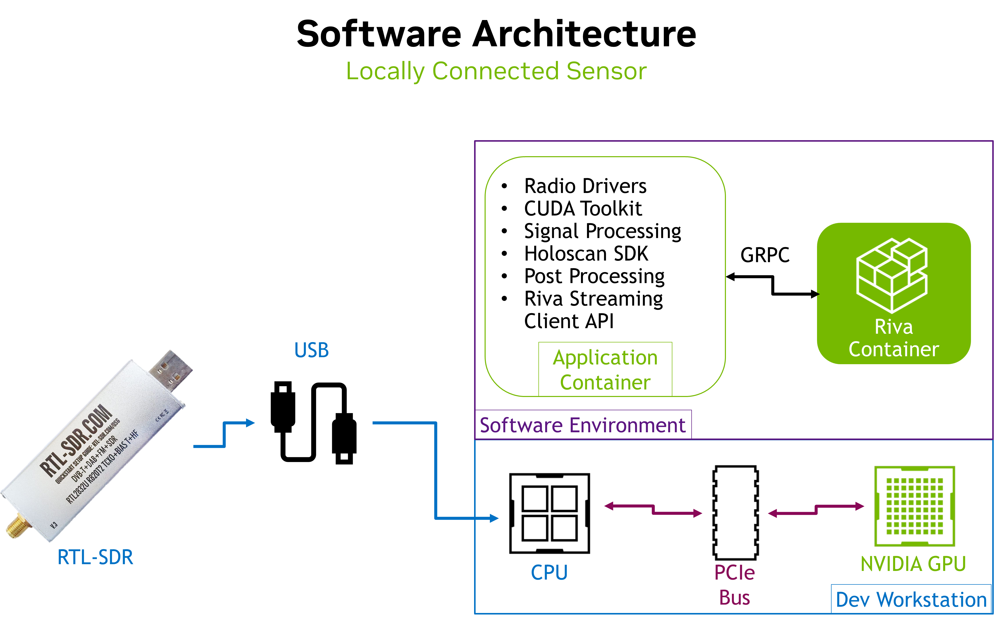

# FM Radio Automatic Speech Recognition

This project is proof-of-concept demo featuring the combination of real-time, low-level signal processing and deep learning inference. It currently supports the [RTL-SDR](https://www.rtl-sdr.com/). Specifically, this project demonstrates the demodulation, downsampling, and automatic transcription of live, civilian FM radio broadcasts. The pipeline architecture is shown in the figure below. 



The primary pipeline segments are written in Python. Future improvements will introduce a fully C++ system.

This project leverages NVIDIA's [Holoscan SDK](https://github.com/nvidia-holoscan/holoscan-sdk) for performant GPU pipelines, cuSignal package for GPU-accelerated signal processing, and the [RIVA SDK](https://docs.nvidia.com/deeplearning/riva/user-guide/docs/overview.html) for high accuracy automatic speech recognition (ASR).

## Table of Contents
- [FM ASR](#fm-asr)
  - [Table of Contents](#table-of-contents)
  - [Install](#install)
    - [Local Sensor - Basic Configuration](#local-sensor---basic-configuration)
      - [Local Jetson Container](#local-jetson-container)
    - [Remote Sensor - Network in the Loop](#remote-sensor---network-in-the-loop)
    - [Bare Metal Install](#bare-metal-install)
  - [Startup](#startup)
    - [Scripted Launch](#scripted-launch)
    - [Manual Launch](#manual-launch)
    - [Initialize and Start the Riva Service](#initialize-and-start-the-riva-service)
  - [Configuration Parameters](#configuration-parameters)
      - [Known Issues](#known-issues)

## Install
To begin installation, clone this repository using the following:
```bash
git clone https://github.com/nvidia-holoscan/holohub.git
```
NVIDIA Riva is required to perform the automated transcriptions. You will need to install and configure the [NGC-CLI](https://ngc.nvidia.com/setup/installers/cli) tool, if you have not done so already, to obtain the Riva container and API. The Riva installation steps may be found at this link: [Riva-Install](https://docs.nvidia.com/deeplearning/riva/user-guide/docs/quick-start-guide.html). Note that Riva performs a TensorRT build during setup and requires access to the targeted GPU. 
This project has been tested with RIVA 2.10.0.

Container-based development and deployment is supported. The supported configurations are explained in the sections that follow. 

### Local Sensor - Basic Configuration
The Local Sensor configuration assumes that the RTL-SDR is connected directly to the GPU-enabled system via USB. I/Q samples are collected from the RTL-SDR directly, using the SoapySDR library. Specialized containers are provided for Jetson devices.

Only two containers are used in this configuration: 
- The Application Container which includes all the necessary low level libraries, radio drivers, Holoscan SDK for the core application pipeline, and the Riva client API; and
- The Riva SDK container that houses the ASR transcription service.



For convenience, container build scripts are provided to automatically build the application containers for Jetson and x86 systems. The Dockerfiles can be readily modified for ARM based systems with a discrete GPU. To build the container for this configuration, run the following:
```bash
# Starting from FM-ASR root directory
cd scripts
./build_application_container.sh # builds Application Container
```
Note that this script does not build the Riva container.

A script for running the application container is also provided. The run scripts will start the containers and leave the user at a bash terminal for development. Separate launch scripts are provided to automatically run the application.
```bash
# Starting from FM-ASR root directory
./scripts/run_application_container.sh
```

#### Local Jetson Container
Helper scripts will be provided in a future release.


### Remote Sensor - Network in the Loop
This configuration is currently in work and will be provided in a future release. Developers can modify this code base to support this configuration if desired.

### Bare Metal Install
Will be added in the future. Not currently supported.

## Startup
After installation, the following steps are needed to launch the application:
1. Start the Riva ASR service
2. Launch the Application Container

### Scripted Launch
The above steps are automated by some helper scripts.
```bash
# Starting from FM-ASR root directory
./scripts/lauch_application.sh # Starts Application Container and launches app using the config file defined in the script

```
### Manual Launch
As an alternative to `launch_application.sh`, the FM-ASR pipeline can be run from inside the Application Container using the following commands:
```bash
cd /workspace
export CONFIG_FILE=/workspace/params/holoscan.yml # can be edited by user
python fm_asr_app.py $CONFIG_FILE
```

### Initialize and Start the Riva Service
Riva can be setup following the [Quickstart guide](https://docs.nvidia.com/deeplearning/riva/user-guide/docs/quick-start-guide.html#) (version 2.10.0 currently supported). To summarize it, run the following:
```bash
cd <riva_quickstart_download_directory>
bash riva_init.sh
bash riva_start.sh
```
The initialization step will take a while to complete but only needs to be done once. Riva requires a capable GPU to setup and run properly. If your system has insufficient resources, the initialization script may hang. 

When starting the service, Riva may output a few "retrying" messages. This is normal and not an indication that the service is frozen. You should see a message saying ```Riva server is ready...``` once successful. 

*Note for users with multiple GPUs:*

If you want to specify which GPU Riva uses (defaults to device 0), open and edit ```<riva_quickstart_download_directory>/config.sh```, then change line
```bash
gpus_to_use="device=0"
```
to
```bash
gpus_to_use="device=<your-device-number>"
# or, to guarantee a specific device
gpus_to_use="device=<your-GPU-UUID>"
```
You can determine your GPUs' UUIDs by running ```nvidia-smi -L```.

## Configuration Parameters
A table of the configuration parameters used in this project is shown below, organized by application operator.

| Parameter | Type | Description |
| --------- | ---- |  ----------- |
| run_time | int | Number of seconds that pipeline will execute |
| RtlSdrGeneratorOp|||
| sample_rate | float | Reception sample rate used by the radio. RTL-SDR max stable sample rate without dropping is 2.56e6.|
| tune_frequency | float | Tuning frequency for the radio in Hz. |
| gain | float | 40.0 | Gain applied to received signal. Max for RTL-SDR is 40. |
| PlayAudioOp |||
| play_audio | bool | Flag used to enable simultaneous audio playback of signal. |
| RivaAsrOp |||
| sample_rate | int | Audio sample rate expected by the Riva ASR model. Riva default is to 16000, other values will incurr an additional resample operation within Riva. |
| max_alternatives | int | Riva - Maximum number of alternative transcripts to return (up to limit configured on server). Setting to 1 returns only the best response. |
| word-time-offsets | bool | Riva - Option to output word timestamps in transcript.|
| automatic-punctuation | bool | Riva - Flag that controls if transcript should be automatically punctuated. |
| uri | str | localhost:50051 | Riva - URI/IP address to access the Riva server. Must match IP that Riva service was configured with. Default is localhost:50051. |
| no-verbatim-transcripts | bool | Riva - If specified, text inverse normalization will be applied |
| boosted_lm_words | str | Riva - words to boost when decoding. Useful for handling jargon and acronyms. |
| boosted_lm_score | float | Value by which to boost words when decoding |
| language-code | str | Riva - Language code of the model to be used. US English is en-US. Check Riva docs for more options|
| interim_transcriptions | bool | Riva - Flag to include interim transcriptions in the output file. |
| ssl_cert | str | Path to SSL client certificates file. Not currently utilized |
| use_ssl | bool | Boolean to control if SSL/TLS encryption should be used. Not currently utilized. |
| recognize_interval| int | Specifies the amount of data RIVA processes per request, in time (s). |
| TranscriptSinkOp |||
| output_file | str | File path to store a transcript. Existing files will be overwritten. |


#### Known Issues
This table will be populated as issues are identified.

| Issue | Description | Status|
| ----- | ----------- | ---|


