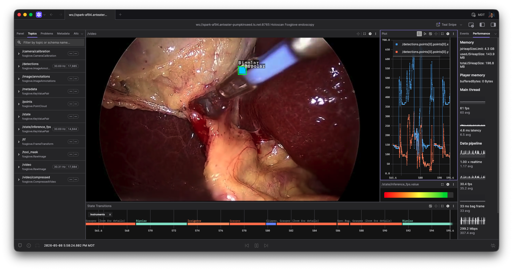

# Foxglove endoscopy tool tracking

This application shows the Foxglove operator in an endoscopy tool-tracking graph.
It replays the standard HoloHub endoscopy sample, runs the existing LSTM
tool-tracking inference path, and publishes video, tool-coordinate annotations,
and inference FPS to Foxglove Studio.



## Requirements

- Holoscan SDK 4.1.0 or newer.
- The HoloHub endoscopy tool-tracking dataset generated through the normal
  HoloHub data workflow.
- Foxglove Studio connected to `ws://localhost:8765`.

## Quick start

You can build and run the application within a container using the following command:

**For C++:**

```bash
./holohub run foxglove_endoscopy_tool_tracking --language cpp
```

**For Python:**

```bash
./holohub run foxglove_endoscopy_tool_tracking --language python
```

Then connect Foxglove Studio to `ws://localhost:8765`.

## Topics

The C++ app publishes:

| Topic | Message | Description |
| ----- | ------- | ----------- |
| `/video` | `RawImage` | Replayed endoscopy frame. |
| `/detections` | `ImageAnnotations` | Tool points, labels, and small boxes aligned to `/video`. |
| `/state/inference_fps` | `KeyValuePair` | Inference throughput estimate for plotting. |

The Python app publishes `/video`, `/tool_mask`, and `/detections`. It
demonstrates the Python publisher and tensor/annotation adapter path; the C++
app is the fuller example because it also publishes inference FPS.

## Notes

The sample does not publish `/tf` pose transforms because the source dataset
does not include camera or tool pose data. Pose publishing is implemented in the
operator through `FoxglovePoseAdapterOp` and is intended for graphs that already
produce a 4x4 transform tensor or `xyz+quat` tensor.
