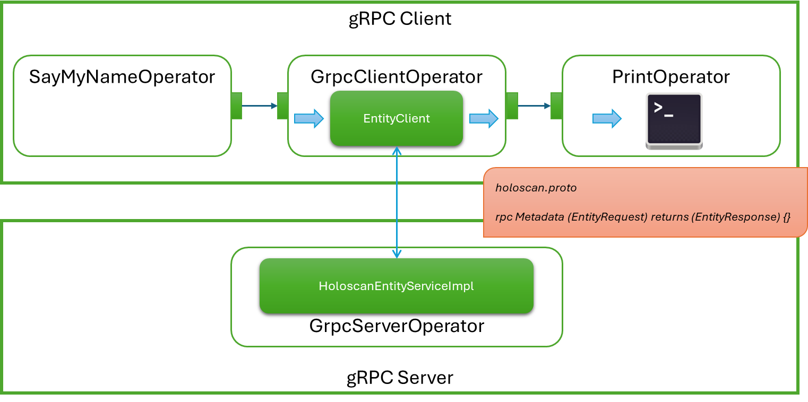

# Hello World with gRPC & Holoscan SDK



## Overview

This sample application demonstrates how to embed gRPC services into a Holoscan application.

## Description

This sample application contains two binary files: [`grpc_server`](./grpc_server.cpp) and [`grpc_client`](./grpc_client.cpp) where the client sends a name to the server, and the server sends a greeting back.

The `server` is a Holoscan application that includes a `GrpcServerOperator`, where the operator itself is a C++ template allowing a custom gRPC service implementation to be instantiated. In this application, we use `HoloscanEntityServiceImpl`.

The `client` is a separate Holoscan application with three operators: `SayMyNameOperator`, `GrpcClientOperator`, and `PrintOperator`.

The `GrpcClientOperator` is also a c++ template allowing users to plug-in a custom gRPC client. In the sample application, we call it `EntityClient`. The gRPC client communicates with the gRPC service embedded inside the `GrpcServerOperator`.

The `SayMyNameOperator` sends a name to the `GrpcClientOperator`. The `GrpcClientOperator` composes a [protobuf message](./protos/holoscan.proto), and sends the message to the gRPC service via the 'EntityClient'. When the server receives the message, it replies with a greeting. When the `GrpcClientOperator` receives the reply, it forwards the greeting to the `PrintOperator` to print it to the terminal.

## Requirements

Holoscan SDK 2.5 or higher is required.

## Build and Run the Application

```bash
# Start the server
./dev_container build_and_run grpc_hello_world --run_args "--server"

# Start the client
./dev_container build_and_run grpc_hello_world --run_args "--client"
```

## Dev Container

To start the Dev Container, run the following command from the root directory of Holohub:

```bash
./dev_container vscode
```

### VS Code Launch Profiles

There are three launch profiles configured for this application:

1. **(gdb) grpc_hello_world/cpp Server**: Launch grpc_server.
2. **(gdb) grpc_hello_world/cpp Client**: Launch grpc_client.
3. **(compound) grpc_hello_world/cpp**: Launch both grpc_server and grpc_client.
