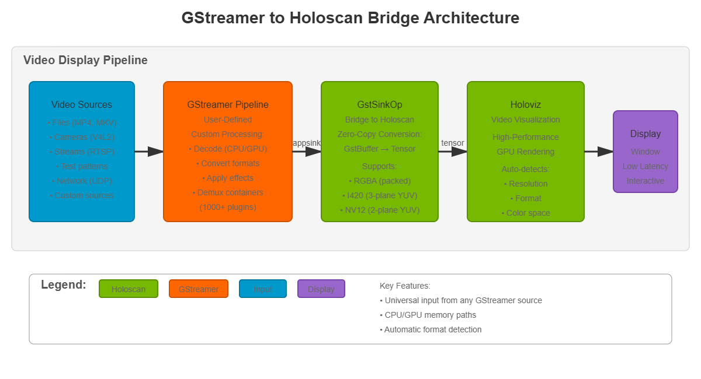

# GStreamer to Holoscan

A Holoscan application that receives video data from GStreamer pipelines and displays it using Holoviz, enabling integration of any GStreamer video source into Holoscan applications.



*Fig. 1: Application architecture showing the integration of GStreamer pipelines with Holoscan's Holoviz display*

## Description

This application showcases how to:

- Receive video from any GStreamer pipeline into Holoscan
- **Build custom GStreamer pipelines** as video sources (files, cameras, streams, effects, etc.)
- Display video using Holoscan's Holoviz operator with zero-copy operation
- Support both CPU and GPU memory paths for optimal performance
- Handle multiple video formats (RGBA, I420, NV12) automatically
- Process video with GStreamer's 1000+ plugins before display

**Key Feature: Universal Video Input**

The application provides a flexible bridge from GStreamer to Holoscan. You can construct **any GStreamer pipeline** as your video source - the examples provided are just demonstrations. This enables unlimited input possibilities:
- Video file playback (MP4, MKV, AVI, WebM, etc.)
- Live camera capture (V4L2, RTSP, IP cameras, etc.)
- Network streaming (RTP, RTSP, HTTP, UDP, etc.)
- Video effects and filters (before display)
- Format conversion and decoding (automatic)
- Test patterns (videotestsrc)
- Custom plugins (use your own GStreamer sources)

**Supported Video Formats:**

The sink automatically detects and handles:
- **RGBA** - Most common RGB format
- **I420** - YUV 4:2:0 planar (3-plane)
- **NV12** - YUV 4:2:0 semi-planar (2-plane)
- Other formats can be added by extending the bridge

## Requirements

- NVIDIA Holoscan SDK
- GStreamer 1.0 with the following plugins:
  - gstreamer1.0-plugins-base (videoconvert, videotestsrc, filesrc)
  - gstreamer1.0-plugins-bad (cudaconvert, cudaupload for GPU support, nvh264dec for GPU decoding)
  - gstreamer1.0-plugins-good (qtdemux, matroskademux for container formats, v4l2src for cameras, rtph264depay for streaming)
  - gstreamer1.0-plugins-ugly (avdec_h264 for CPU-based H.264 decoding)
  - Additional codecs available through gstreamer1.0-libav if needed

## Quick Start

To run the application with the default test pattern:

```bash
./holohub run gst_to_holo
```

This single-line command will build and run the customized container for this application with all the dependencies installed, and then build and start the application displaying a test pattern.

## Building

### Option 1: Containerized Build (Recommended)

No setup required - all dependencies are included in the container:

```bash
./holohub build gst_to_holo
```

### Option 2: Local Build

For faster builds and easier debugging. First install dependencies, then build locally:

```bash
# Install dependencies (from workspace root)
./applications/gstreamer/install_deps.sh

# Then build locally
./holohub build --local gst_to_holo
```

The `install_deps.sh` script installs:

- pkg-config (required for CMake)
- GStreamer development libraries
- All necessary GStreamer plugins for video sources and decoding

## Usage

The recommended way to run the application is through the `holohub` launcher:

```bash
./holohub run gst_to_holo --run-args="[OPTIONS]"
```

Alternatively, if you know the binary location, you can run it directly:

```bash
gst-to-holo [OPTIONS]
```

### Options

**General Options:**

- `-c, --count <number>` - Number of iterations to run (default: unlimited)
  - Useful for testing or limiting runtime
  - Application exits after processing this many frames
- `-p, --pipeline <desc>` - GStreamer pipeline description (default: `videotestsrc pattern=0 ! videoconvert name=sink`)
  - **IMPORTANT**: Your pipeline MUST name the final element as 'sink'
  - **Build any pipeline you want**: The examples are just suggestions - you have full access to GStreamer's 1000+ plugins
  - **Examples**: file playback, cameras, streams, effects, custom sources, etc.
- `--caps <caps_string>` - GStreamer capabilities for the sink (default: `video/x-raw,format=RGBA`)
  - Use `video/x-raw,format=RGBA` for CPU memory path
  - Use `video/x-raw(memory:CUDAMemory),format=RGBA` for GPU memory path
- `-h, --help` - Show help message

### Examples

**Note**: The following examples demonstrate common use cases. You can construct **any GStreamer pipeline** you want by using the `--pipeline` parameter. These are just starting points - feel free to combine, modify, or create entirely new pipelines using GStreamer's extensive plugin ecosystem.

#### Test Pattern Examples

**Display test pattern (default):**

```bash
./holohub run gst_to_holo
```

**Display test pattern with frame limit:**

```bash
./holohub run gst_to_holo --run-args="--count 300"
```

#### File Playback Examples

**Important Note**: When running through `holohub run` (in a container), use absolute paths:
- Inside container: `/workspace/holohub/video.mp4`
- On your host: `<workspace_path>/video.mp4` (wherever your holohub workspace is located)

**Play MP4 file (CPU decode, CPU memory):**

```bash
./holohub run gst_to_holo --run-args="--pipeline 'filesrc location=/workspace/holohub/video.mp4 ! qtdemux ! h264parse ! avdec_h264 ! videoconvert name=sink'"
```

**Play MP4 file (GPU decode, GPU memory for zero-copy):**

```bash
./holohub run gst_to_holo --run-args="--pipeline 'filesrc location=/workspace/holohub/video.mp4 ! qtdemux ! h264parse ! nvh264dec ! cudaconvert name=sink' --caps 'video/x-raw(memory:CUDAMemory),format=RGBA'"
```

**Play MKV file with automatic format detection:**

```bash
./holohub run gst_to_holo --run-args="--pipeline 'filesrc location=/workspace/holohub/video.mkv ! matroskademux ! h264parse ! avdec_h264 ! videoconvert name=sink'"
```

**Play video with uridecodebin (automatic decoding):**

```bash
./holohub run gst_to_holo --run-args="--pipeline 'uridecodebin uri=file:///workspace/holohub/video.mp4 ! videoconvert name=sink'"
```

#### Camera Examples

**Display from V4L2 camera:**

```bash
./holohub run gst_to_holo --run-args="--pipeline 'v4l2src device=/dev/video0 ! videoconvert name=sink'"
```

**Display from V4L2 camera with specific resolution:**

```bash
./holohub run gst_to_holo --run-args="--pipeline 'v4l2src device=/dev/video0 ! video/x-raw,width=1280,height=720 ! videoconvert name=sink'"
```

**Display from V4L2 camera with GPU acceleration:**

```bash
./holohub run gst_to_holo --run-args="--pipeline 'v4l2src device=/dev/video0 ! videoconvert ! cudaupload ! cudaconvert name=sink' --caps 'video/x-raw(memory:CUDAMemory),format=RGBA'"
```

#### Network Streaming Examples

**Receive RTP H.264 stream:**

**Important:** For UDP streaming, start the receiver FIRST, then the sender. UDP is connectionless - packets sent before the receiver is ready are lost.

Terminal 1 - Start receiver (gst_to_holo):
```bash
./holohub run gst_to_holo --run-args="--pipeline 'udpsrc port=5000 caps=\"application/x-rtp,encoding-name=H264\" ! rtph264depay ! h264parse ! avdec_h264 ! videoconvert name=sink'"
```

Terminal 2 - Then start sender:
```bash
gst-launch-1.0 videotestsrc ! videoconvert ! x264enc ! rtph264pay ! udpsink host=127.0.0.1 port=5000
```

**Connect to RTSP stream:**

```bash
./holohub run gst_to_holo --run-args="--pipeline 'rtspsrc location=rtsp://example.com/stream ! decodebin ! videoconvert name=sink'"
```

**Receive RTSP stream with GPU decode:**

```bash
./holohub run gst_to_holo --run-args="--pipeline 'rtspsrc location=rtsp://example.com/stream ! rtph264depay ! h264parse ! nvh264dec ! cudaconvert name=sink' --caps 'video/x-raw(memory:CUDAMemory),format=RGBA'"
```

#### Advanced Examples

**Apply video effects before display:**

```bash
./holohub run gst_to_holo --run-args="--pipeline 'filesrc location=/workspace/holohub/video.mp4 ! qtdemux ! h264parse ! avdec_h264 ! videoconvert ! videoflip method=horizontal-flip ! videobalance brightness=0.2 ! videoconvert name=sink'"
```

**Display with scaling:**

```bash
./holohub run gst_to_holo --run-args="--pipeline 'filesrc location=/workspace/holohub/video.mp4 ! qtdemux ! h264parse ! avdec_h264 ! videoconvert ! videoscale ! video/x-raw,width=1280,height=720 ! videoconvert name=sink'"
```

## Architecture

The application uses a simple pipeline to receive video from GStreamer and display it:

### Pipeline Flow

```text
GStreamer Pipeline → GstSinkOp → Holoviz → Display
```

**GStreamer Pipeline (user-defined):**
- Can be any GStreamer source or processing pipeline
- Must name the final element as 'sink' for proper linking
- Automatically negotiates format with the Holoscan sink

**GstSinkOp:**
- Receives video frames from GStreamer via GstSinkResource
- Converts GStreamer buffers to Holoscan tensors
- Handles both CPU and GPU memory paths
- Supports multiple video formats (RGBA, I420, NV12)

**Holoviz:**
- Displays the video frames in a window
- Provides high-performance rendering
- Automatically handles format-specific display requirements

## Performance

The application supports both host and device (CUDA) memory paths:

### CPU Memory Path (Default)

```bash
--caps "video/x-raw,format=RGBA"
```

- Uses host memory for video buffers
- Required for CPU-based decoders (avdec_h264, etc.)
- Data is copied from host to GPU for display
- Compatible with all GStreamer elements

### GPU Memory Path (Zero-Copy)

```bash
--caps "video/x-raw(memory:CUDAMemory),format=RGBA"
```

- Uses GPU memory for video buffers
- Requires GPU-capable GStreamer elements (nvh264dec, cudaconvert)
- Zero-copy operation for best performance
- Eliminates host-to-device memory transfers

**Performance Recommendations:**

- **For file playback**: Use GPU decode (`nvh264dec`) with CUDA memory for best performance
- **For cameras**: CPU path is usually sufficient unless doing heavy processing
- **For streams**: GPU decode reduces latency and CPU usage
- **For effects**: Keep data on GPU (`cudaupload`, `cudaconvert`) if possible

## Notes

### GStreamer Pipeline

- **Pipeline element naming**: The final element MUST be named 'sink' for proper linking
- **Full customization**: You can use ANY GStreamer elements and build any pipeline you need
- **Examples provided are starting points**: Modify, combine, or create entirely new pipelines
- **Dynamic elements**: Elements like `qtdemux`, `decodebin`, `uridecodebin` work automatically
- **Format handling**: The sink automatically detects and handles RGBA, I420, and NV12 formats
- **GPU pipelines**: Use `cudaconvert` as the final element with `--caps` containing `memory:CUDAMemory`
- **CPU pipelines**: Use `videoconvert` as the final element (default)
- **Discover elements**: Use `gst-inspect-1.0` to explore GStreamer's extensive plugin library (1000+ elements)

### Video Formats

The application automatically detects and handles:

- **RGBA** (8-bit per channel, 4 channels): Most common RGB format
- **I420** (YUV 4:2:0 planar): Y, U, V in separate planes (common in video codecs)
- **NV12** (YUV 4:2:0 semi-planar): Y plane + interleaved UV plane (efficient for hardware)

Format conversion is handled by GStreamer (`videoconvert` or `cudaconvert`), so you don't need to worry about input format - just ensure your pipeline ends with one of these formats.

### Display

- The Holoviz window can be closed at any time to exit the application
- Press `Ctrl+C` in the terminal to gracefully shut down
- Frame count can be limited with `--count` or runs indefinitely if not specified
- The application manages GStreamer pipeline lifecycle and handles cleanup properly

### File Paths in Containers

When running through `holohub run` (in a container):
- Inside container: `/workspace/holohub/` maps to your workspace root
- On your host: `<workspace_path>/` (wherever your holohub workspace is located)
- Always use `/workspace/holohub/` prefix in your pipeline commands

Example:
```bash
--pipeline "filesrc location=/workspace/holohub/video.mp4 ! ..."
```

## Troubleshooting

**Issue**: "Could not find element named 'sink' in pipeline"
- **Solution**: Make sure your pipeline ends with `name=sink`, for example: `videoconvert name=sink`

**Issue**: "Failed to link sink to appsink"
- **Solution**: Ensure the final element's output format is compatible (use `videoconvert` or `cudaconvert`)

**Issue**: Video plays but display is corrupted
- **Solution**: Try using CPU path (default caps) instead of GPU path, or vice versa

**Issue**: "Resource not found" error with file path
- **Solution**: Check your file path - use `/workspace/holohub/` prefix when running in container

**Issue**: No video from camera
- **Solution**: Check available cameras with `v4l2-ctl --list-devices` and use correct `/dev/videoX` device

**Issue**: Network stream not working
- **Solution**: Make sure receiver is started BEFORE sender for UDP/RTP streams

## See Also

- `holo_to_gst` - Pushes Holoscan video data into GStreamer pipelines (reverse direction)
- `gst_video_recorder` - Records video to files using GStreamer encoding
- [GStreamer documentation](https://gstreamer.freedesktop.org/documentation/)
- [Holoscan SDK documentation](https://docs.nvidia.com/holoscan/)
- [Holoviz operator documentation](https://docs.nvidia.com/holoscan/sdk-user-guide/visualization.html)
