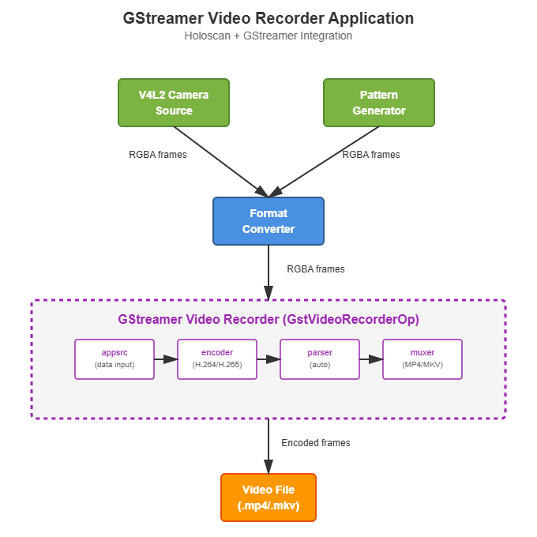

# GStreamer Video Recorder

A Holoscan application that demonstrates video recording using the GStreamer encoding pipeline.


*Fig. 1: Application architecture showing the integration of Holoscan operators with GStreamer's encoding pipeline*

## Description

This application showcases how to:

- Capture video from V4L2 cameras (USB webcams, MIPI cameras, etc.) or generate test patterns
- Feed video frames to GStreamer for encoding
- Record encoded video to files in various formats (MP4, MKV)
- Use different video codecs (H.264, H.265, and other GStreamer-supported codecs)
- Support both host and CUDA device memory for zero-copy operation

**Supported Video Sources:**

- **V4L2 Camera** - Capture from any V4L2-compatible camera (USB webcams, MIPI cameras, etc.)
- **Pattern Generator** - Generate animated test patterns (gradient, checkerboard, color bars)

## Requirements

- NVIDIA Holoscan SDK
- GStreamer 1.0 with the following plugins:
  - gstreamer1.0-plugins-base (videoconvert for host memory support)
  - gstreamer1.0-plugins-bad (cudaconvert, nvh264enc, nvh265enc for NVIDIA hardware encoding)
  - gstreamer1.0-plugins-good (mp4mux, matroskamux for container formats)
  - gstreamer1.0-plugins-ugly (x264enc for CPU-based H.264 encoding)
  - Additional codecs available through gstreamer1.0-libav if needed
- V4L2-compatible camera (optional, for camera capture mode)
  - USB webcams, MIPI CSI cameras, or any V4L2 video device
  - Use `v4l2-ctl --list-devices` to see available cameras

## Quick Start

To run the application with the default settings, simply run one of the following commands:

A. Using the **V4L2 camera**:

```bash
./holohub run gst_video_recorder v4l2
```

B. Generating test patterns:

```bash
./holohub run gst_video_recorder pattern
```

These single-line commands will build and run the customized container for this application with all the dependencies installed (defined by `Dockerfile`), and then build and start the application using the default settings. The output video will be saved in the build directory as `output.mp4`.

## Building

### Option 1: Containerized Build (Recommended)

No setup required - all dependencies are included in the container:

```bash
./holohub build gst_video_recorder
```

### Option 2: Local Build

For faster builds and easier debugging. First install dependencies:

```bash
# From the gst_video_recorder directory
./install_deps.sh

# Then build locally
./holohub build --local gst_video_recorder
```

The `install_deps.sh` script installs:

- pkg-config (required for CMake)
- GStreamer development libraries
- All necessary GStreamer plugins for encoding

## Usage

The recommended way to run the application is through the `holohub` launcher:

```bash
./holohub run gst_video_recorder --run-args="[OPTIONS]"
```

Alternatively, if you know the binary location, you can run it directly:

```bash
gst-video-recorder [OPTIONS]
```

### Options

**General Options:**

- `--source <type>` - Video source: `pattern` or `v4l2` (default: pattern)
- `-o, --output <filename>` - Output video filename (default: output.mp4)
  - Supported formats: .mp4, .mkv
  - If no extension, defaults to .mp4
- `-e, --encoder <name>` - Encoder base name (default: nvh264)
  - Examples: nvh264, nvh265, x264, x265
  - Note: 'enc' suffix is automatically appended
- `-c, --count <number>` - Number of frames to capture/generate (default: unlimited)
- `-f, --framerate <rate>` - Frame rate as fraction or decimal (default: 30/1)
  - Examples: '30/1', '30000/1001', '29.97', '60'
  - Use '0/1' for live mode (no throttling, real-time timestamps)
- `--property <key=value>` - Set encoder property (can be used multiple times)
  - Examples: --property bitrate=8000 --property preset=1
  - Property types are automatically detected and converted
- `--help` - Show help message

**Resolution Options:**

- `-w, --width <pixels>` - Frame width (default: 1920)
  - For V4L2: Must match a supported camera resolution
  - For pattern: Any reasonable resolution (64-8192 pixels)
- `-h, --height <pixels>` - Frame height (default: 1080)
  - For V4L2: Must match a supported camera resolution
  - For pattern: Any reasonable resolution (64-8192 pixels)

**V4L2 Camera Options:**

- `--device <path>` - V4L2 device path (default: /dev/video0)
- `--pixel-format <format>` - V4L2 pixel format (default: auto)
  - Examples: YUYV, MJPEG, auto

**Pattern Generator Options:**

- `--pattern <type>` - Pattern type (default: 0)
  - 0 = animated gradient
  - 1 = animated checkerboard
  - 2 = color bars (SMPTE style)
- `--storage <type>` - Memory storage type (default: 1)
  - 0 = host memory
  - 1 = device/CUDA memory

### Examples

#### V4L2 Camera Examples

**Record from default V4L2 camera at 1920x1080 (30 seconds at 30 FPS):**

```bash
./holohub run gst_video_recorder --run-args="--source v4l2 --width 1920 --height 1080 --count 900 -o camera.mp4"
```

**Record from specific V4L2 device with H.265:**

```bash
./holohub run gst_video_recorder --run-args="--source v4l2 --device /dev/video1 --width 1920 --height 1080 --encoder nvh265 --count 600 -o camera_h265.mp4"
```

**Record at 720p resolution:**

```bash
./holohub run gst_video_recorder --run-args="--source v4l2 --width 1280 --height 720 --count 300 -o camera_720p.mp4"
```

**Record with specific pixel format (YUYV):**

```bash
./holohub run gst_video_recorder --run-args="--source v4l2 --width 640 --height 480 --pixel-format YUYV --count 300 -o camera_yuyv.mp4"
```

**Record with custom encoder settings:**

```bash
./holohub run gst_video_recorder --run-args="--source v4l2 --property bitrate=12000 --property preset=1 --count 900 -o high_quality.mp4"
```

#### Pattern Generator Examples

**Record 10 seconds of animated gradient (300 frames at 30 FPS):**

```bash
./holohub run gst_video_recorder --run-args="--source pattern --count 300 -o video.mp4"
```

**Record high-quality H.265 video:**

```bash
./holohub run gst_video_recorder --run-args="--source pattern --count 300 --encoder nvh265 --property bitrate=10000 -o video.mp4"
```

**Record 720p video:**

```bash
./holohub run gst_video_recorder --run-args="--source pattern --count 300 --width 1280 --height 720 -o video_720p.mp4"
```

**Record checkerboard pattern:**

```bash
./holohub run gst_video_recorder --run-args="--source pattern --count 300 --pattern 1 -o checkerboard.mp4"
```

**Record using host memory (CPU):**

```bash
./holohub run gst_video_recorder --run-args="--source pattern --count 300 --storage 0 --encoder x264 -o video.mp4"
```

## Testing

The application includes integration tests to validate the pipeline execution and recording file creation. To run the tests, use the following command:

```bash
./holohub test gst_video_recorder --verbose
```

## Architecture

The application supports two video sources and uses a common encoding backend:

### Video Sources

1. **V4L2VideoCaptureOp**: Captures video from V4L2-compatible cameras (USB webcams, MIPI CSI cameras, etc.)
2. **PatternGenOperator**: Generates animated test patterns as Holoscan entities with tensors

### Encoding Backend

- **GstVideoRecorderOp**: Receives video frames, manages the GStreamer pipeline, and handles encoding

### Pipeline Flow

**V4L2 Camera Pipeline:**

```text
V4L2VideoCaptureOp → FormatConverterOp → GstVideoRecorderOp → GStreamer Pipeline → File
```

**Pattern Generator Pipeline:**

```text
PatternGenOperator → GstVideoRecorderOp → GStreamer Pipeline → File
```

The GStreamer encoding pipeline is automatically constructed based on the encoder and file format:

- **Pipeline structure**: `[converter] ! [encoder]enc ! [parser] ! [muxer] ! filesink`
- **Converter**: Automatically selected based on memory type (videoconvert for host, cudaconvert for device)
- **Encoder**: Specified via `--encoder` option (nvh264, nvh265, x264, x265, etc.)
- **Parser**: Automatically determined from encoder (h264parse, h265parse, etc.)
- **Muxer**: Automatically determined from file extension (mp4mux for .mp4, matroskamux for .mkv)

Example pipelines:

- **NVIDIA H.264 to MP4**: `cudaconvert ! nvh264enc ! h264parse ! mp4mux ! filesink`
- **NVIDIA H.265 to MKV**: `cudaconvert ! nvh265enc ! h265parse ! matroskamux ! filesink`
- **CPU x264 to MP4**: `videoconvert ! x264enc ! h264parse ! mp4mux ! filesink`

## Performance

The application supports both host and device (CUDA) memory:

- **Device memory** (`--storage 1`, default): Zero-copy operation for better performance when using NVIDIA hardware encoders (nvh264enc, nvh265enc)
- **Host memory** (`--storage 0`): Required for CPU encoders (x264, x265) but involves memory copies

## Notes

### Video Sources

**V4L2 Camera:**

- Supports any V4L2-compatible camera (USB webcams, MIPI CSI cameras)
- Camera resolution must be explicitly specified with `--width` and `--height`
- Use `v4l2-ctl --list-formats-ext` to see supported resolutions and formats
- FormatConverterOp automatically converts camera output to the format expected by the recorder

**Pattern Generator:**

- Supports three test patterns:
  - Animated gradient (default): Colorful sine wave patterns
  - Animated checkerboard: Moving checkerboard with variable square size
  - Color bars: SMPTE-style color bars (7 colors)
- Useful for testing the encoding pipeline without hardware dependencies

### Recording

- The application waits for encoding to complete before exiting to ensure proper file finalization
- EOS (End-Of-Stream) signal is sent automatically when recording completes
- Video parameters (width, height, format, storage) are automatically detected from incoming frames
- Frame count can be limited with `--count` or runs indefinitely if not specified
- Output files are written to the holohub workspace directory when using `./holohub run` (use absolute paths like `/workspace/holohub/video.mp4` for predictable output locations)
