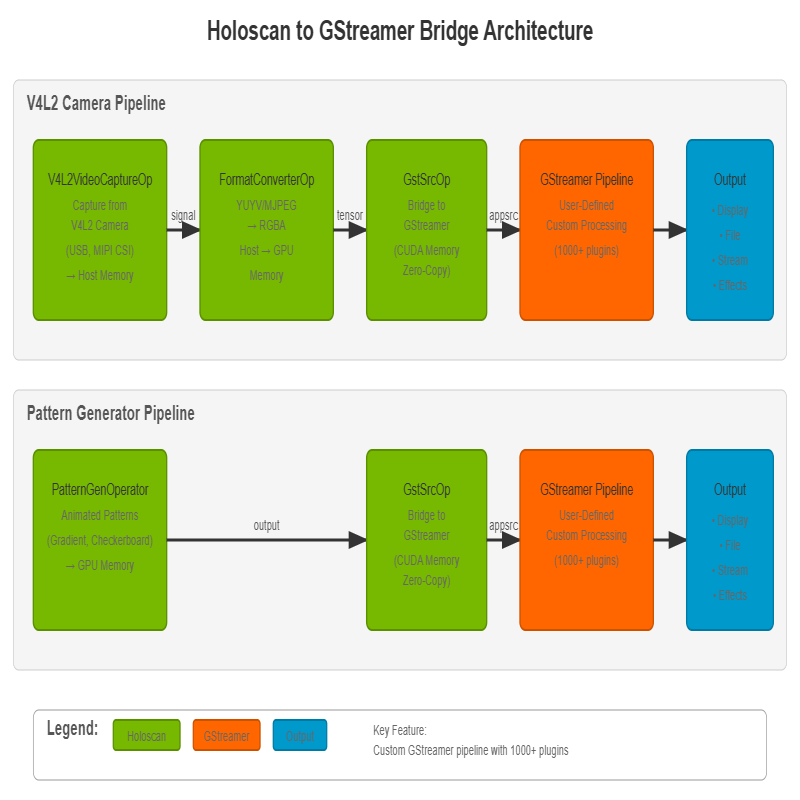

# Holoscan to GStreamer Bridge

A Holoscan application that pushes video data from Holoscan operators into GStreamer pipelines for processing, encoding, and streaming.



*Fig. 1: Application architecture showing the integration of Holoscan operators with GStreamer's flexible processing pipeline*

## Description

This application showcases how to:

- Capture video from V4L2 cameras (USB webcams, MIPI cameras, etc.) or generate test patterns
- Push video frames from Holoscan to GStreamer for processing
- **Build custom GStreamer pipelines** for your specific use case (encoding, streaming, effects, etc.)
- Stream or record video using any combination of GStreamer's 1000+ plugins
- Use different video codecs and effects through GStreamer plugins
- Support both host and CUDA device memory for zero-copy operation

**Key Feature: Custom Pipeline Construction**

The application provides a flexible bridge between Holoscan and GStreamer. You can construct **any GStreamer pipeline** you want - the examples provided are just demonstrations. This enables unlimited possibilities:
- Video encoding (H.264, H.265, VP8, VP9, AV1, etc.)
- Live streaming (RTP, RTSP, WebRTC, HLS, etc.)
- Video effects and filters (flip, rotate, color correction, etc.)
- Format conversion (resize, colorspace, etc.)
- Multi-output (tee to multiple destinations)
- Custom plugins (use your own GStreamer plugins)

**Supported Video Sources:**

- **V4L2 Camera** - Capture from any V4L2-compatible camera (USB webcams, MIPI cameras, etc.)
- **Pattern Generator** - Generate animated test patterns (gradient, checkerboard, color bars)

## Requirements

- NVIDIA Holoscan SDK
- GStreamer 1.0 with the following plugins:
  - gstreamer1.0-plugins-base (videoconvert for host memory support)
  - gstreamer1.0-plugins-bad (cudaconvert, cudadownload, nvh264enc, nvh265enc for NVIDIA hardware encoding)
  - gstreamer1.0-plugins-good (mp4mux, matroskamux for container formats, autovideosink for display)
  - gstreamer1.0-plugins-ugly (x264enc for CPU-based H.264 encoding)
  - Additional codecs available through gstreamer1.0-libav if needed
- V4L2-compatible camera (optional, for camera capture mode)
  - USB webcams, MIPI CSI cameras, or any V4L2 video device
  - Use `v4l2-ctl --list-devices` to see available cameras

## Quick Start

To run the application with the default settings, simply run one of the following commands:

A. Using the **V4L2 camera**:

```bash
./holohub run holo_to_gst v4l2
```

B. Generating test patterns:

```bash
./holohub run holo_to_gst pattern
```

These single-line commands will build and run the customized container for this application with all the dependencies installed, and then build and start the application using the default settings.

## Building

### Option 1: Containerized Build (Recommended)

No setup required - all dependencies are included in the container:

```bash
./holohub build holo_to_gst
```

### Option 2: Local Build

For faster builds and easier debugging. First install dependencies, then build locally:

```bash
# From the holo_to_gst directory
./install_deps.sh

# Then build locally
./holohub build --local holo_to_gst
```

The `install_deps.sh` script installs:

- pkg-config (required for CMake)
- GStreamer development libraries
- All necessary GStreamer plugins for processing and encoding

## Usage

The recommended way to run the application is through the `holohub` launcher with predefined modes:

```bash
./holohub run holo_to_gst [MODE] [--run-args="[OPTIONS]"]
```

Available modes:
- `v4l2` - Display live feed from V4L2 camera
- `pattern` - Display animated gradient pattern

You can override or extend mode settings with `--run-args`:

```bash
./holohub run holo_to_gst v4l2 --run-args="--count 300 --pipeline '...'"
```

Alternatively, if you know the binary location, you can run it directly:

```bash
holo-to-gst [OPTIONS]
```

### Options

**General Options:**

- `--source <type>` - Video source: `pattern` or `v4l2` (default: pattern)
- `-c, --count <number>` - Number of frames to capture/generate (default: unlimited)
- `-f, --framerate <fps>` - Frame rate in frames per second (default: 30)
- `-p, --pipeline <desc>` - GStreamer pipeline description (default: `cudadownload name=first ! videoconvert ! autovideosink sync=false`)
  - **IMPORTANT**: Your pipeline MUST name the first element as 'first'
  - **Build any pipeline you want**: The examples are just suggestions - you have full access to GStreamer's 1000+ plugins
  - **Examples**: encoding, streaming, effects, filters, multi-output, custom plugins, etc.
- `--caps <caps_string>` - GStreamer capabilities for the source (default: `video/x-raw,format=RGBA`)
- `--help` - Show help message

**Resolution Options:**

- `-w, --width <pixels>` - Frame width (default: 1920)
  - For V4L2: Must match a supported camera resolution
  - For pattern: Any reasonable resolution (64-8192 pixels)
- `-h, --height <pixels>` - Frame height (default: 1080)
  - For V4L2: Must match a supported camera resolution
  - For pattern: Any reasonable resolution (64-8192 pixels)

**V4L2 Camera Options:**

- `--device <path>` - V4L2 device path (default: /dev/video0)
  - Use `v4l2-ctl --list-devices` to find the correct device
  - Some devices (like `/dev/video1`) may be metadata-only and won't work
- `--pixel-format <format>` - V4L2 pixel format (default: auto)
  - Must use 4-character FourCC codes: `YUYV`, `MJPG`, `NV12`
  - `YUYV`/`NV12`: Uncompressed, typically max 1920x1080
  - `MJPG`: Compressed, supports higher resolutions (4K on some cameras)
  - `auto`: Automatically selects format (usually YUYV for lower resolutions)
- `--storage <type>` - Must be set to `1` for V4L2 (FormatConverterOp outputs GPU memory)

**Pattern Generator Options:**

- `--pattern <type>` - Pattern type (default: 0)
  - 0 = animated gradient
  - 1 = animated checkerboard
  - 2 = color bars (SMPTE style)
- `--storage <type>` - Memory storage type (default: 1)
  - 0 = host memory
  - 1 = device/CUDA memory

### Examples

**Note**: The following examples demonstrate common use cases. You can construct **any GStreamer pipeline** you want by using the `--pipeline` parameter. These are just starting points - feel free to combine, modify, or create entirely new pipelines using GStreamer's extensive plugin ecosystem.

#### V4L2 Camera Examples

**Important Note**: V4L2 cameras expose multiple `/dev/videoX` devices. Use `v4l2-ctl --list-devices` to identify the main video capture device (usually `/dev/video0`). Some devices like `/dev/video1` may be metadata-only and won't work for video capture.

**Display live camera feed (default 1920x1080):**

```bash
./holohub run holo_to_gst v4l2
```

**Record from default V4L2 camera (30 seconds at 30 FPS, 1080p):**

```bash
./holohub run holo_to_gst v4l2 --run-args="--count 900 --pipeline 'cudadownload name=first ! videoconvert ! x264enc ! mp4mux ! filesink location=/workspace/holohub/camera.mp4'"
```

The output file will be available at `holohub/camera.mp4` on your host.

**Record at 720p resolution with GPU encoder:**

```bash
./holohub run holo_to_gst v4l2 --run-args="--width 1280 --height 720 --count 600 --pipeline 'cudaconvert name=first ! nvh264enc ! h264parse ! mp4mux ! filesink location=/workspace/holohub/camera_720p.mp4'"
```

**Record in 4K (may require MJPG format for high resolution):**

```bash
./holohub run holo_to_gst v4l2 --run-args="--width 3840 --height 2160 --pixel-format MJPG --count 300 --pipeline 'cudaconvert name=first ! nvh264enc ! h264parse ! mp4mux ! filesink location=/workspace/holohub/camera_4k.mp4'"
```

**Stream camera over network (RTP):**

**Important:** For UDP streaming, start the receiver FIRST, then the sender. UDP is connectionless - packets sent before the receiver is ready are lost.

Terminal 1 - Start receiver first:
```bash
gst-launch-1.0 udpsrc port=5000 caps="application/x-rtp,encoding-name=H264" ! rtph264depay ! h264parse ! avdec_h264 ! videoconvert ! autovideosink
```

Terminal 2 - Then start streaming (no --count for continuous streaming):
```bash
./holohub run holo_to_gst v4l2 --run-args="--pipeline 'cudaconvert name=first ! nvh264enc ! h264parse ! rtph264pay ! udpsink host=127.0.0.1 port=5000'"
```

**Checking Camera Capabilities:**

Before running, check your camera's supported formats and resolutions:

```bash
# List all V4L2 devices
v4l2-ctl --list-devices

# Check supported formats for a specific device (usually /dev/video0)
v4l2-ctl --list-formats-ext -d /dev/video0
```

#### Pattern Generator Examples

**Display animated gradient (default):**

```bash
./holohub run holo_to_gst pattern
```

**Display checkerboard pattern:**

```bash
./holohub run holo_to_gst pattern --run-args="--pattern 1"
```

**Record pattern to file (10 seconds at 30 FPS):**

```bash
./holohub run holo_to_gst pattern --run-args="--count 300 --pipeline 'cudadownload name=first ! videoconvert ! x264enc ! mp4mux ! filesink location=/workspace/holohub/output.mp4'"
```

**Record 720p video:**

```bash
./holohub run holo_to_gst pattern --run-args="--width 1280 --height 720 --count 300 --pipeline 'cudadownload name=first ! videoconvert ! x264enc ! mp4mux ! filesink location=/workspace/holohub/output_720p.mp4'"
```

**Stream pattern over network:**

Terminal 1 - Start receiver first:
```bash
gst-launch-1.0 udpsrc port=5000 caps="application/x-rtp,encoding-name=H264" ! rtph264depay ! h264parse ! avdec_h264 ! videoconvert ! autovideosink
```

Terminal 2 - Then start streaming:
```bash
./holohub run holo_to_gst pattern --run-args="--pipeline 'cudadownload name=first ! videoconvert ! x264enc ! rtph264pay ! udpsink host=127.0.0.1 port=5000'"
```

## Architecture

The application supports two video sources and uses GStreamer for output processing:

### Video Sources

1. **V4L2VideoCaptureOp**: Captures video from V4L2-compatible cameras (USB webcams, MIPI CSI cameras, etc.)
2. **PatternGenOperator**: Generates animated test patterns as Holoscan entities with tensors

### Output Bridge

- **GstSrcOp**: Receives video frames and pushes them into GStreamer via GstSrcResource

### Pipeline Flow

**V4L2 Camera Pipeline:**

```text
V4L2VideoCaptureOp → FormatConverterOp → GstSrcOp → GStreamer Pipeline → Output
```

**Pattern Generator Pipeline:**

```text
PatternGenOperator → GstSrcOp → GStreamer Pipeline → Output
```

The GStreamer pipeline is user-defined and can include any GStreamer elements:

- **Display**: `cudadownload ! videoconvert ! autovideosink`
- **CPU Encoding**: `cudadownload ! videoconvert ! x264enc ! h264parse ! mp4mux ! filesink location=/workspace/holohub/output.mp4`
- **GPU Encoding**: `cudaconvert ! nvh264enc ! h264parse ! mp4mux ! filesink location=/workspace/holohub/output.mp4`
- **Streaming**: `cudaconvert ! nvh264enc ! h264parse ! rtph264pay ! udpsink host=<ip> port=<port>`
- **Effects**: `cudadownload ! videoconvert ! videoflip ! videobalance ! autovideosink`
- **Multi-output**: `cudadownload ! videoconvert ! tee ! [multiple outputs]`
- **Custom**: Any combination of GStreamer plugins - the possibilities are endless!

**Pipeline Flexibility**: You have full access to GStreamer's ecosystem of 1000+ plugins. Build complex pipelines for your specific needs - these examples just scratch the surface.

## Performance

The application supports both host and device (CUDA) memory:

- **Device memory** (`--storage 1`, default): Zero-copy operation for better performance when using NVIDIA hardware encoders or GPU effects
- **Host memory** (`--storage 0`): Required for some CPU-based GStreamer elements

**Important**: V4L2 sources must use `--storage 1` as FormatConverterOp outputs GPU memory.

## Notes

### Video Sources

**V4L2 Camera:**

- Supports any V4L2-compatible camera (USB webcams, MIPI CSI cameras)
- **Important**: V4L2 cameras expose multiple `/dev/videoX` devices
  - Use `v4l2-ctl --list-devices` to identify your camera
  - Main video capture device is usually `/dev/video0`
  - Other devices (like `/dev/video1`) may be metadata-only and won't work for video capture
- **Camera resolution MUST match a supported resolution** - the default is 1920x1080
- Use `v4l2-ctl --list-formats-ext -d /dev/video0` to see supported resolutions and formats
- **Pixel format matters for resolution:**
  - Uncompressed formats (`YUYV`, `NV12`): Typically max out at 1920x1080
  - Compressed format (`MJPG`): Supports higher resolutions (up to 4K on capable cameras)
  - Use `--pixel-format MJPG` for 4K/high-resolution recording
- Pixel format must be specified as 4-character FourCC codes (e.g., `MJPG`, not `MJPEG`)
- Common resolutions: 640x480, 1280x720, 1920x1080, 3840x2160 (check your specific camera)
- FormatConverterOp automatically converts camera output to RGBA on GPU
- **Must use `--storage 1`** as FormatConverterOp outputs GPU memory

**Pattern Generator:**

- Supports three test patterns:
  - Animated gradient (default): Colorful sine wave patterns
  - Animated checkerboard: Moving checkerboard with variable square size
  - Color bars: SMPTE-style color bars (7 colors)
- Useful for testing the pipeline without hardware dependencies
- Supports both host (`--storage 0`) and device (`--storage 1`) memory

### GStreamer Pipeline

- **Pipeline element naming**: The first element MUST be named 'first' for proper linking
- **Full customization**: You can use ANY GStreamer elements and build any pipeline you need
- **Examples provided are starting points**: Modify, combine, or create entirely new pipelines
- **GPU pipelines**: Use `cudaconvert` to keep data on GPU (best for GPU encoders)
- **CPU pipelines**: Use `cudadownload` to transfer to host memory (required for CPU encoders/effects)
- **Sync behavior**: Use `sync=false` on `autovideosink` for real-time display without timestamp synchronization
- **Discover elements**: Use `gst-inspect-1.0` to explore GStreamer's extensive plugin library (1000+ elements)

### Output

- Frame count can be limited with `--count` or runs indefinitely if not specified
- The application manages GStreamer pipeline lifecycle and handles cleanup properly
- EOS (End-Of-Stream) signal is sent automatically when frame generation completes

**File Output Paths:**

When running through `holohub run` (in a container), use absolute paths for file output:
- Inside container: `/workspace/holohub/filename.mp4`
- On your host: `/home/ubuntu/repos/holohub/filename.mp4` (or your workspace path)

The container mounts your workspace root at `/workspace/holohub`, so files written there are accessible on your host.

## See Also

- `gst_video_recorder` - Records video to files using GStreamer encoding
- GStreamer documentation: https://gstreamer.freedesktop.org/documentation/
- Holoscan SDK documentation: https://docs.nvidia.com/holoscan/
