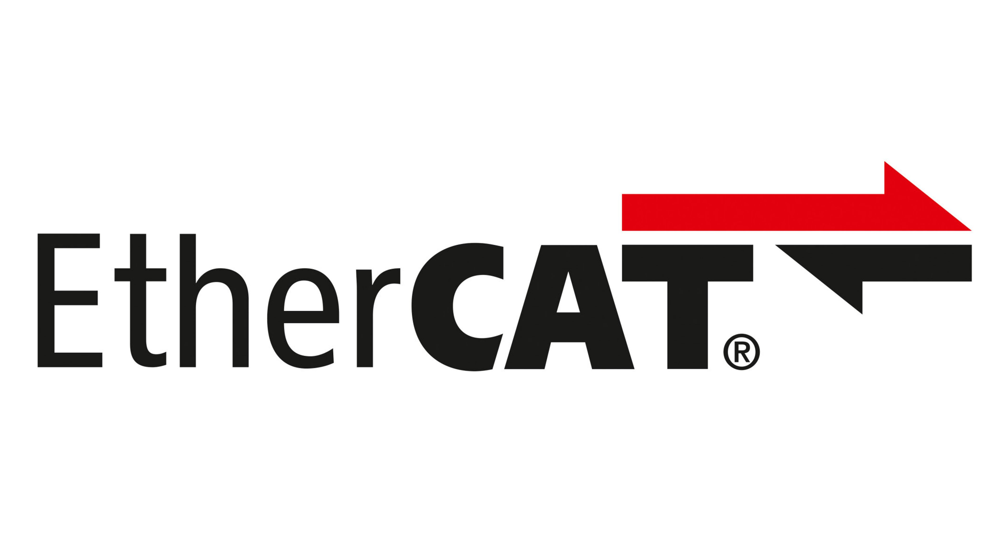

# HoloCat - EtherCAT Real-time Integration



HoloCat is an EtherCAT master application that integrates the Acontis EC-Master SDK with NVIDIA's Holoscan platform. As of this version, it is a proof-of-concept using user-space Acontis drivers, which is not performance-optimized.  Also, it is not a richly flexible example, but contains hard-coded assumptions around
your hardware; specifically, it targets a single DIO device.

However, this is a starting point which you can tailor to your EtherCAT master application.

## Overview

HoloCat provides EtherCAT communication capabilities using the Acontis EC-Master library within the Holoscan ecosystem, enabling:

- Deterministic Real-time Control: Achieves highly predictable EtherCAT cycle timing with minimal jitter by leveraging the Holoscan SDK periodic scheduling.
- Native Holoscan Implementation: Implements EtherCAT as Holoscan operators for zero-copy data sharing and interoperability within the Holoscan ecosystem.
- Fine-grained user control of EtherCAT timing and operation.

## Quick Start

### Prerequisites

**Acontis EC-Master SDK** requires a download and evaluation license. See the [Required Dependencies](#required-dependencies) section below for details on obtaining and installing the SDK.

After installing:

```bash
# Set EC-Master SDK path
export ECMASTER_ROOT=/path/to/ecmaster/root

# Verify installation
./applications/holocat/scripts/verify_ecmaster.sh
```

### Build

```bash
cd /path/to/holohub

# Build using HoloHub CLI (recommended)
./holohub build holocat --local
```

### Set Raw Network Capability

```bash
# Ensure capabilities are set
sudo setcap 'cap_net_raw=ep' ./build/holocat/applications/holocat/holocat
```

### Set Adapter Name

Modify `applications/holocat/configs/holocat_config.yaml`. Set `adapter_name` to the Ethernet adapter connected to your EtherCAT network.

### Run Tests

```bash
ctest --test-dir build/holocat
```

### Run Directly

```bash
# Run with specified config file
./build/holocat/applications/holocat/holocat --config ./applications/holocat/configs/holocat_config.yaml
```

### Build and Run

This will build and run combined. Note that this may not work if your system requires `sudo setcap 'cap_net_raw=ep'` to allow raw network access. In that case, build first and set capabilities, then run.

```bash
# Run with default configuration file
./holohub run holocat --local
```

## Architecture Overview

HoloCat implements a three-operator architecture that bridges Holoscan applications with EtherCAT slave devices through the Acontis EC-Master SDK:

### Operator Components

- **HolocatOp**: Core lifecycle manager that initializes and coordinates the EtherCAT master. It interfaces directly with the Acontis EC-Master SDK to handle master initialization, ENI configuration loading, and cycle scheduling. This operator orchestrates the real-time communication loop and manages the overall EtherCAT master state machine.

- **HcDataTxOp**: Transmit operator responsible for handling outgoing process data from the Holoscan application to EtherCAT slaves. It manages timing control to ensure data is sent within the configured cycle boundaries and synchronizes with the EtherCAT master's scheduling.

- **HcDataRxOp**: Receive operator that handles incoming process data from EtherCAT slaves. It processes received data and publishes it to downstream Holoscan operators, enabling the application to react to slave device inputs and status.

### Data Flow

```text
Holoscan Application
       |
       v
   HolocatOp (Acontis EC-Master SDK Interface)
       |
       +-- ENI Configuration Loading
       +-- Master Initialization
       +-- Cycle Scheduling
       |
       +--[TX Path]---------------+      +--[RX Path]---------------+
       |                          |      |                          |
       v                          |      v                          |
   HcDataTxOp                     |   HcDataRxOp                    |
       |                          |      ^                          |
       | (Process Data Out)       |      | (Process Data In)        |
       v                          |      |                          |
   EtherCAT Master ---------------+------+                          |
       |                                                            |
       v                                                            |
   EtherCAT Network                                                 |
       |                                                            |
       v                                                            |
   Slave Devices ---------------------------------------------------+
```

### Real-Time Considerations

HoloCat operates with strict real-time requirements:

- **Cycle Timing**: Configurable cycle time (default 10000 μs) determines the master update rate
- **Priority Scheduling**: Separate priority levels for the EtherCAT master thread (`rt_priority`) and job processing thread (`job_thread_priority`) ensure deterministic behavior
- **Synchronization**: TX and RX operations are synchronized with the EtherCAT cycle to maintain timing coherence

### Configuration Points

The architecture is configured through three primary parameters:

- **`adapter_name`**: Network interface name for EtherCAT communication (e.g., "eth0")
- **`eni_file`**: Path to the EtherCAT Network Information (ENI) XML file defining the slave topology and process data mapping
- **`cycle_time_us`**: EtherCAT cycle time in microseconds, defining the real-time update rate

## Required Dependencies

### Acontis EC-Master SDK (Commercial License)

This application requires the Acontis EC-Master SDK (version 3.2.3 or compatible) for EtherCAT communication. The SDK is commercial software available from Acontis at <https://www.acontis.com/en/ethercat-master.html>. Evaluation licenses are available for testing and development.

Request access and download the EC-Master library from Acontis: `EC-Master-V3.2-<ARCH>.tar.gz`. Extract the library (note: the archive may be in .tar format rather than .tar.gz) to your desired installation directory (for example, `/path/to/ecmaster/root`). Then verify your setup as described in [Quick Start](#quick-start).

The current version uses the generic user-space driver which works with any Ethernet card, but is comparatively low-performance relative to available kernel-level EtherCAT drivers.

## Configuration

### Basic Configuration

Create or edit the config file (e.g. `configs/holocat_config.yaml`):

```yaml
holocat:
  # Network adapter for EtherCAT
  adapter_name: "eth0"  # Change to your EtherCAT interface
  
  # EtherCAT configuration file
  eni_file: "/tmp/holocat_config.xml"
  
  # Cycle time in microseconds
  cycle_time_us: 10000  # 10ms cycle time
  
  # Real-time priorities (1-99)
  rt_priority: 39
  job_thread_priority: 98
  
  # Enable real-time scheduling
  enable_rt: true

# Holoscan application configuration
holoscan:
  logging:
    level: "info"
```

### ENI File Generation

Use EtherCAT configuration tools to generate your ENI file.

## Troubleshooting

### Common Issues

1. **Permission Denied**
   ```bash
   # Ensure capabilities are set
   sudo setcap 'cap_net_raw=ep' ./build/holocat/applications/holocat/holocat
   ```

2. **EC-Master SDK Not Found**
   ```bash
   # Verify ECMASTER_ROOT environment variable
   echo $ECMASTER_ROOT
   ls -la $ECMASTER_ROOT/SDK/INC/EcMaster.h
   ```

3. **dlopen returned error 'libemllSockRaw.so: cannot open shared object file: No such file or directory'**

   ```bash
   # Set EC-Master SDK path
   export ECMASTER_ROOT=/path/to/ecmaster/root

   # Add link layer libraries to library path (REQUIRED for runtime)
   export LD_LIBRARY_PATH=$ECMASTER_ROOT/Linux/x64:$LD_LIBRARY_PATH

   # Verify installation
   ./applications/holocat/scripts/verify_ecmaster.sh
   ```