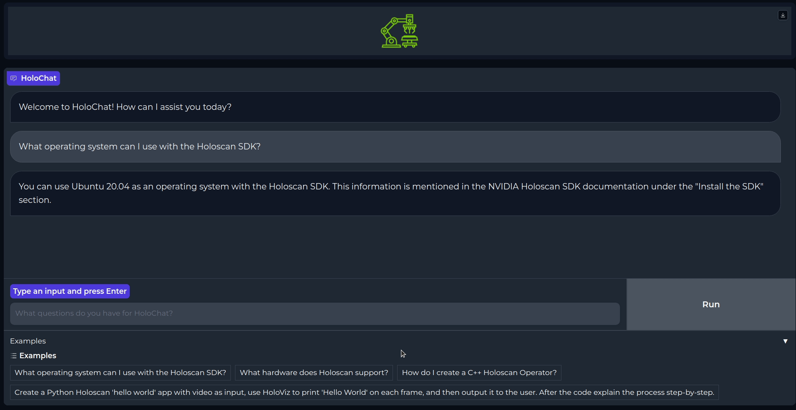

# HoloChat-local

HoloChat-local is an AI-driven chatbot, built on top of a locally hosted Code Llama model which acts as developer's copilot in Holoscan development. The Code Llama model leverages a vector database comprised of the Holoscan SDK repository and user guide, enabling HoloChat to answer general questions about Holoscan, as well act as a Holoscan SDK coding assistant.
<p align="center">
  <kbd style="border: 2px solid black;">
    
  </kbd>
</p>

## Hardware Requirements: 👉💻
- **Processor:** x86/Arm64
- **GPU**: NVIDIA dGPU w/ >= 28 GB VRAM
- **Memory**: \>= 28 GB of available disk memory
  - Needed to download [fine-tuned Code Llama 34B](https://catalog.ngc.nvidia.com/orgs/nvidia/teams/clara-holoscan/models/phind-codellama-34b-v2-q5_k_m) and [BGE-Large](https://huggingface.co/BAAI/bge-large-en) embedding model

*Tested using [NVIDIA IGX Orin](https://www.nvidia.com/en-us/edge-computing/products/igx/) w/ RTX A6000 and [Dell Precision 5820 Workstation](https://www.dell.com/en-us/shop/desktop-computers/precision-5820-tower-workstation/spd/precision-5820-workstation/xctopt5820us) w/ RTX A6000, both running Ubuntu 20.04 LTS*

## Dependencies: 📦
- [NVIDIA Drivers >= 520.61.05](https://www.nvidia.com/download/index.aspx)
- [Docker](https://docs.docker.com/desktop/install/linux-install/)

## Running HoloChat-local: 🏃💨

### Build Notes:

**Build Time:**
- HoloChat uses a [PyTorch container](https://catalog.ngc.nvidia.com/orgs/nvidia/containers/pytorch) from [NGC](https://catalog.ngc.nvidia.com/?filters=&orderBy=weightPopularDESC&query=) and two large models that are downloaded from [HuggingFace.co](https://huggingface.co/). As such, the first time building this application **will likely take ~45 minutes** depending on your internet speeds. However, this is a one-time set-up and subsequent runs of HoloChat should take seconds to launch.

**Build Location:**
- HoloChat downloads ~28 GB of model data to the `holochat/models` directory. As such, it is **recommended** to only run this application on a disk drive with ample storage (ex: the 500 GB SSD included with NVIDIA IGX Orin).


### Running Instructions:

If connecting to your machine via SSH, be sure to forward the ports 7860 & 8080:
```bash
ssh <user_name>@<IP address> -L 7860:localhost:7860 -L 8080:localhost:8080
```

**Recommended:**
```bash
make run_holochat
```

**Manual Setup:**
```bash
make build_llamaCpp
make build_db
make download_llama
make start_holochat
```
HoloChat is hosted at http://127.0.0.1:7860/. Open this URL in a web browser to begin interacting with your personal Holoscan SDK assistant!

## Usage Notes: 🗒️ 

### Intended use: 🎯
  >HoloChat is developed to accelerate and assist Holoscan developers’ learning and development. HoloChat serves as an intuitive chat interface, enabling users to pose natural language queries related to the Holoscan SDK. Whether seeking general information about the SDK or specific coding insights, users can obtain immediate responses thanks to the underlying Large Language Model (LLM) and vector database, both hosted 100% locally on user’s NVIDIA IGX Orin.
  > 
  >HoloChat's local hosting approach is designed to provide developers with the same benefits as popular closed-source chatbots, all while eliminating the privacy and security concerns associated with sending data to 3rd-party remote servers for processing. However, what makes HoloChat unique from a general chatbot is that it is given access to the Holoscan SDK repository, the HoloHub repository, and the Holoscan SDK user guide. This essentially allows users to engage in natural language conversations with these documents, gaining instant access to the information they need, thus sparing them the task of sifting through vast amounts of documentation themselves.

### Known Limitations: ⚠️🚧
Before diving into how to make the most of HoloChat, it's crucial to understand and acknowledge its known limitations. These limitations can guide you in adopting the best practices below, which will help you navigate and mitigate these issues effectively.
* **Hallucinations:** Occasionally, HoloChat may provide responses that are not entirely accurate. It's advisable to approach answers with a healthy degree of skepticism.
* **Memory Loss:** CodeLlama's limited attention window may lead to the loss of previous conversation history. To mitigate this, consider restarting the application to clear the chat history when necessary.
* **Limited Support for Stack Traces**: HoloChat's knowledge is based on the Holoscan repository and the user guide, which lack large collections of stack trace data. Consequently, HoloChat may face challenges when assisting with stack traces.

### Best Practices: ✅👍
While users should be aware of the above limitations, following the recommended tips will drastically minimize these possible shortcomings. In general, the more detailed and precise a question is, the better the results will be. Some best practices when asking questions are:
* **Be Verbose**: If you want to create an application, specify which operators should be used if possible (HolovizOp, V4L2VideoCaptureOp, InferenceOp, etc.).
* **Be Specific**: The less open-ended a question is the less likely the model will hallucinate.
* **Specify Programming Language**: If asking for code, include the desired language (Python or C++).
* **Provide Code Snippets:** If debugging errors include as much relevant information as possible. Copy and paste the code snippet that produces the error, the abbreviated stack trace, and describe any changes that may have introduced the error.

In order to demonstrate how to get the most out of HoloChat two example questions are posed below. These examples illustrate how a user can refine their questions and as a result, improve the responses they receive: 

---
**Worst👎:**
“Create an app that predicts the labels associated with a video”

**Better👌:**
“Create a Python app that takes video input and sends it through a model for inference.”

**Best🙌:**
“Create a Python Holoscan application that receives streaming video input, and passes that video input into a pytorch classification model for inference. Then, collect the model’s predicted class and use Holoviz to display the class label on each video frame.”

---
**Worst👎:**
“What os can I use?”

**Better👌:**
“What operating system can I use with Holoscan?”

**Best🙌:**
“Can I use MacOS with the Holoscan SDK?”


## Appendix:
### Meta Terms of Use:
By using the Llama 2 model, you are agreeing to the terms and conditions of the [license](https://ai.meta.com/llama/license/), [acceptable use policy](https://ai.meta.com/llama/use-policy/) and Meta’s [privacy policy](https://www.facebook.com/privacy/policy/).
### Implementation Details: 
  >HoloChat operates by taking user input and comparing it to the text stored within the vector database, which is comprised of Holoscan SDK information. The most relevant text segments from SDK code and the user guide are then appended to the user's query. This approach allows [Phind’s fine-tuned CodeLlama 34b](https://huggingface.co/Phind/Phind-CodeLlama-34B-v2) to answer questions about the Holoscan SDK, without being explicitly trained on SDK data.
  >
  >However, there is a drawback to this method - the most relevant documentation is not always found within the vector database. Since the user's question serves as the search query, queries that are too simplistic or abbreviated may fail to extract the most relevant documents from the vector database. As a consequence, the LLM will then lack the necessary context, leading to poor and potentially inaccurate responses. This occurs because LLMs strive to provide the most probable response to a question, and without adequate context, they hallucinate to fill in these knowledge gaps.

