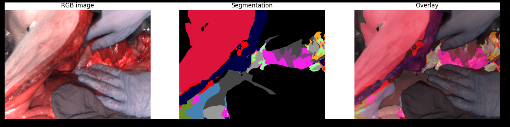

# Hyperspectral Image Segmentation

<br>

This application segments endoscopic hyperspectral cubes into 20 organ classes. It visualizes the result together with the RGB image corresponding to the cube.

## Data and Models

The data is a subset of the [HeiPorSPECTRAL](https://www.heiporspectral.org/) dataset. The application loops over the 84 cubes selected. The model is the `2022-02-03_22-58-44_generated_default_model_comparison` checkpoint from [this repository](https://github.com/IMSY-DKFZ/htc), converted to ONNX with the script in `utils/convert_to_onnx.py`.

[📦️ (NGC) App Data and Model for Hyperspectral Segmentation](https://catalog.ngc.nvidia.com/orgs/nvidia/teams/clara-holoscan/resources/hyperspectral_segmentation).  This resource is automatically downloaded when building the application.

## Run Instructions

This application requires some python modules to be installed. You can simply use Holohub CLI to build and run the application.

```bash
./holohub run hyperspectral_segmentation
```

This single command builds and runs a Docker container, then inside that container, it builds and runs the application.

To build and run the container without building the application, you can use the following command:

```bash
./holohub run-container hyperspectral_segmentation
```

## Viewing Results

With the default settings, the results of this application are saved to `result.png` file in the hyperspectral segmentation app directory. Each time a new image is processed, it overwrites `result.png`.  By opening this image while the application is running, you can see the results as the updates are made (may depend on your image viewer).
