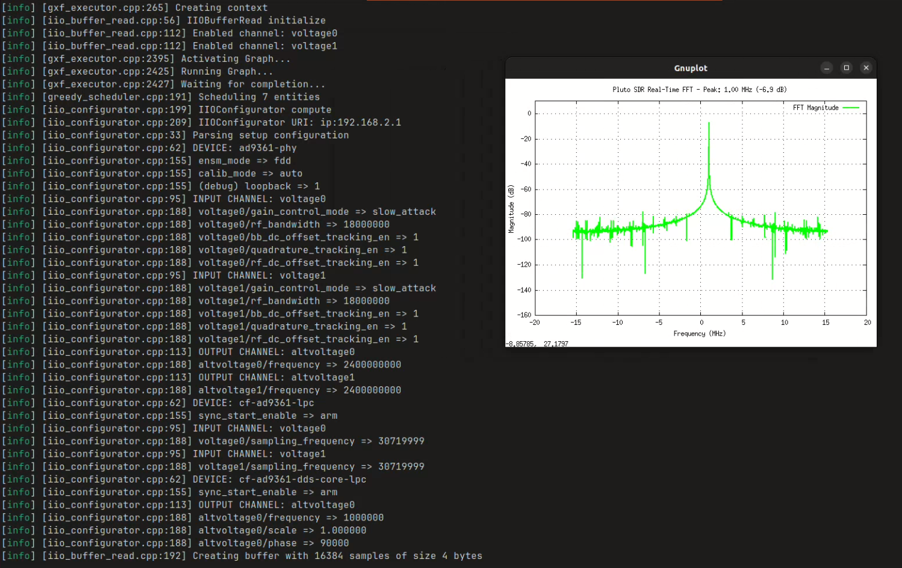

# Industrial I/O (IIO) - ADALM-Pluto SDR Integration

## Overview

This application demonstrates how to use the IIO (Industrial I/O) operators to interface with Software Defined Radio (SDR) devices, specifically the ADALM-Pluto SDR from Analog Devices. The application showcases real-time signal generation, transmission, and reception capabilities using the Holoscan SDK framework.

## What is ADALM-Pluto?

The ADALM-Pluto (Active Learning Module) is an affordable, portable SDR platform that can transmit and receive RF signals from 325 MHz to 3.8 GHz. It features:
- AD9363 transceiver chip
- USB-powered operation
- 20 MHz bandwidth (upgradeable to 56 MHz)
- Support for various modulation schemes
- Multiple input/output channels for data streaming

## Application Capabilities

This application provides examples of:
1. **Attribute Reading/Writing**: Configure SDR parameters like sampling rate, gain, and frequency
2. **Buffer Operations**: Stream raw buffer data through device channels for signal transmission and reception
3. **Device Configuration**: Apply complex device settings from YAML configuration files
4. **Signal Generation**: Create and transmit test signals through buffer channels

## Use Cases
- **RF Signal Analysis**: Capture and analyze radio frequency signals in real-time
- **Communications Research**: Prototype and test wireless communication systems
- **Educational Labs**: Learn about SDR concepts and digital signal processing
- **IoT Development**: Test and debug wireless IoT protocols
- **Amateur Radio**: Digital mode experimentation and signal monitoring
- **Data Acquisition**: High-speed streaming of ADC/DAC samples

## Architecture

The application uses the IIO (Industrial I/O) Linux subsystem to communicate with the ADALM-Pluto device. The IIO framework provides a standardized interface for:
- Reading/writing device attributes (frequency, gain, sample rate)
- Streaming raw data buffers through device channels
- Managing device states and configurations

## Requirements

### Hardware
- ADALM-Pluto SDR device
- USB connection to host computer
- Optional: Antennas for RF transmission/reception

### Software
- Holoscan SDK
- libiio library (version 0.x)
- Network connection to Pluto (default IP: 192.168.2.1), connecting through usb requires minimal code modifications

## Quick Start

### 1. Connect ADALM-Pluto
Connect your ADALM-Pluto to your computer via USB. The device will appear as a network interface with IP address 192.168.2.1.

### 2. Build the Application

```bash
# From HoloHub root directory
./dev_container build_and_run iio
```

### 3. Run Examples

The application includes several example modes:

#### Transmit a Test Signal
```bash
# Transmits a sine wave on the configured frequency
./run launch iio python
```

#### Read Device Attributes
Uncomment the `attr_read_example()` line in the compose() method to read device parameters.

#### Configure Device from YAML
Uncomment the `configurator_example()` line to apply settings from iio_config.yaml.

#### Run the Pluto FFT example

The C++ FFT example (`cpp/pluto_fft_example`) demonstrates real-time FFT visualization of RF signals captured from the ADALM-Pluto:

```bash
# Build and run the FFT example
./run build iio cpp
./run launch iio cpp
```

This example captures IQ samples from the Pluto SDR and displays a real-time FFT spectrum:



## Configuration

### Network Settings
The default URI for ADALM-Pluto is `ip:192.168.2.1`. Modify the `G_URI` variable in the Python script if your device has a different IP address.

### Signal Parameters
In the `BasicIIOBufferEmitterOp` class:
- `frequency`: Sine wave frequency (Hz)
- `amplitude`: Signal amplitude
- `sample_rate`: Samples per second
- `total_samples`: Number of samples per buffer

### Channel Configuration
- `G_NUM_CHANNELS`: Set to 1 or 2 for single/dual channel operation

## Example Workflows

### 1. Signal Generation and Transmission
The buffer write example generates a sine wave and transmits it through the SDR:
```python
# Generates 8kHz sine wave with amplitude 408
data_vector = self.generate_sinewave(total_samples, frequency=8, amplitude=408, sample_rate=400)
```

### 2. Signal Reception
The buffer read example captures IQ samples from the RF input:
```python
# Captures 8192 samples from the receiver
iio_buf_read_op = IIOBufferRead(
    samples_count=8192,
    enabled_channel_names=["voltage0", "voltage1"]
)
```

### 3. Device Configuration
The YAML configuration allows complex device setup:
```yaml
devices:
  - ad9361-phy:
      attrs:
        - ensm_mode: "fdd"
        - calib_mode: "manual"
```

## Understanding Channel Data

The ADALM-Pluto provides multiple channels for data streaming:
- **voltage0, voltage1**: Independent channels that can be used for different data streams
- **Channel Types**: Each channel can be configured as input or output
- **Data Format**: Raw 16-bit signed integer samples
- **Buffer Organization**: Samples from enabled channels are interleaved in the buffer

For example, with two channels enabled:
- Single channel: [S0, S1, S2, S3, ...] where S represents samples from that channel
- Dual channel: [Ch0_S0, Ch1_S0, Ch0_S1, Ch1_S1, ...] where samples alternate between channels

Note: The actual interpretation of the data (whether it represents I/Q components, real signals, or other data types) depends on your application and how you process the raw samples. The IIO operators simply provide raw buffer access without any automatic data conversion.

## Troubleshooting

1. **Connection Issues**: Ensure ADALM-Pluto is recognized as a network device (check with `ping 192.168.2.1` or using `iio_info -S` from `libiio`)
2. **Buffer Overruns**: Reduce sample count or increase processing speed
3. **Signal Quality**: Check antenna connections and gain settings
4. **Permission Errors**: May need to run with appropriate permissions for USB device access

## References

- [ADALM-Pluto Documentation](https://wiki.analog.com/university/tools/pluto)
- [libiio Documentation](https://wiki.analog.com/resources/tools-software/linux-software/libiio)
- [AD9361 Datasheet](https://www.analog.com/media/en/technical-documentation/data-sheets/AD9361.pdf)
- [Scopy Application](https://github.com/analogdevicesinc/scopy)
