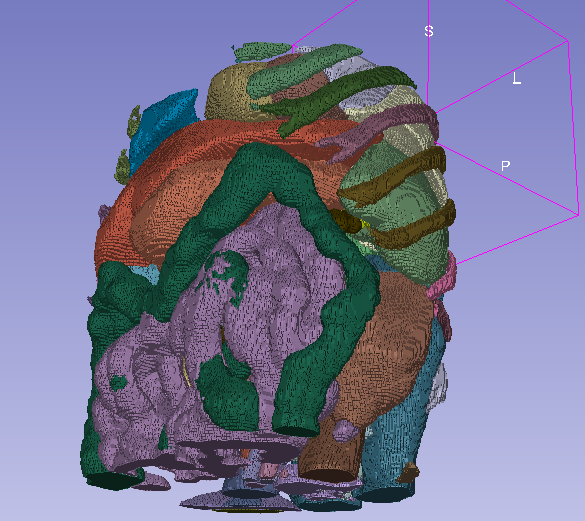
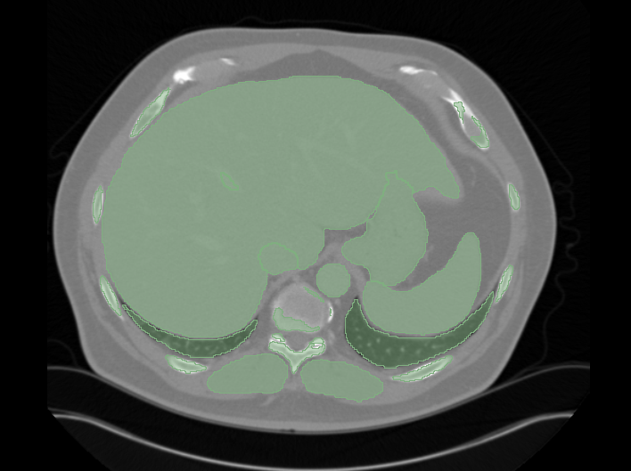

# Imaging AI Whole Body Segmentation

This application demonstrates the use of medical imaging operators to build and package an application that parses DICOM images and performs inference using a MONAI model (TotalSegmentator).

  
_Fig. 1: 3D volume rendering of segmentation results in NIfTI format_

## Overview

This application uses a MONAI re-trained TotalSegmentator model to segment 104 body parts from a DICOM CT series. It is implemented using Holohub DICOM processing operators and PyTorch inference operators.

The input is a DICOM CT series, and the segmentation results are saved as both DICOM Segmentation (Part 10 storage format) and NIfTI format. The workflow includes:

- Loading DICOM studies
- Selecting series with application-defined rules
- Converting DICOM pixel data to a 3D volume image
- Using the MONAI SDK to transform input/output and perform inference
- Writing results as a DICOM Segmentation OID instance, re-using study-level metadata from the original DICOM study

  
_Fig. 2: A slice of the segmentation saved in a DICOM segmentation instance (without color coding the segments)_

## Requirements

- On a [Holohub supported platform](../../README.md#supported-platforms)
- Python 3.8+
- Python packages from [PyPI](https://pypi.org), including:
  - torch
  - monai
  - nibabel
  - pydicom
  - highdicom
  - Other dependencies as specified in [requirements.txt](./requirements.txt)
- NVIDIA GPU with at least 14GB memory (for a 200-slice CT series)

## Data

The input for this application is a folder of DICOM image files from a CT series. For testing, CT scan images can be downloaded from [The Cancer Imaging Archive](https://nbia.cancerimagingarchive.net/nbia-search/), subject to [Data Usage Policies and Restrictions](https://www.cancerimagingarchive.net/data-usage-policies-and-restrictions/).

One such dataset, a CT Abdomen series described as `ABD/PANC_3.0_B31f`, was used in testing the application. Other DICOM CT Abdomen series can be downloaded from TCIA as test inputs.

### Data Citation

National Cancer Institute Clinical Proteomic Tumor Analysis Consortium (CPTAC). (2018). The Clinical Proteomic Tumor Analysis Consortium Cutaneous Melanoma Collection (CPTAC-CM) (Version 11) [Dataset]. The Cancer Imaging Archive. <https://doi.org/10.7937/K9/TCIA.2018.ODU24GZE>

## Model

This application uses the [MONAI whole-body segmentation model](https://github.com/Project-MONAI/model-zoo/tree/dev/models/wholeBody_ct_segmentation), which can segment 104 body parts from CT scans.

## Build and Run Instructions

### Quick Start Using Holohub Container

This is the simplest and fastest way to run the application:

```bash
./holohub run imaging_ai_segmentator
```

**_Note:_** It takes quite a few minutes when this command is run the first time. This command pulls the latest Holoscan SDK docker image, create Holohub docker image and set up requirement for this application, run the container, and finally build and run the application.

The output will be available in the `"<LOCAL_HOLOHUB_PATH>/build/imaging_ai_segmentator/output"` directory, where `<LOCAL_HOLOHUB_PATH>` refers to where you have cloned your Holohub repository and running the `./holohub` command.

```console
output
├── 1.2.826.0.1.3680043.10.511.3.57591117750107235783166330094310669.dcm
└── saved_images_folder
    └── 1.3.6.1.4.1.14519.5.2.1.7085.2626
        ├── 1.3.6.1.4.1.14519.5.2.1.7085.2626.nii
        └── 1.3.6.1.4.1.14519.5.2.1.7085.2626_seg.nii
```

### Development Environment Setup

You can run the application either in your local development environment or inside the Holohub development container.

1. **Set up the environment:**

   A. **Holohub Container:**

   - Build and launch the Holohub Container:

      ```bash
      ./holohub run-container imaging_ai_segmentator
      ```

   B. **Bare Metal (not using Holohub/Holoscan container):**

    - Install Python dependencies:  
      It is strongly recommended a Python virtual environment is used for running the application in dev environment.

       ```bash
       pip install -r applications/imaging_ai_segmentator/requirements.txt
       ```

    - Set up the Holohub environment:  
      Although this application is implemented entirely in Python and relies on standard PyPI packages, you still may want to set up Holohub environment and use `./holohub build` to help organize the Python code and automatically download the required segmentation model.

       ```bash
       sudo ./run setup
       ```

    - Set environment variables for the application:

       ```bash
       source applications/imaging_ai_segmentator/env_settings.sh
       ```

2. **Download test data (if not already done):**
   - Download CT series from [TCIA](https://nbia.cancerimagingarchive.net/nbia-search/)
   - Save DICOM files under `$HOLOSCAN_INPUT_PATH`

3. **Build the application:**

   ```bash
   ./holohub build imaging_ai_segmentator
   ```

4. **Run the application:**

   ```bash
   rm -fr $HOLOSCAN_OUTPUT_PATH  # Optional
   export PYTHONPATH=$PYTHONPATH:/workspace/holohub/build/imaging_ai_segmentator/python/lib:/workspace/holohub
   python applications/imaging_ai_segmentator/app.py
   ```

   **_Tip:_**
   You can override the default input, output, and model directories by specifying them as command-line arguments. For example:

   ```bash
   python applications/imaging_ai_segmentator/app.py -m /path/to/model -i /path/to/input -o /path/to/output
   ```

5. **Check output:**

    ```bash
    ls $HOLOSCAN_OUTPUT_PATH
    ```

## Output

The application generates two types of outputs:

1. DICOM Segmentation file (Part10 storage format)
2. NIfTI format files in the `saved_images_folder`:
   - Original CT scan in NIfTI format
   - Segmentation results in NIfTI format

## Packaging the Application for Distribution

With Holoscan CLI, an applications built with Holoscan SDK can be packaged into a Holoscan Application Package (HAP), which is essentially a Open Container Initiative compliant container image. An HAP is well suited to be distributed for deployment on hosting platforms, be a Docker Compose, Kubernetes, or else. Please refer to Packaging Holoscan Applications in the User Guide for more information.

This example application includes all the necessary files for HAP packaging. First, you should install the application:

```bash
./dev_container build_and_install imaging_ai_segmentator
```

Then, run the following command to see and use the specific packaging commands.

```bash
source applications/imaging_ai_segmentator/packageHAP.sh
```
