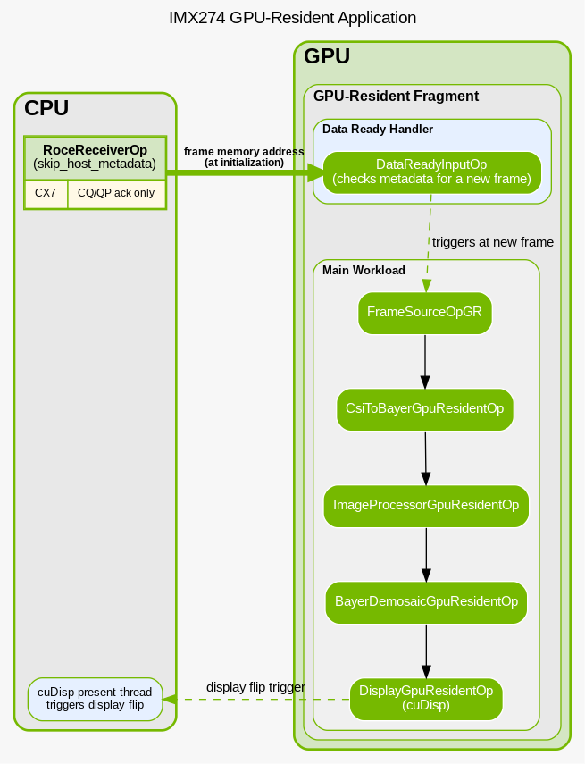
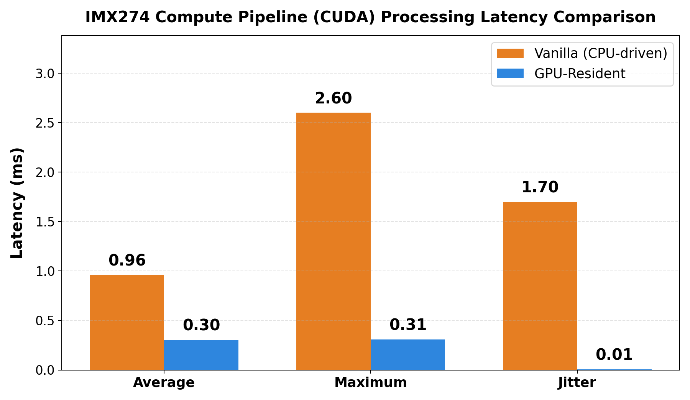
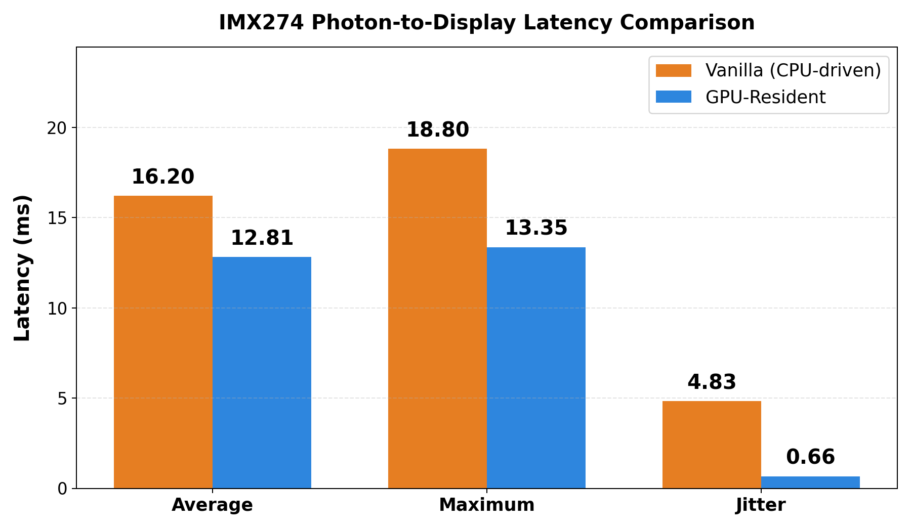

# IMX274 GPU-Resident Application

This application demonstrates an end-to-end example of a GPU-resident Holoscan
SDK application. It leverages Holoscan Sensor Bridge (HSB) to visualize IMX274
camera stream to a connected monitor (G-SYNC enabled monitor is recommended).
With the help of GPU-resident execution, CPU is kept out of the fast and
latency-critical camera to display path, and the application achieves ultra-low
jitter and predictable end-to-end latency, not possible with traditional
CPU-driven applications.

**Note:** Although the entire application runs from the GPU after initial
configuration, two components still remain on the CPU, which will be
removed in a later release. 

1. The RoCE receiver operator acknowledges interrupts on the CPU. This will be removed
   with a DOCA GPUNetIO-based GPU-resident operator in the future, which will enable GPU-native CQ/QP management, keeping the frame receival entirely out of the CPU control.

2. The GPU-resident display operator uses a background thread on the CPU to
   trigger a *display flip* operation on the GPU in *G-SYNC* mode because of
   hardware and software limitations. This will also be optimized in a later
   release.
   
In spite of the two small components on the CPU, the application's primary
control flow and the full data flow are executed on the GPU, enabling it to
deterministic latency.

### Architecture

The following diagram shows the split in application components between the **CPU** (receiver fragment and cuDisp present thread) and the **GPU** (GPU-resident fragment and pipeline). The receiver fragment runs on the CPU and only performs CQ/QP acknowledgment (see `hsb_roce_receiver_nmd` / `RoceReceiverNoHostMetadata`). The GPU-resident fragment runs the full CSI→Bayer→demosaic→display pipeline on the GPU. A lightweight cuDisp present thread on the CPU triggers display flips (e.g. in G-SYNC mode).

<p align="center">
  
</p>

### Development container

This application also provides a development container for the IMX274 camera with
**Holoscan Sensor Bridge (HSB)** and HoloHub, targeting GPU-resident execution
on aarch64 (e.g., IGX Orin). The container uses an HSDK dev container base image that already
provides HSB (e.g. at `/opt/nvidia/hololink`). This Dockerfile adds build dependencies and the
HoloHub CLI on top of the base image so you can build and run HSB-based
operators and applications.

## Performance

The GPU-resident version of the IMX274 application is designed to achieve predictable end-to-end latency by reducing the jitter. By keeping the main workload on the GPU and avoiding costly CPU-GPU synchronization and orchestration overheads, the application significantly reduces variation in processing times and consequently photon-to-display layency.

The graphs below illustrate the latency comparison between the CPU-driven (vanilla) application (`imx274_player` in [holoscan-sensor-bridge](https://github.com/nvidia-holoscan/holoscan-sensor-bridge/tree/release-2.5.0)) and the GPU-resident application. The GPU-resident approach exhibits significantly lower jitter and improved consistency for both the compute pipeline and the overall photon-to-display latency.

### Compute Pipeline Latency

<p align="center">
  
</p>

### Photon-to-Display Latency

<p align="center">
  
</p>

## Running the application

### Prerequisites

#### Driver Version

This application is currently only supported with NVIDIA driver version
590.48.01 or higher. As IGX OS currently does not support this driver version
out of the box, you need to manually install the driver.

**Installation Steps:**

1. **Download** the NVIDIA driver runfile for IGX Orin from the [NVIDIA Driver Downloads](https://download.nvidia.com/XFree86/Linux-aarch64/590.48.01/) page. Select the appropriate product (e.g., Jetson/IGX Orin) and choose version **590.48.01** or newer.

2. **Stop the display manager** (required before removing or installing drivers):
   ```bash
   sudo service display-manager stop
   ```

3. **Unload all NVIDIA kernel modules**:
   ```bash
   sudo rmmod nvidia_drm nvidia_modeset nvidia_uvm nvidia_peermem nvidia
   ```
   If a module is not loaded on your system, `rmmod` will report an error for that name. Run `lsmod | grep nvidia` to see which modules are currently loaded.

4. **Remove the existing NVIDIA driver.** If the NVIDIA uninstaller is present, use it:
   ```bash
   sudo /usr/bin/nvidia-uninstall
   ```
   If `/usr/bin/nvidia-uninstall` is not available, purge the NVIDIA installation with:
   ```bash
   sudo apt-get purge 'nvidia-*' 'libnvidia-*'
   sudo apt-get autoremove
   ```

5. **Install the driver** using the downloaded runfile (replace with your exact filename and version):
   ```bash
   chmod +x NVIDIA-Linux-aarch64-590.48.01.run
   sudo ./NVIDIA-Linux-aarch64-590.48.01.run
   ```
   Follow the installer prompts.

6. **Verify** the driver version:
   ```bash
   nvidia-smi
   ```
   Confirm the driver version shown is **590.48.01** or higher.


#### Display Manager (Mandatory)

Before running the application on the host IGX system, turn off the default display manager. The GPU-resident display operator only works with exclusive display mode where no other display compositors are running.

```bash
sudo service display-manager stop
```

**Note:** To get back the default display manager, `sudo service display-manager start` will work.

#### HoloHub Commands

This application uses `./holohub` commands to build and run the application.
  Please refer to the [README.md](../../README.md) for more details on its usage.


### Building and Running the Application

Ensure you are in the HoloHub repository root for all commands below.

---

### 1. Build the container

From the **HoloHub repository root**:

```bash
./holohub build-container --base-img=nvcr.io/nvidia/clara-holoscan/holoscan:v4.0.0-cuda12-dgpu imx274_gpu_resident
```

The Holoscan `v4.0.0-cuda12-dgpu` container image is built on top of a Holoscan container that **already includes HSB** (e.g. installed at `/opt/nvidia/hololink`).

**Note:** You can pull the base image before building, e.g.  
`docker pull nvcr.io/nvidia/clara-holoscan/holoscan:v4.0.0-cuda12-dgpu`

#### Verify the image

```bash
docker images
# Look for an image associated with imx274_gpu_resident
```

---

### 2. Run the container

From the **HoloHub repository root**:

```bash
./holohub run-container imx274_gpu_resident --no-docker-build
```

This uses the application's configured Docker options for HSB (privileged mode, device mounts, hugepages, etc.).

### 3. Build the application

After launching the container with the command above, you can build the application:

```bash
./holohub build imx274_gpu_resident
```

#### List buildable components

```bash
./holohub list
```

#### Build a single operator

Use the operator name as reported by `./holohub list` (e.g. under operators):

```bash
./holohub build <operator_name>
```

Examples for operators used with this application:

```bash
./holohub build csi_to_bayer_gpu_resident
./holohub build image_processor_gpu_resident
./holohub build hsb_roce_receiver_nmd
```

Artifacts are produced under `./build/<operator_name>/` (e.g. `./build/csi_to_bayer_gpu_resident/`).

#### Build options

- **Debug build**: `./holohub build <operator_name> --build-type debug`
- **Extra CMake options**: `./holohub build <operator_name> --configure-args '-DCMAKE_VERBOSE_MAKEFILE=ON'`

Run `./holohub build --help` for more options.

### 4. Run the application

In the container, run the application:

```bash
./build/imx274_gpu_resident/applications/imx274_gpu_resident/cpp/imx274_gpu_resident
```

`--help` will show available command line options.

After running the application, the application will pause for 5 to 10 seconds
before showing anything to the display monitor, as it initializes the display.

To stop the application, press Ctrl+C. A few `[warning] [event_based_scheduler.cpp:255] Deadlock detected after dispatch
  due to external event` messages may be printed on the terminal before
  application terminates. (See [Known Issues](#known-issues)) However, please do
  not press Ctrl+C multiple times, as that might skip the proper shutdown
  process and might not show any measurement outputs at the end.

At the end of a successful run,
execution time measurements of the GPU-resident component will be printed:

```bash
[info] [application.cpp:1072] Terminating fragment 'gr_fragment' via stop_execution()
[info] [imx274_gpu_resident.cpp:227] Disabled receiver tick condition
[info] [gpu_resident_deck.cpp:119] Torn down GPU-resident workload. Waiting for execution stream to synchronize.
[info] [fragment.cpp:1000] GPU-resident fragment has been successfully stopped.
[info] [event_based_scheduler.cpp:994] Stopping all async jobs
[info] [event_based_scheduler.cpp:456] Dispatcher thread has stopped checking jobs
[info] [event_based_scheduler.cpp:641] Async event handler thread exiting.
[info] [event_based_scheduler.cpp:973] Waiting to join all async threads
[info] [event_based_scheduler.cpp:980] Waiting to join max duration thread
[info] [event_based_scheduler.cpp:988] All async worker threads joined, deactivating all entities
[info] [event_based_scheduler.cpp:953] Event Based scheduler finished.
[info] [gxf_executor.cpp:2814] [receiver_fragment] Deactivating Graph...
[info] [ucx_context.cpp:113] UcxContext: Initiating graceful shutdown
[info] [event_based_scheduler.cpp:728] Total execution time of Event Based scheduler : 38003.554966 ms

[info] [gxf_executor.cpp:2823] [receiver_fragment] Graph execution finished.
[info] [fragment.cpp:1445] GPU Resident Performance Metrics for fragment 'gr_fragment':
[info] [fragment.cpp:1449]   Average execution time:  304.28 us
[info] [fragment.cpp:1450]   Minimum execution time:  302 us
[info] [fragment.cpp:1451]   Maximum execution time:  307 us
[info] [fragment.cpp:1452]   Std deviation:           0.67 us
[info] [fragment.cpp:1453]   Jitter (max - min):      5 us
[info] [fragment.cpp:1454]   99.9th percentile:       306 us
[info] [fragment.cpp:1455]   Number of analyzed samples:        1673 (skipped first 100, last 100)
[info] [fragment.cpp:1459]   Number of collected samples:       1873
[info] [fragment.cpp:1380] Saved GPU-resident performance results as CSV to file 'gpu_resident_perf.csv'
[info] [gxf_executor.cpp:536] Destroying context
```

## Known Issues

- `[warning] [event_based_scheduler.cpp:255] Deadlock detected after dispatch
  due to external event`: Due to asynchronous event handling in Holoscan SDK and
  HSB, this warning  is posted intermittently and at the end of the application.
- **Monitor Resolution Issue:** The application, by default, attempts to use
  2560x1440 resolution. This can be changed by providing the `--resolution`
  argument to the application. Some monitors may not support certain resolution
  and refresh rate combinations. For example, we have noticed `1920x1080@60Hz`
  and `1920x1080@240Hz`
  do not work on some monitors. In such cases, other refresh rates may be tried.
- `[5956799]` In some IGX Orin setups, camera frames from HSB may not arrive in the GPU,
    which leads to no frame being processed by the GPU-resident fragment. In
    such cases, the application may not work.
