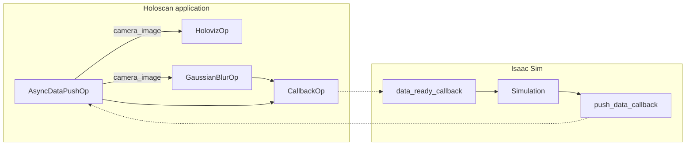

# Isaac Holoscan Bridge

This application illustrates how to call the Holoscan pipeline with IsaacSim generated data.

A simple IsaacSim world will be generated with a camera. Then the video frame captured by the camera will be forward to a Holoscan pipeline to demonstrate the interaction between IsaacSim and Holoscan.



## Requirements

- On a [Holohub supported platform](../../README.md#supported-platforms)
- Python 3.8+
- Nvidia GPU with at least 8GB memory, for images render

## Run Instructions

There are a number of ways to build and run this application, as well as packaging this application as a Holoscan Application Package. The following sections describe each in detail.

### Quick Start Using a Docker Container

This is the simplest and fastest way to see the application in action running as a container.

```bash
./dev_container build_and_run --container_launch_args "--as_root" --container_args "-e ACCEPT_EULA=Y -e PRIVACY_CONSENT=Y \
-v ${HOME}/docker/isaac-sim/cache/kit:/isaac-sim/kit/cache:rw \
-v ${HOME}/docker/isaac-sim/cache/ov:/root/.cache/ov:rw \
-v ${HOME}/docker/isaac-sim/cache/pip:/root/.cache/pip:rw \
-v ${HOME}/docker/isaac-sim/cache/glcache:/root/.cache/nvidia/GLCache:rw \
-v ${HOME}/docker/isaac-sim/cache/computecache:/root/.nv/ComputeCache:rw \
-v ${HOME}/docker/isaac-sim/logs:/root/.nvidia-omniverse/logs:rw \
-v ${HOME}/docker/isaac-sim/data:/root/.local/share/ov/data:rw \
-v ${HOME}/docker/isaac-sim/documents:/root/Documents:rw" isaac_holoscan_bridge
```

**_Note_**
It takes quite a few minutes when this command is run the first time.

### Run the Application in Dev Environment

It is strongly recommended a Python virtual environment is used for running the application in dev environment.

This application only has Python implementation depending on a set of Python packages from [Pypi](https://pypi.org).


Set up the Holohub environment, if not already done
```bash
./run setup
```

Build and install the application
```bash
./dev_container build_and_install isaac_holoscan_bridge
```

Run the application
```bash
python install/isaac_holoscan_bridge/app.py
```

### Run the Application in Dev Container
TODO
