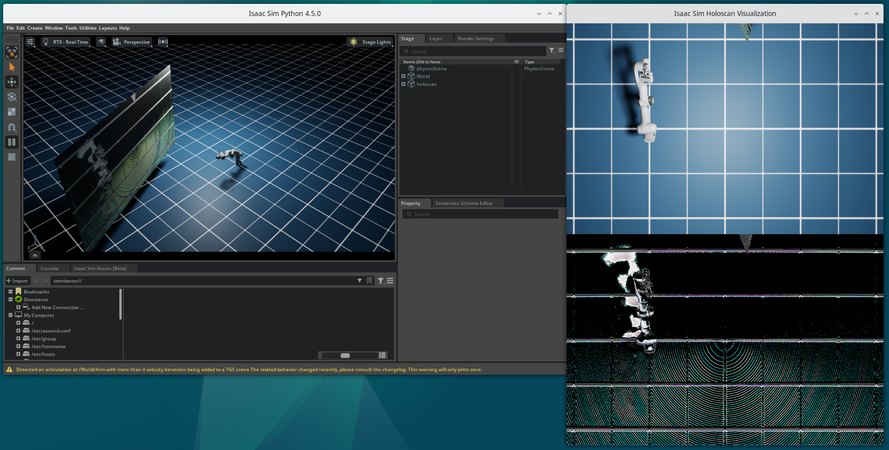
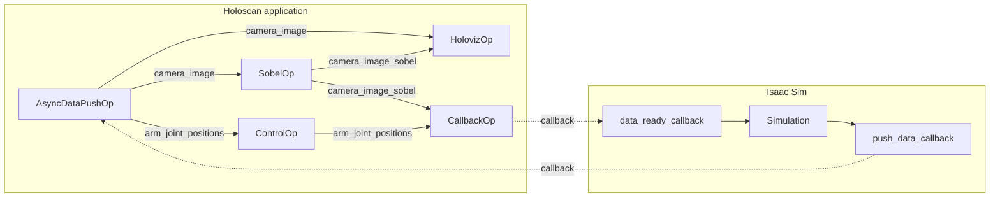

# Isaac Holoscan Bridge

The Isaac Holoscan Bridge is a sophisticated application that demonstrates the integration between NVIDIA's Isaac Simulator and the Holoscan framework.



It creates a bridge where simulated data, including camera and robotic joint data, from Isaac Sim is processed through a Holoscan pipeline. The application features a virtual camera in Isaac Sim that captures video frames, which are then streamed to a Holoscan pipeline for real-time processing. The processed data is then again displayed in Isaac Sim. The application also streams joint positions from a robot to a Holoscan pipeline. The pipeline modifies these joint positions and feeds them back into the simulation moving the robotic arm.

The pipeline includes several specialized operators:

- an AsyncDataPushOp for handling data streaming from Isaac Sim to Holoscan
- a CallbackOp which is handling data transfer from Holoscan to Isaac Sim
- a SobelOp for image processing (edge detection)
- a ControlOp for managing arm joint positions
- and HolovizOp for visualization.

A unique feature of this application is its bidirectional callback system, where data flows between the simulation and Holoscan pipeline through carefully orchestrated callbacks, enabling real-time interaction between the two systems.

## Flow Diagram



## Requirements

- On a [Holohub supported platform](../../README.md#supported-platforms)
- Python 3.10+
- Nvidia GPU with at least 8GB memory

## Run Instructions

```bash
./holohub run isaac_holoscan_bridge
```

To keep Isaac Sim configuration and data persistent when running in a container, various directories are mounted into the container.

**_Note_**
It takes quite a few minutes when this command is run the first time since shaders need to be compiled.
