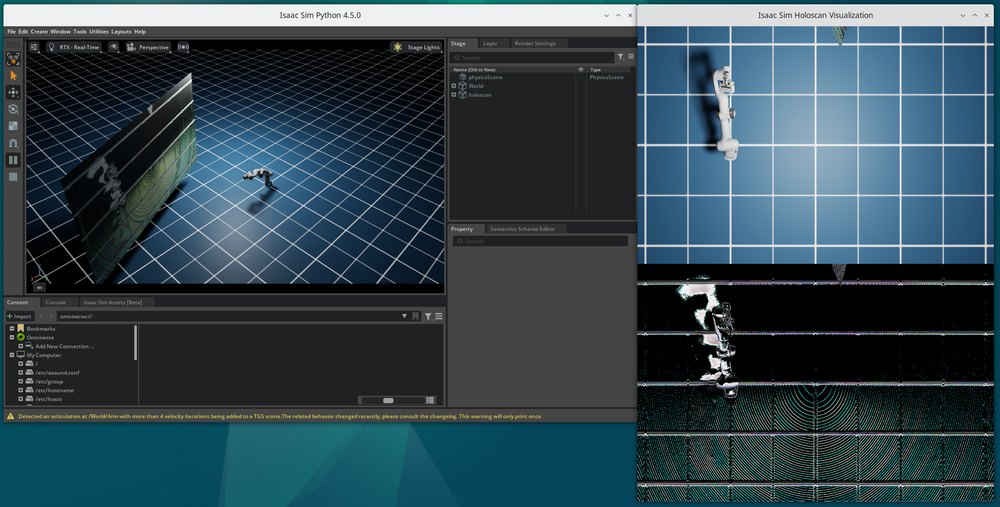
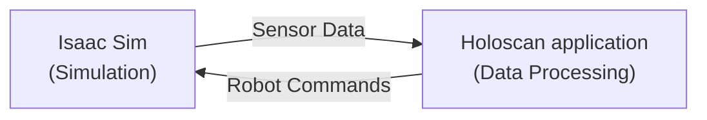
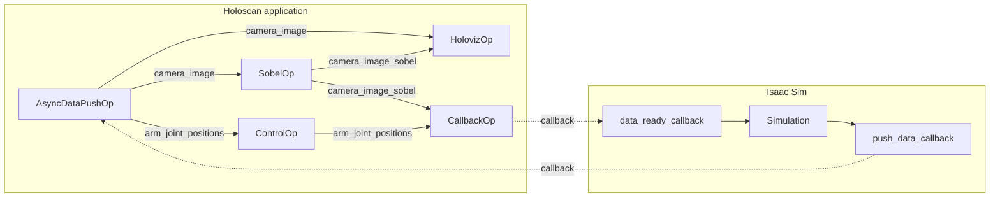

# Isaac Sim Holoscan Bridge

The Isaac Sim Holoscan Bridge application demonstrates how to conduct software-in-the-loop testing of a Holoscan robotics application using NVIDIA Isaac Sim. This allows developers to test and validate the functionality of the robot application in a simulated environment before it is deployed to the physical robot.



## Overview

The application is comprised of two components:

- **Isaac Sim** simulates the robot, sensors, and physical environment.
- A **Holoscan application** runs the robot logic.

On each step of the simulation:

- Isaac Sim generates and sends physically-accurate robot sensor data (camera images, robot joint positions) to the Holoscan application.
- The Holoscan application receives the sensor data, processes it, and sends the resulting robot actuation commands (target joint positions) back to Isaac Sim.
- Isaac Sim then applies these commands to the virtual robot.



## Architecture

The Holoscan application is comprised of the following operators, which enable pushing data to and from Isaac Sim in real time:

- `AsyncDataPushOp` streams data from Isaac Sim to Holoscan
- `CallbackOp` transfers data from Holoscan to Isaac Sim
- `SobelOp` processes the simulated robot camera images as an example of image processing
- `ControlOp` generates target joint positions for the robot
- `HolovizOp` visualizes the robot camera images before and after processing with `SobelOp`



## Requirements

- On a [Holohub supported platform](../../README.md#supported-platforms)
- Python 3.10+
- Nvidia GPU with at least 8GB memory

## Run Instructions

```bash
./holohub run isaac_sim_holoscan_bridge
```

To keep Isaac Sim configuration and data persistent when running in a container, various directories are mounted into the container.

**_Note_**
It takes quite a few minutes when this command is run the first time since shaders need to be compiled.
