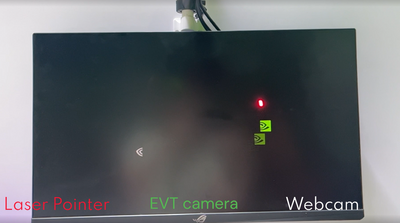
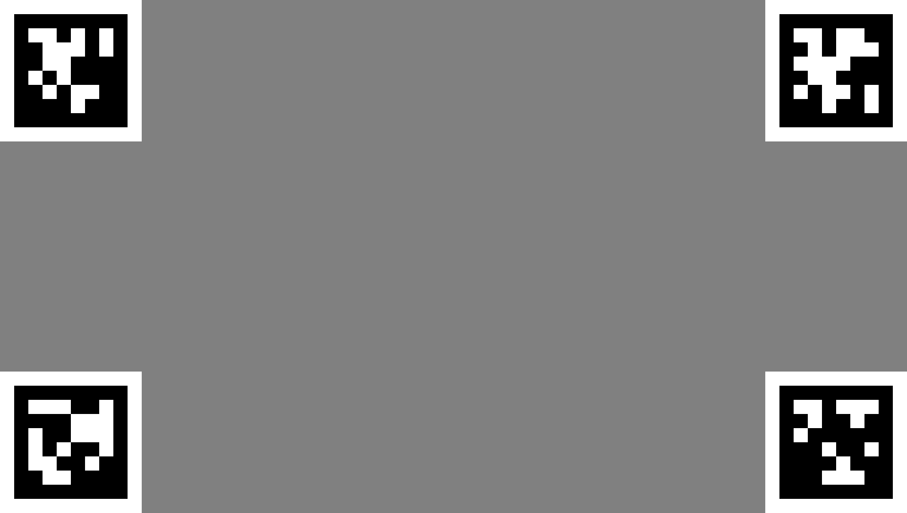

# Laser Detection Latency

## Introduction

The laser detection latency application demonstrates the latency differences between two different cameras visually.

<center> </center>

This folder contains three applications, please refer to the respective application folder for application and configuration file.

1. **[USB Camera Calibration app](./usb_cam_calibration):**
    This app is designed to do monitor registration by the USB camera. It uses a gray image which has [April tags](https://github.com/AprilRobotics/apriltag) on all the four corners and is as shown below.

<center> </center>

The detection of these four April tags are done using `ApriltagDetectionOp`. For proper and correct monitor registration, the camera should be able to completely see all the four corners of the monitor. If it does not, the app will not output correct corners for the monitor. It is also important to make sure that the scene is well lit with no light sources in the back of the monitor.

This app is designed using [Logitech 4k Pro Webcam](https://www.logitech.com/en-us/products/webcams/4kprowebcam.960-001390.html?utm_source=google&utm_source=Google&utm_medium=Paid-Search&utm_campaign=DEPT_FY25_QX_USA_LO_Logi_DTX-Logitech-PMax_Google_na&gad_source=1&gclid=Cj0KCQjwzva1BhD3ARIsADQuPnUJKLsoYuS-GIrre9P-cJz28NXW6jaQjIzPG2dLoLr4Yi6qBfKLCUoaAkIkEALw_wcB). If a different camera is being used, please change the camera settings in the python app or yaml configuration file.

2. **[EVT Camera Calibration app](./evt_cam_calibration):**
    This app is designed to do monitor registration by the [Emergent Vision Technologies (EVT)](https://emergentvisiontec.com/) camera. It uses the same gray image which has April tags on all the four corners as shown above.

In this app the detection of these four April tags are done using `ApriltagDetectionOp` as well. For proper and correct monitor registration, the camera should be able to completely see all the four corners of the monitor. If it does not, the app will not output correct corners for the monitor. It is also important to make sure that the scene is well lit with no light sources in the back of the monitor.

This app is designed using [EVT HB-9000-G 25GE](https://emergentvisiontec.com/products/bolt-hb-25gige-cameras-rdma-area-scan/hb-9000-g/). If a different camera is being used, please change the camera settings in the python app or yaml configuration file.

3. **[Laser Detection app](./laser_detection):**
    The laser detection is the app that is run after the calibration apps detected the monitor successfully. This app uses two camera sources: one is EVT camera and other is USB camera. The video feed from both camera is used to detect laser pointed at the monitor. There are two icons that will be shown on the display. The white icon represents USB camera and the green icon represents the EVT camera. When the laser is detected the respective icons move to the coordinates. The laser detection algorithm is same for both camera sources.

## Hardware requirements

### 1. USB camera
The app is designed using [Logitech 4k Pro Webcam](https://www.logitech.com/en-us/products/webcams/4kprowebcam.960-001390.html). A different webcam can also be used, but if resolution settings are different the application code and yaml file will need to be updated accordingly.

### 2. EVT camera
Visit [Holoscan SDK user guide](https://docs.nvidia.com/holoscan/sdk-user-guide/emergent_setup.html) to check the hardware requirements for EVT camera.

### 3. Monitor
Any matte screen monitor with a refresh rate of at least 120fps is required to see the performance differences between the two camera sources.

### 4. Laser pointer
Please make sure to only buy laser pointers that are safe to use for viewing purposes.

## Setting up IGX Development Kit

### 1. Setup the EVT camera

To setup the EVT camera, refer to [Holoscan SDK user guide](https://docs.nvidia.com/holoscan/sdk-user-guide/emergent_setup.html).

### 2. Build Holohub app natively

Currently EVT camera based apps are only available for native environment. To build the setup natively, download the Holohub repo and run following.

```bash
./holohub setup  # sudo privileges may be required
```

### 3. Install Python3 requirements
```bash
sudo pip3 install -r applications/laser_detection_latency/requirements.txt
```

### 4. Install CVCUDA
Download and install the latest [CVCUDA package](https://github.com/CVCUDA/CV-CUDA/releases). Replace the latest version in the below commands.
```bash
wget -O cvcuda-lib-0.10.1_beta-cuda12-aarch64-linux.deb https://github.com/CVCUDA/CV-CUDA/releases/download/v0.10.1-beta/cvcuda-lib-0.10.1_beta-cuda12-aarch64-linux.deb
wget -O cvcuda-python3.10-0.10.1_beta-cuda12-aarch64-linux.deb https://github.com/CVCUDA/CV-CUDA/releases/download/v0.10.1-beta/cvcuda-python3.10-0.10.1_beta-cuda12-aarch64-linux.deb
sudo dpkg -i cvcuda-lib-0.10.1_beta-cuda12-aarch64-linux.deb
sudo dpkg -i cvcuda-python3.10-0.10.1_beta-cuda12-aarch64-linux.deb
```

### 5. Setup cuApriltags
Download the latest [cuApriltags library and header file](https://github.com/NVIDIA-ISAAC-ROS/isaac_ros_nitros/tree/main/isaac_ros_nitros/lib/cuapriltags), and set it up on IGX Orin as follows:
```bash
sudo mkdir /opt/nvidia/cu-april-tags
sudo mkdir /opt/nvidia/cu-april-tags/include
sudo mkdir /opt/nvidia/cu-april-tags/lib
sudo cp libcuapriltags.a /opt/nvidia/cu-april-tags/lib/.
sudo cp cuAprilTags.h /opt/nvidia/cu-april-tags/include/.
```

## Running the sample apps

### 1. Build and run `usb_cam_calibration`
Before running the app, make sure that the USB camera can see all the corners of the monitor. The [`v4l2_camera`](https://github.com/nvidia-holoscan/holoscan-sdk/tree/main/examples/v4l2_camera) app can be used to verify it visually.

```bash
LD_PRELOAD=/usr/lib/aarch64-linux-gnu/nvidia/libnvjpeg.so ./holohub run usb_cam_calibration --local
```
This will output a file `usb-cali.npy` in the build directory.

### 2. Build and run `evt_cam_calibration`
Before running the app, make sure that the EVT camera can see all the corners of the monitor. The [`high_speed_endoscopy`](https://github.com/nvidia-holoscan/holohub/tree/main/applications/high_speed_endoscopy) app can be used to verify it visually.
```bash
./holohub build evt_cam_calibration --local
[sudo] ./holohub run evt_cam_calibration --local --no-local-build
```
This will output a file `evt-cali.npy` in the build directory.

#### note:
Use `sudo` when running the application with EVT camera.

### 3. Build and run `laser_detection`
```bash
./holohub build laser_detection --local
[sudo] LD_PRELOAD=/usr/lib/aarch64-linux-gnu/nvidia/libnvjpeg.so ./holohub run laser_detection --local --no-local-build
```
Now you can use the laser pointer and point it to the monitor. If the icons are not detecting the laser or they are moving in random fashion, then redo the calibration steps.

#### note:
- Please make sure that the monitor that is being used has matte screen. The glossy screen can create specular reflections and could damage the eye of the person looking at the monitor at certain angles.
- Please make sure to only buy laser pointers that are safe to use for viewing purposes.
