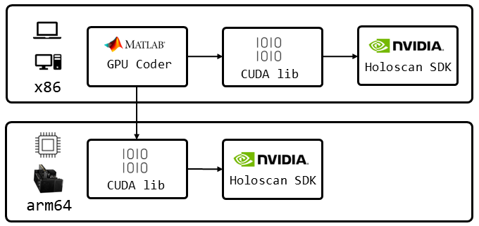

# Develop Holoscan Applications with MATLAB GPU Coder

This folder shows how to develop Holoscan applications that uses CUDA code generated by [MATLAB GPU Coder](https://www.mathworks.com/products/gpu-coder.html). 

With MATLAB running on a supported system (x86), the GPU Coder toolbox converts MATLAB code to CUDA. The CUDA code is then compiled on the target system (arm64 or x86) and linked with Holoscan SDK to create a Holoscan application using MATLAB functionality. An overview is shown in the below figure.



## Sample Applications

There are two sample applications, one that does a simple image processing operation on a video stream and one more advanced that does ultrasound beamforming on simulated data:

* [Image Processing with MATLAB GPU Coder](./matlab_image_processing/README.md)
* [Ultrasound Beamforming with MATLAB GPU Coder](./matlab_beamform/README.md)

## MATLAB Requirements

The required MATLAB Toolboxes are:

* [GPU Coder Toolbox](https://www.mathworks.com/products/gpu-coder.html)
* To compile on Jetson devices (arm64):
    * [Embedded Coder Toolbox](https://uk.mathworks.com/products/embedded-coder.html)
    * [MATLAB Coder Support Package for NVIDIA Jetson and NVIDIA DRIVE Platforms](https://uk.mathworks.com/help/supportpkg/nvidia/)
    * Look at [this documentation](https://uk.mathworks.com/help/coder/nvidia/ug/install-and-setup-prerequisites.html) for making CUDA accessible to the MATLAB host machine

## Configure

Prior to building the Holoscan application the CUDA code needs to be generated and built on the target platform. The Holoscan project needs also configured to link with the MATLAB CUDA code. This process is detailed in each sample applications' README: [Image Processing](./matlab_image_processing/README.md), [Ultrasound Beamforming](./matlab_beamform/README.md).

## Build

Having followed the instructions in the previous section you will be inside the running HoloHub container. Next, `cd` to the `matlab_gpu_coder` folder and create the `build` directory:
```sh
cd applications/matlab_gpu_coder
mkdir -p build
```
Next, configure the CMake project changing the `-D*` parameter from `OFF` to `ON` depending on what application you want to build (and have configured):
```sh
cmake -DBUILD_IMAGE_PROCESSING=OFF -DBUILD_BEAMFORM=OFF -S . -B build
```
The applications(s) including the utility functions in `matlab_utils` can then be built with:
```sh
cmake --build build
```
The image processing is run with:
```sh
cd build/matlab_image_processing
./matlab_image_processing
```
and the ultrasound beamforming with:
```sh
cd build/matlab_beamform
./matlab_beamform
```