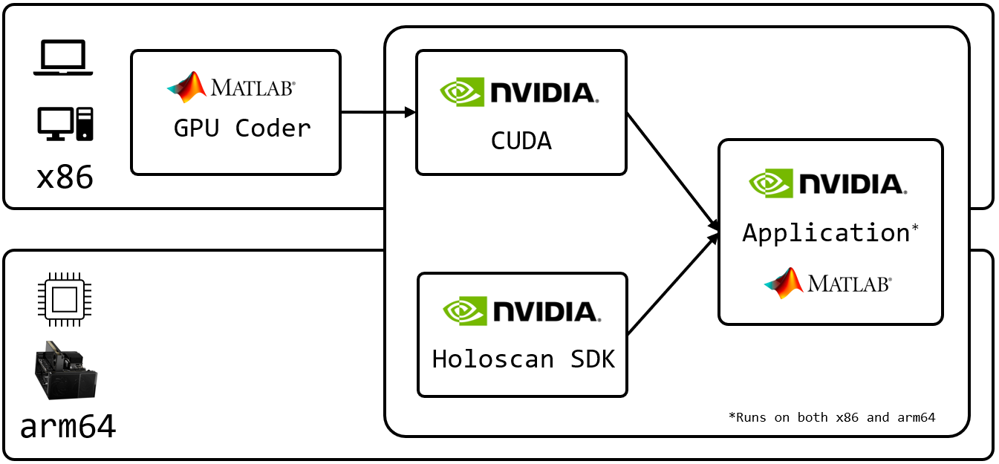

# Ultrasound Beamforming with MATLAB GPU Coder

This application does ultrasound beamforming of simulated data. The beamforming algorithm is implemented in [MATLAB](https://uk.mathworks.com/products/matlab.html) and MATLAB [GPU Coder](https://www.mathworks.com/products/gpu-coder.html) is used to generate CUDA code. The CUDA code is compiled on the target platform, either x86 or arm64, and called by the application on each Holoscan operator `compute()` call. When the application is run, Holoviz will display the beamformed data in real time.



## MATLAB Requirements

This application has been tested on MATLAB R2023b, but should work on other versions of MATLAB.

The required MATLAB Toolboxes are:

* [GPU Coder Toolbox](https://www.mathworks.com/products/gpu-coder.html)
* To generate simulated data:
    * [Phased Array System Toolbox](https://uk.mathworks.com/products/phased-array.html)
    * [Communications Toolbox](https://uk.mathworks.com/products/communications.html)
* To compile on Jetson devices (arm64):
    * [Embedded Coder Toolbox](https://uk.mathworks.com/products/embedded-coder.html)
    * [MATLAB Coder Support Package for NVIDIA Jetson and NVIDIA DRIVE Platforms](https://uk.mathworks.com/help/supportpkg/nvidia/)
    * Look at [this documentation](https://uk.mathworks.com/help/coder/nvidia/ug/install-and-setup-prerequisites.html) for making CUDA accessible to the MATLAB host machine

## Folder Structure

```sh
matlab_gpu_coder
├── data  # Data is generated with generate_data.mlx
│   └── ultrasound_beamforming.bin  # Simulated ultrasound data
├── matlab  # MATLAB files
│   ├── generate_beamform_jetson.m  # MATLAB script to generate CUDA DLLs on Jetson
│   ├── generate_beamform_x86.m  # MATLAB script to generate CUDA DLLs on x86
│   ├── generate_data.mlx  # MATLAB script to generate simulated data
│   └── matlab_beamform.m  # MATLAB function that CUDA code is generated from
├── holoscan_matlab_utils.cu  # Utility functions/kernels
├── holoscan_matlab_utils.h  # Utility functions/kernels
├── main.cpp  # Ultrasound beamforming app
└── matlab_beamform.yaml  # Ultrasound beamforming config
```

## Generate Simulated Data

Simply run the script `matlab/generate_data.mlx` from MATLAB and a binary file `ultrasound_beamforming.bin` will be written to a top-level `data` folder. The binary file contains the simulated ultrasound data, prior to beamforming.

## Generate CUDA Code with MATLAB GPU Coder

### x86: Ubuntu >= 20.04

In order to generate the CUDA Code, start MATLAB and `cd` to the `matlab_gpu_coder/matlab` folder and open the `generate_beamform_x86.m` script. Run the script and a folder `codegen/dll/matlab_beamform` will be generated in the `matlab_gpu_coder` folder.

### arm64: Jetson

On an x86 computer with MATLAB installed, `cd` to the `matlab_gpu_coder/matlab` folder and open the `generate_beamform_jetson.m` script. Having an `ssh` connection to the Jetson device you want to build the CUDA DLLs on, specify the parameters of that connection in the `hwobj` on line 7, also replace `<ABSOLUTE_PATH>` of `cfg.Hardware.BuildDir` on line 39, as the absolute path (on the Jetson device) to `holohub` folder. Run the script and a folder `MATLAB_ws` will be created in the `matlab_gpu_coder` folder.

## Configure/Build/Run Application

Start by pulling the Holoscan image from NVIDIA NGC:
```sh
docker pull nvcr.io/nvidia/clara-holoscan/holoscan:v1.0.3-dgpu
```

### Configure Holoscan for MATLAB

#### x86: Ubuntu >= 20.04

Define the environment variable:
```sh
export MATLAB_ROOT="/usr/local/MATLAB"
export MATLAB_VERSION="R2023b"
```
where you, if need be, replace `MATLAB_ROOT` with the location of your MATLAB install and `MATLAB_VERSION` with the correct version.

Next, run the HoloHub Docker container:
```sh
./dev_container launch \
    --img nvcr.io/nvidia/clara-holoscan/holoscan:v1.0.3-dgpu \
    --add-volume ${MATLAB_ROOT}/${MATLAB_VERSION} \
    --docker_opts "-e MATLAB_ROOT=/workspace/volumes/${MATLAB_VERSION}"
```

#### arm64: Jetson

The folder `MATLAB_ws`, created by MATLAB, mirrors the folder structure of the host machine and is therefore different from one user to another; hence, we need to specify the path to the `codegen` folder in the `matlab_gpu_coder/CMakeLists.txt`, in order for the build to find the required libraries. Set the variable `REL_PTH_MATLAB_CODEGEN` to the relative path where the `codegen` folder is located in the `MATLAB_ws` folder. For example, if GPU Coder created the following folder structure on the Jetson device:
```sh
matlab_gpu_coder
└── MATLAB_ws
    └── R2023b
        └── C
            └── Users
                └── Jensen
                    └── holohub
                        └── applications
                            └── matlab_gpu_coder
                                └── matlab
                                    └── codegen
```
the variable should be set as:
```sh
REL_PTH_MATLAB_CODEGEN=MATLAB_ws/R2023b/C/Users/Jensen/holohub/applications/matlab_gpu_coder/matlab/codegen
```

Next, run the HoloHub Docker container:
```sh
./dev_container launch --img nvcr.io/nvidia/clara-holoscan/holoscan:v1.0.3-dgpu
```

### Build and Run

Run the below commands to build the application:
```sh
cd applications/matlab_gpu_coder
mkdir -p build
cmake -S . -B build
cmake --build build
```

The application can then be run with:
```sh
cd build
./matlab_beamform
```
