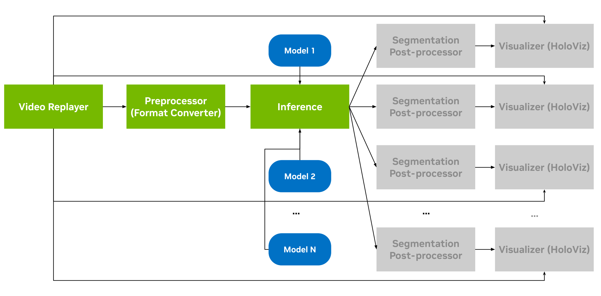
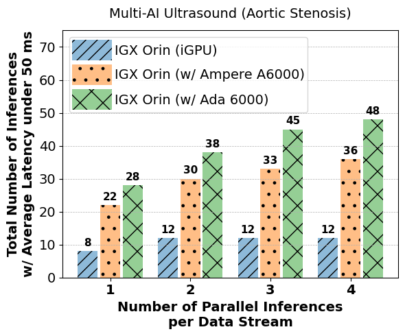

# Benchmark Model

This application demonstrates an easy, quick and straightforward way to benchmark the scalaibility of
inferencing with a model against a single video data stream in a typical Holoscan application. The
video stream is played via a V4L2 loopback device. Then, the stream is preprocessed and fed to the
model for inferencing. Then, the results are visualized after postprocessing.

## Usage

As this application is, by default, set to use the 
[ultrasound segmentation](../ultrasound_segmentation/) example, you can build and run the ultrasound
segmentation example first, and then try running this benchmarking application.

Build and run the ultrasound segmentation application:
```
./run build ultrasound_segmentation && ./run launch ultrasound_segmentation cpp
```

Now, this benchmarking application can be built and run. However, before doing so, the v4l2loopback
must be run first. Check out the [notes and prerequisites
here](https://github.com/nvidia-holoscan/holoscan-sdk/tree/main/examples/v4l2_camera) to play a
video via a V4L2 loopback device. Assuming, everything is set up correctly, the ultrasound
segmentation example video could be run with the following command:

> Note: we are playing the video to `/dev/video6` after running `sudo modprobe v4l2loopback video_nr=6 max_buffers=4`
```
$ ffmpeg -stream_loop -1 -re -i ./data/ultrasound_segmentation/ultrasound_256x256.avi -pix_fmt yuyv422 -f v4l2 /dev/video6
ffmpeg version 4.2.7-0ubuntu0.1 Copyright (c) 2000-2022 the FFmpeg developers
  built with gcc 9 (Ubuntu 9.4.0-1ubuntu1~20.04.1)
  configuration: --prefix=/usr --extra-version=0ubuntu0.1 --toolchain=hardened --libdir=/usr/lib/
  ...
  libavutil      56. 31.100 / 56. 31.100
  libavcodec     58. 54.100 / 58. 54.100
  ...
[mov,mp4,m4a,3gp,3g2,mj2 @ 0x560a570b0740] st: 0 edit list: 1 Missing key frame while searching for timestamp: 0
...
Input #0, mov,mp4,m4a,3gp,3g2,mj2, from './data/ultrasound_segmentation/ultrasound_256x256.avi':
...
```

Now, the benchmarking application can be built and run:
```
./run build model_benchmarking
./run launch model_benchmarking <cpp/python>
```

To use a different video, the video can be played via the above `ffmpeg` command.

To use a different model, you can specify the data path in the 
`./run launch model_benchmarking <cpp/python>` command with the `-d` option, and the model name,
residing in the data path directory, with the `-m` option.

```
./run launch model_benchmarking <cpp/python> --extra_args "-d <data_path> -m <model_name>"
```

To check the full list of options, run:
```
./run launch model_benchmarking <cpp/python> --extra_args "-h"
```

## Capabilities
This benchmarking application can be used to measure performance of parallel inferences for the same
model on a single video stream. The `-l` option can be used to specify the number of parallel
inferences to run. Then, the same model will be loaded to the GPU multiple times defined by the `-l`
parameter. 

The schematic diagram of this benchmarking application is in Figure 1. The visualization and
(visualization + postprocessing) steps are marked as grey, as they can optionally be turned off
with, respectively, `-p` and `-i` options. The figure shows a single video data stream is used in
the application. Multiple ML/AI models are ingested by the Holoscan Inference operator to perform
inference on a single data stream. The same ML model is replicated to be loaded multiple times to
the GPU in this application.


Figure 1. The schematic diagram of the benchmarking application

## Sample Result
This application demonstrates how to measure the performance of parallel inferencing by multiple
replications of the same model on a single video data stream. The [Holoscan Flow
Benchmarking](../tutorial/holoscan_flow_benchmarking/) guide shows how to run multiple instances of
the same application where every application instance operates on a single data stream. 
Here, we present an experiment
combining these two dimensions (parallel data streams and parallel inferences per data stream). We
use the [Multi-AI Ultrasound](../multiai_ultrasound/) video and aortic stenosis model in this
experiment. We use 1 to 4 parallel inferences (`-l` parameter of this application) per data stream 
and variable number of application instances (`-i` parameter of the `benchmark.py` script of the
[Flow Benchmarking guide](../tutorial/holoscan_flow_benchmarking/)) to measure the scalability of
the model on different IGX platforms.


Figure 2. Multi-AI Aortic Stenosis Scalability Result

Figure 2 shows the result of the experiment. The x-axis shows the number of parallel inferences per
data stream, and the y-axis shows the total number of inferences in all the data streams,
where average end-to-end latency does not exceed `50ms`. The experiment compares scalability among
different IGX SKUs and demonstrates that IGX with a discrete GPU like RTX
Ampere A6000 or RTX Ada 6000 handles significantly more total number of inferences without incurring a
latency penalty.
