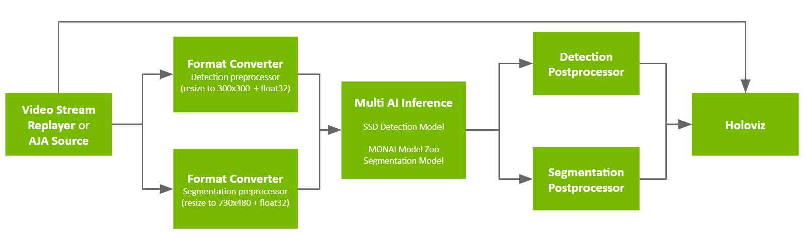

# Multi AI Application with SSD Detection and MONAI Endoscopic Tool Segmentation 
In this application, we show how to build a Multi AI application with detection and segmentation models, write postprocessing operators using CuPy and NumPy in Python tensor interop and [MatX library (An efficient C++17 GPU numerical computing library with Python-like syntax)](https://github.com/NVIDIA/MatX) in C++ tensor interop, and pass multiple tensors from postprocessing to Holoviz.

Please refer to the README under [./app_dev_process](./app_dev_process/README.md) to see the process of developing the applications.

The application graph looks like:


## Model
We combine two models from the single model applications [SSD Tool Detection](https://github.com/nvidia-holoscan/holohub/tree/main/applications/ssd_detection_endoscopy_tools) and [MONAI Endoscopic Tool Segmentation](https://github.com/nvidia-holoscan/holohub/tree/main/applications/monai_endoscopic_tool_seg):

 - [SSD model from NGC](https://catalog.ngc.nvidia.com/orgs/nvidia/teams/clara-holoscan/resources/ssd_surgical_tool_detection_model) with additional NMS op: `epoch24_nms.onnx`
 - [MONAI tool segmentation model from NGC](https://catalog.ngc.nvidia.com/orgs/nvidia/teams/clara-holoscan/resources/monai_endoscopic_tool_segmentation_model): `model_endoscopic_tool_seg_sanitized_nhwc_in_nchw_out.onnx`
## Data
[📦️ (NGC) Sample App Data for AI-based Endoscopy Tool Tracking](https://catalog.ngc.nvidia.com/orgs/nvidia/teams/clara-holoscan/resources/holoscan_endoscopy_sample_data)

## Requirements
Ensure you have installed the Holoscan SDK via one of the methods specified in [the SDK user guide](https://docs.nvidia.com/holoscan/sdk-user-guide/sdk_installation.html#development-software-stack).

The directory specified by `--data` at app runtime is assumed to contain three subdirectories, corresponding to the three NGC resources specified in [Model](#model) and [Data](#data): `endoscopy`, `monai_tool_seg_model` and `ssd_model`.  These resources will be automatically downloaded to the holohub data directory when building the application.

## Building the application

The repo level build command 
```sh
./run build multiai_endoscopy
```
will build one of the cpp apps `post-proc-cpu`. 


## Running the application
### Python Apps
To run the Python application, you can make use of the run script
```sh
./run launch multiai_endoscopy python
```
Alternatively, to run this application, you'll need to configure your PYTHONPATH environment variable to locate the
necessary python libraries based on your Holoscan SDK installation type.

You should refer to the [glossary](../../README.md#Glossary) for the terms defining specific locations within HoloHub.

If your Holoscan SDK installation type is:

* python wheels:

  ```bash
  export PYTHONPATH=$PYTHONPATH:<HOLOHUB_BUILD_DIR>/python/lib
  ```

* otherwise:

  ```bash
  export PYTHONPATH=$PYTHONPATH:<HOLOSCAN_INSTALL_DIR>/python/lib:<HOLOHUB_BUILD_DIR>/python/lib
  ```
Next, run the application:
```sh
cd <HOLOHUB_SOURCE_DIR>/applications/multiai_endoscopy/python
python3 multi_ai.py --data <DATA_DIR>
```

### C++ Apps

There are three versions of C++ apps, with the only difference being that they implement the inference post-processing operator `DetectionPostprocessorOp` in different ways:

- `post-proc-cpu`: Multi-AI app running the inference post-processing operator on the CPU using `std` features only.
- `post-proc-matx-cpu`: Multi-AI app running the inference post-processing operator on the CPU using the [MatX library]([GitHub - NVIDIA/MatX: An efficient C++17 GPU numerical computing library with Python-like syntax](https://github.com/NVIDIA/MatX)).
- `post-proc-matx-gpu`: Multi-AI app running  the inference post-processing operator on the GPU using MatX (CUDA).

To run `post-proc-cpu`, since it already gets built with `./run build multiai_endoscopy`:
```sh
./run launch multiai_endoscopy cpp
```

For the other two C++ applications, you'll need to build these without the run script as follows.

To run `post-proc-matx-cpu` or `post-proc-matx-gpu`, first navigate to the app directory.

```shell
cd cpp/post-proc-matx-cpu
```

Next we need to configure and build the app.

#### Configuring

First, create a build folder:

```shell
mkdir -p build
```

then run CMake configure with:

```shell
cmake -S . -B build
```

Unless you make changes to `CMakeLists.txt`, this step only needs to be done **once**.

#### Building

The app can be built with:

```shell
cmake --build build
```

or equally:

```shell
cd build
make
```

#### Running

You can run the app with:

```shell
./build/multi_ai --data <DATA_DIR>
```
