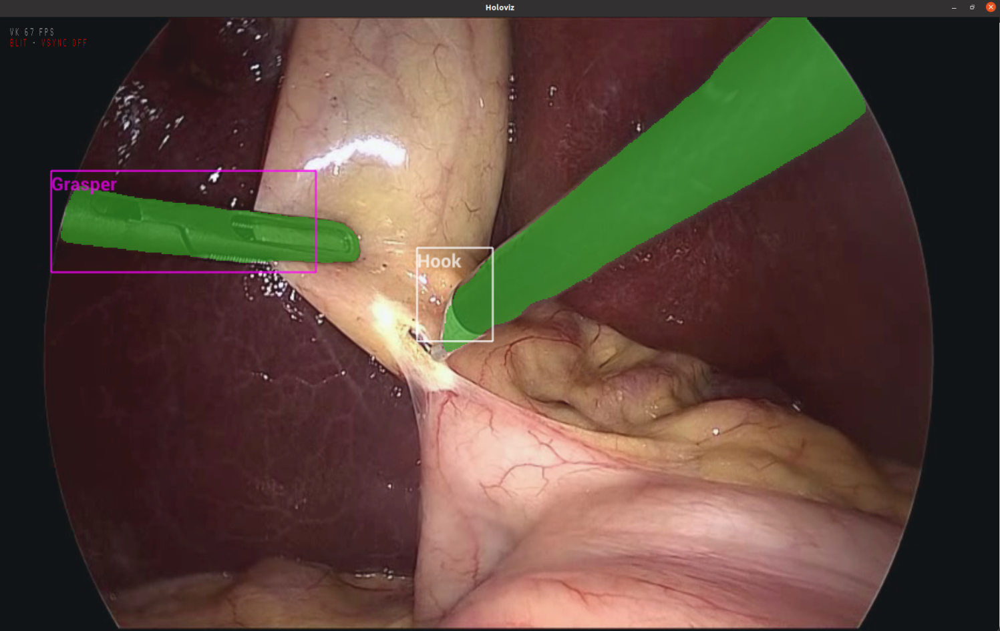

## Multi AI Application Creation Overview
After creating single-model applications from the [SSD tool detection model](https://github.com/nvidia-holoscan/holohub/tree/main/applications/ssd_detection_endoscopy_tools) (Phase 1) and the [MONAI endoscopic tool segmentation model](https://github.com/nvidia-holoscan/holohub/tree/main/applications/monai_endoscopic_tool_seg) (Phase 2), we bring them together in a Multi AI application in Python (Phase 3) and C++ (Phase 4).

**Phase 1: Bring a single SSD model to Holoscan**


**Phase 2: Bring a single semantic segmentation model to Holoscan**

**Phase 3: Combine the two models into a Multi AI application in Holoscan**

**Phase 4: Porting the Multi AI application to C++**


## **Phase 3**: Combine the two models into a Multi AI application in Holoscan
### **Data and Model**
We use the same test video as the two single model apps from [Holoscan Endoscopy Sample Data](https://catalog.ngc.nvidia.com/orgs/nvidia/teams/clara-holoscan/resources/holoscan_endoscopy_sample_data) and and combine two models:

 - [SSD model from NGC](https://catalog.ngc.nvidia.com/orgs/nvidia/teams/clara-holoscan/resources/ssd_surgical_tool_detection_model) with additional NMS op: `epoch24_nms.onnx`
 - [MONAI tool segmentation model from NGC](https://catalog.ngc.nvidia.com/orgs/nvidia/teams/clara-holoscan/resources/monai_endoscopic_tool_segmentation_model): `model_endoscopic_tool_seg_sanitized_nhwc_in_nchw_out.onnx`


### **Python API App Development**
Python app: [`multi_ai.py`](../python/multi_ai.py) for displaying bboxes and labels with separate colors, combining the single model apps  [`ssd_detection_endoscopy_tools/ssd_step2_route2_render_labels.py`](https://github.com/nvidia-holoscan/holohub/blob/main/applications/ssd_detection_endoscopy_tools/ssd_step2_route2_render_labels.py) and [`monai_endoscopic_tool_seg/tool_segmentation.py`](https://github.com/nvidia-holoscan/holohub/blob/main/applications/monai_endoscopic_tool_seg/tool_segmentation.py).

Config file: [`multi_ai.yaml`](../python/multi_ai.yaml)

Let's take a look at how to configure the `InferenceOp` in [`multi_ai.yaml`](../python/multi_ai.yaml):

```
multi_ai_inference:
  backend: "trt"
  pre_processor_map: 
    "ssd": ["ssd_preprocessed"]
    "tool_seg": ["seg_preprocessed"]
  inference_map: 
    "ssd": ["inference_output_num_detections", "inference_output_detection_boxes", 
                     "inference_output_detection_scores", "inference_output_detection_classes",]
    "tool_seg": ["tool_seg_inferred"]
  parallel_inference: true # optional param, default to true
  infer_on_cpu: false # optional param, default to false
  enable_fp16: true
  input_on_cuda: true # optional param, default to true
  output_on_cuda: true # optional param, default to true
  transmit_on_cuda: true # optional param, default to true
  is_engine_path: false # optional param, default to false
```
There are a few important things to note in `InferenceOp`: 

1. The parameter `model_path_map` is specified in the [application](../python/multi_ai.py) by the `--data` arg at runtime.

2. The names specified in `inference_map` don't need to match the output tensor names in the ONNX model. Previously in SDK v0.5.1 and below, when using `TensorRTInferenceOp` we need to match the exact tensor names in the ONNX model, but with the new InferenceOp we can specify any name for the output tensors, as they will be mapped in sequence from the model. We can utilize [netron.app](http://netron.app) to inspect the model output tensor sequence. 

2. If `out_tensor_names` is not specified, it will be derived from `inference_map`. If `in_tensor_names` is not specified, it will be derived from `pre_processor_map`.

3. When specifying `out_tensor_names`, it can contain all of the tensor names from `inference_map`, or only a subset that we wish to utilize downstream. 

4. When specifying the combination of `is_engine_path` and `model_path_map`, if specifying `is_engine_path: false`, the op will look for the ONNX models specified by `model_path_map` and convert to TensorRT during the first time running the application. Otherwise, if we already have the TensorRT file, we can specify:

 ```
 model_path_map: 
    "ssd": "<path-to>/epoch24_nms.NVIDIARTXA6000.8.6.84.trt.engine.fp16"
    "tool_seg": "<path-to>/model_endoscopic_tool_seg_sanitized_nhwc_in_nchw_out.NVIDIARTXA6000.8.6.84.trt.engine.fp16"
  ...
  is_engine_path: true
 ```

 5. For faster inference speedup, set `enable_fp16` to `true` when you first run your application and the ONNX model gets converted to TensorRT. This enables the TensorRT model to run at fp16 precision instead of fp32. 

Please note: during the first time running the Multi AI application, the TRT conversion may take a longer time than with the single model application. For example, we have observed 10-11 minutes at the first run.

We can see the definition of `holoviz_tensors` pass into the `tensors` param for Holoviz for defining static rectangles and texts.  
```python
# from multi_ai.py
holoviz = HolovizOp(
            self, allocator=pool, 
            name="holoviz", 
            tensors=holoviz_tensors, 
            **self.kwargs("holoviz")
        )
```
The way we can find out the tensor name for the segmentation postprocessor is by looking at its source code in [segmentation_postprocessor.cpp](https://github.com/nvidia-holoscan/holoscan-sdk/blob/main/src/operators/segmentation_postprocessor/segmentation_postprocessor.cpp#L129): `auto out_tensor = out_message.value().add<nvidia::gxf::Tensor>("out_tensor");`.

### Running the Python Apps
Please see section [Running the Application - Python Apps](../README.md#python-apps).
#### **Result**
The multi ai app runs at 60-70 FPS on a NVIDIA IGX Orin DevKit (Early Access). This is with fp16 precision for the TensorRT model. If we use the fp32 precision, it is slower at around 50 FPS.


## Phase 4: Porting the Multi AI application to C++

This section uses the Holoscan SDK C++ API to convert the Python application from **Phase 3** to C++.

There are three versions of C++ apps, with the only difference being that they implement the inference post-processing operator `DetectionPostprocessorOp` in different ways:

- `post-proc-cpu`: Multi-AI app running the inference post-processing operator on the CPU using `std` features only.
- `post-proc-matx-cpu`: Multi-AI app running the inference post-processing operator on the CPU using the [MatX library](https://github.com/NVIDIA/MatX).
- `post-proc-matx-gpu`: Multi-AI app running  the inference post-processing operator on the GPU using MatX (CUDA).

Each app is defined by the files:

C++ app: `multi_ai.cpp/multi_ai.cu`

Config file: `app_config.yaml`

CMake file: `CMakeLists.txt`

Having followed this document, and knowing a bit of C++ and Cmake, the implementation of each app should be easy to understand. As writing efficient, custom CUDA code is non-trivial we here use the MatX library to run the post-processing operator on the GPU. MatX is an open-source, efficient C++17 GPU numerical computing library with NumPy-like syntax, created by NVIDIA.

#### Benchmarking the Different Versions

All C++ app run their operators on the GPU; except one, the post-processing operator `DetectionPostprocessorOp` (following model inference), which runs either on GPU or CPU. Model inference is done with `fp16` enabled in `InferenceOp`.

The pros and cons of the different implementations of `DetectionPostprocessorOp` are:

- `post-proc-cpu`: Uses C++ standard features only and does not require third party libraries. If the input tensors to the `DetectionPostprocessorOp` are small and the operations needed in the `compute` method are easy to implement, this is a good option.
- `post-proc-matx-cpu`: Uses MatX in CPU (host) mode. Runs faster than MatX in GPU (device) mode for small tensors, and it is easier to implement more complex operations with MatX's NumPy-like syntax than using just standard C++.
- `post-proc-matx-gpu`: Uses MatX in GPU (device) mode. This is the preferred option if the input tensors are larger, as running the compute on the GPU will be much more efficient.

A simple benchmark for this multi-AI application, where the input tensors to the `DetectionPostprocessorOp` have small number of elements (`N~100`), gives the following performance

- `python`: 60-70 FPS (Phase 3 version)
  
- `post-proc-cpu`: 65-75 FPS
  
- `post-proc-matx-cpu`: 65-75 FPS
  
- `post-proc-matx-gpu`: 40-45 FPS

This benchmark was done on an IGX Orin Developer Kit with an RTX A6000 GPU. The FPS numbers were obtained by enabling the *Enable Graphics API Visual Indicator* flag of the *NVIDIA X server* application. If the input tensors had more elements, `post-proc-matx-gpu` should perform favourably compared to the CPU versions.

### Running a C++ app


Please see section [Running the Application - C++ Apps](../README.md#c-apps).
