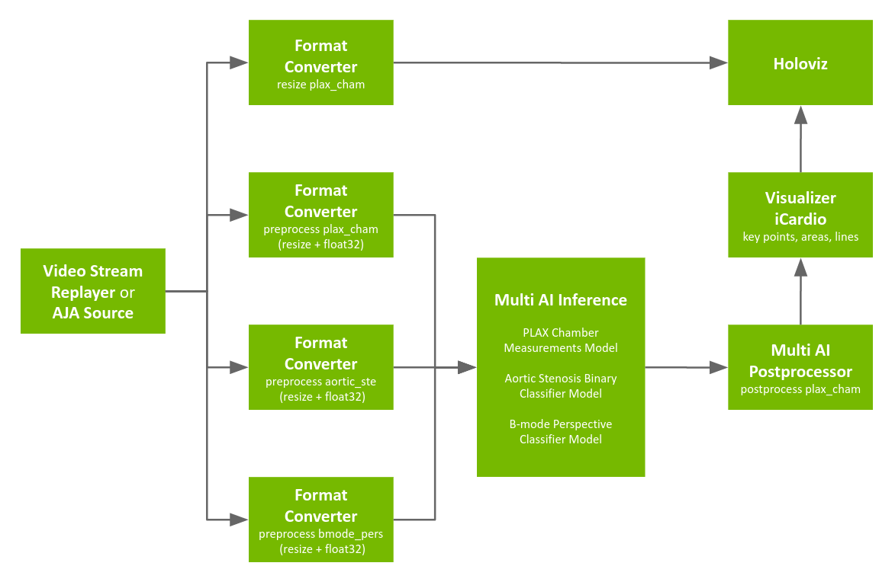
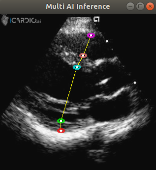

## Multi AI Ultrasound Application

To run multiple inference pipelines in a single application, the Multi AI operators (inference and postprocessor) use APIs from the Holoscan Inference module to extract data, initialize and execute the inference workflow, process, and transmit data for visualization.

This application uses models and echocardiogram data from [iCardio.ai](https://www.icardio.ai/). The models include:
- a Plax chamber model, that identifies four critical linear measurements of the heart
- a B-Mode Perspective Classifier model, that determines confidence of each frame to known 28 cardiac anatomical view as defined by the guidelines of the American Society of Echocardiography
- an Aortic Stenosis Classification model, that provides a score which determines likeability for the presence of aortic stenosis

 
Fig. 1 Multi AI sample application workflow

The pipeline uses a recorded ultrasound video file (generated by `convert_video_to_gxf_entities` script) for input frames. The data is loaded by [Video Stream Replayer](https://docs.nvidia.com/holoscan/sdk-user-guide/holoscan_operators_extensions.html#operators) and forwarded to the following operators for pre-processing:
- B-mode Perspective Preprocessor: Entity uses [Format Converter](https://docs.nvidia.com/holoscan/sdk-user-guide/holoscan_operators_extensions.html#operators) to convert the data type of the image to `float32` and resize the data to 320x240 per frame.
- Plax Chamber Resized: Entity uses [Format Converter](https://docs.nvidia.com/holoscan/sdk-user-guide/holoscan_operators_extensions.html#operators) to resize the input image to 320x320x3 with `RGB888` image format for visualization.
- Plax Chamber Preprocessor: Entity uses [Format Converter](https://docs.nvidia.com/holoscan/sdk-user-guide/holoscan_operators_extensions.html#operators) to convert the data type of the image to `float32` and resize the data to 320x320 per frame.
- Aortic Stenosis Preprocessor: Entity uses [Format Converter](https://docs.nvidia.com/holoscan/sdk-user-guide/holoscan_operators_extensions.html#operators) to convert the data type of the image to `float32` and resize the data to 300x300 per frame.

Then:
- the [Multi AI Inference](https://docs.nvidia.com/holoscan/sdk-user-guide/holoscan_operators_extensions.html#operators) uses outputs from three preprocessors to execute the inference.
- [Multi AI Postprocessor](https://docs.nvidia.com/holoscan/sdk-user-guide/holoscan_operators_extensions.html#operators) uses the inferred output to process as per specifications.
- The [Visualizer iCardio](https://docs.nvidia.com/holoscan/sdk-user-guide/holoscan_operators_extensions.html#operators) extension is used to generate visualization components for the plax chamber output.
- Visualization components are finally fed into [HoloViz](https://docs.nvidia.com/holoscan/sdk-user-guide/holoscan_operators_extensions.html#operators) to generate the visualization.

The sample application outputs demonstrates 5 keypoints identified by the Plax Chamber model. Keypoints are connected in the output frame as shown in the image below.

 
Fig. 2 Multi AI sample application. Data courtesy of [iCardio.ai](https://www.icardio.ai) ([NGC Resource](https://catalog.ngc.nvidia.com/orgs/nvidia/teams/clara-holoscan/resources/holoscan_multi_ai_ultrasound_sample_data))

Aortic Stenosis and B-mode Perspective models are the Classification models. Classification results can be printed using `print` keyword against the output tensors from the Classification models in the Multi AI Postprocessor settings. Printing of the results is optional and can be ignored by removing relevant entries in the post processor settings.

> **Note:**
The Holoscan SDK provides capability to process all models in ONNX, TensorRT FP32 and TensorRT FP16 format. Classification models (Aortic Stenosis and B-mode Perspective), do not support TensorRT FP16 conversion. Plax Chamber model is supported for all available formats (ONNX, TensorRT FP32 and TensorRT FP16).

### Holoscan SDK version

Multi AI application in HoloHub requires version 0.6+ of the Holoscan SDK.
If the Holoscan SDK version is 0.5 or lower, following code changes must be made in the application:

* In cpp/main.cpp: `#include <holoscan/operators/inference/inference.hpp>` is replaced with `#include <holoscan/operators/multiai_inference/multiai_inference.hpp>`
* In cpp/main.cpp: `#include <holoscan/operators/inference_processor/inference_processor.hpp>` is replaced with `#include <holoscan/operators/multiai_postprocessor/multiai_postprocessor.hpp>`
* In cpp/main.cpp: `ops::InferenceOp` is replaced with `ops::MultiAIInferenceOp`
* In cpp/main.cpp: `ops::InferenceProcessorOp` is replaced with `ops::MultiAIPostprocessorOp`
* In cpp/CMakeLists.txt: update the holoscan SDK version from `0.6` to `0.5`
* In cpp/CMakeLists.txt: `holoscan::ops::inference` is replaced with `holoscan::ops::multiai_inference`
* In cpp/CMakeLists.txt: `holoscan::ops::inference_processor` is replaced with `holoscan::ops::multiai_postprocessor`
* In python/CMakeLists.txt: update the holoscan SDK version from `0.6` to `0.5`
* In python/multiai_ultrasound.py: `InferenceOp` is replaced with `MultiAIInferenceOp`
* In python/multiai_ultrasound.py: `InferenceProcessorOp` is replaced with `MultiAIPostprocessorOp`
