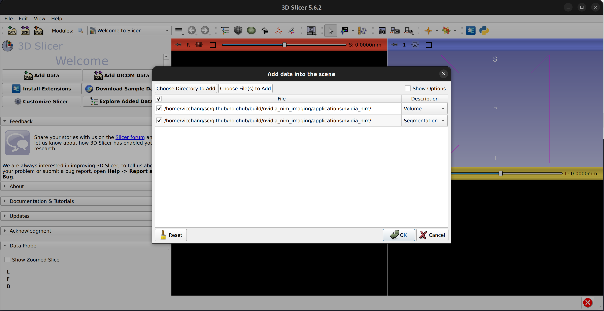
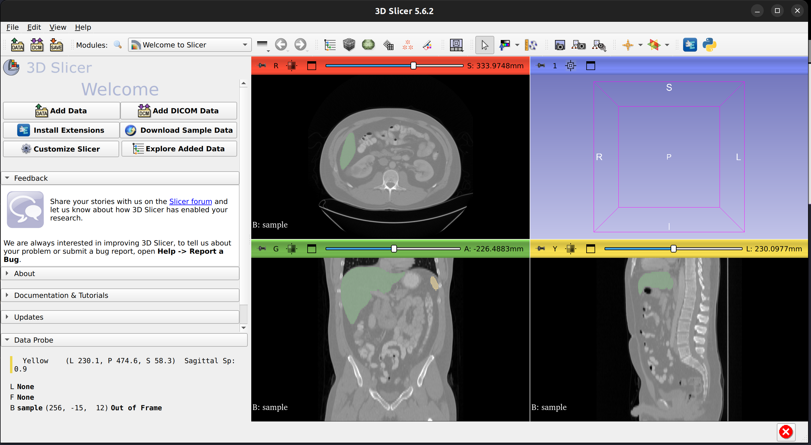

# Medical Imaging Segmentation with NVIDIA Vista-3D NIM

[Vista-3D](https://build.nvidia.com/nvidia/vista-3d) is a specialized interactive foundation model for segmenting and annotating human anatomies.
This sample application demonstrates using the Vista-3D NVIDIA Inference Microservice (NIM) in a Holoscan pipeline.

The application instructs the Vista-3D NIM API to process the given dataset and downloads and extracts the results of a segmentation NRRD file onto a local directory.

Visit [build.nvidia.com](https://build.nvidia.com) to learn more about Vista-3D and generate an API key to use with this application.

### Quick Start

1. Add API key in `nvidia_nim.yaml`
2. `./holohub run nvidia_nim_imaging`

## Configuring the sample application

Use the `nvidia_nim.yaml` configuration file to configure the sample application:

### Connection Information

```yaml
nim:
 base_url: https://integrate.api.nvidia.com/v1
 api_key:
```

- `base_url`: The URL of your NIM instance. Defaults to NVIDIA-hosted NIMs.
- `api_key`: Your API key to access NVIDIA-hosted NIMs.

## Build and Run the sample application

```bash
# This first builds and runs the Docker images, then builds and runs the application.
./holohub run nvidia_nim_imaging
```

## Display the Results

In this section, we will show how to view the sample data and segmentation results returned from Vista-3D.

1. Download 3D Slicer: https://download.slicer.org/
2. Decompress and launch 3D Slicer
   ```bash
   tar -xvzf Slicer-5.6.2-linux-amd64.tar.gz
   ```
3. Locate the sample data volume and the segmentation results in `build/nvidia_nim_imaging/applications/nvidia_nim/nvidia_nim_imaging`
   ```
   drwxr-xr-x 3 user domain-users     4096 Jul  3 11:41 ./
   drwxr-xr-x 4 user domain-users     4096 Jul  3 11:40 ../
   -rw-r--r-- 1 user user         27263336 Jul 23 14:22 example-1_seg.nrrd
   -rw-r--r-- 1 user user         33037057 Jul 23 14:21 sample.nii.gz
   ```
5. In 3D Slicer, click *File*, *Add Data* and click *Choose File(s) to Add*.
   From the *Add Data into the scene* dialog, find and add the `sample.nii.gz` file and the `example-1_seg.nrrd` file.
   For the `sample.nrrd` file, select *Segmentation* and click *Ok*.
   
6. 3D Slicer shall display the volume and the segmentation results as shown below:
   
