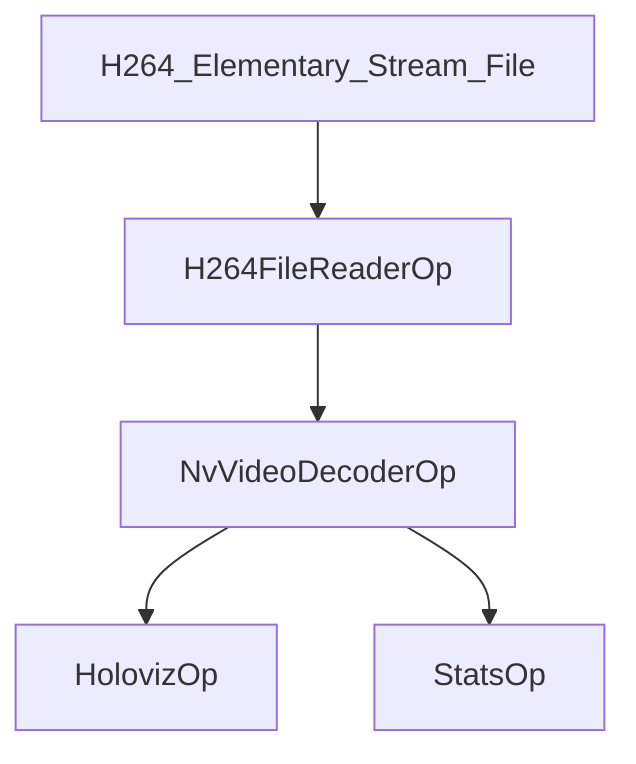

# NVIDIA Video Codec: H.264 File Decoder

This application demonstrates decoding H.264 elementary stream files using the NVIDIA Video Codec SDK. The application reads H.264 files directly, decodes them with the NVIDIA Video Decoder, and displays the results with Holoviz.

> [!IMPORTANT]  
> By using the NVIDIA Video Codec Demo application and its operators, you agree to the [NVIDIA Software Developer License Agreement](https://developer.nvidia.com/designworks/sdk-samples-tools-software-license-agreement). If you disagree with the EULA, please do not run this application.

## Key Features

- **Direct Elementary Stream Processing**: Reads H.264 elementary stream files without container conversion
- **GPU-Accelerated Decoding**: Uses NVIDIA Video Codec SDK for hardware-accelerated decoding
- **Real-time Visualization**: Displays decoded frames using Holoviz
- **Performance Monitoring**: Tracks decode latency, FPS, and jitter metrics

## Requirements

- [NVIDIA Video Codec SDK](https://developer.nvidia.com/video-codec-sdk)
- H.264 elementary stream file (`.h264`, `.264` extension)

> 💡 **Note:** NVIDIA IGX Orin with integrated GPU is not currently supported.

## Architecture



### Key Components

1. **H264FileReaderOp**: Reads H.264 elementary stream files and emits raw bitstream data as tensors
2. **NvVideoDecoderOp**: Hardware-accelerated decoder using NVIDIA Video Codec SDK
3. **HolovizOp**: Visualization of decoded video frames
4. **StatsOp**: Performance monitoring and metrics collection

## Preparing H.264 Elementary Stream Files

The application expects H.264 elementary stream files (pure H.264 bitstream without container). You can create these files using FFmpeg:

### From MP4/Container Format
```bash
ffmpeg -i input_video.mp4 -c:v copy -f h264 output.h264
```

### From Endoscopy Sample Data
```bash
ffmpeg -i surgical_video.mp4 -c:v copy -f h264 surgical_video.264
```

### Verification
Use the provided test script to verify your H.264 file:
```bash
python3 test_h264_reader.py
```

## Building and Running

### Python
```bash
./holohub run nvidia_video_codec --language python
```

### Manual Run
```bash
cd holohub/applications/nvidia_video_codec/nvc_decode/python
python3 nvidia_video_codec.py --data /path/to/data/directory
```

## Configuration

The application is configured via [nvc_decode.yaml](./nvc_decode.yaml):

```yaml
decoder:
  cuda_device_ordinal: 0

holoviz:
  window_title: "NVIDIA Video Codec - H.264 Decode"
  tensors:
    - name: ""
      type: color
      opacity: 1.0
      priority: 0
```

## Technical Details

### Elementary Stream vs Containerized Formats

- **Elementary Stream**: Raw H.264 encoded data containing NAL units with start codes (0x00000001 or 0x000001)
- **Containerized Stream**: Elementary stream wrapped in container format (MP4, AVI, MOV) with metadata and timing information

This application works directly with elementary streams, which is more efficient for scenarios where you have raw H.264 data.

### Integration with NvVideoDecoderOp

The `NvVideoDecoderOp` uses an internal `FFmpegDemuxer` with a `StreamDataProvider` interface that can handle elementary streams directly:

1. H264FileReaderOp reads the entire H.264 file into memory
2. Creates a tensor with the raw bitstream data
3. NvVideoDecoderOp receives the tensor and feeds it to StreamDataProvider
4. FFmpegDemuxer parses the elementary stream internally
5. NVIDIA decoder processes the parsed data

## Performance Metrics

The application tracks several performance metrics:

- **Decode Latency**: Time taken for hardware decoding
- **FPS**: Frames per second throughput
- **Jitter Time**: Frame timing variability

Example output:
```
Decode Latency (min, max, avg): 2.145, 5.234, 2.876
FPS (min, max, avg): 95.234, 120.456, 108.765
Jitter Time (min, max, avg): 0.123, 0.456, 0.234
```

## Troubleshooting

### Common Issues

1. **File Not Found**: Ensure your H.264 file exists and the path is correct
2. **Invalid Format**: Use `test_h264_reader.py` to verify your file contains valid H.264 elementary stream
3. **GPU Not Supported**: Ensure your GPU supports NVIDIA Video Codec SDK

### File Format Requirements

- File must be H.264 elementary stream (not containerized format)
- Should contain NAL units with proper start codes
- Supported extensions: `.h264`, `.264`

### Creating Test Files

If you don't have H.264 elementary stream files, create them from existing videos:

```bash
# From any video file
ffmpeg -i input.mp4 -c:v libx264 -preset fast -crf 23 -f h264 test.h264

# From webcam (for testing)
ffmpeg -f v4l2 -i /dev/video0 -t 10 -c:v libx264 -f h264 webcam_test.h264
```

## Licensing

Holohub applications and operators are licensed under Apache-2.0.

NVIDIA Video Codec is governed by the terms of the [NVIDIA Software Developer License Agreement](https://developer.nvidia.com/designworks/sdk-samples-tools-software-license-agreement), which you accept by cloning, running, or using the NVIDIA Video Codec sample applications and operators.