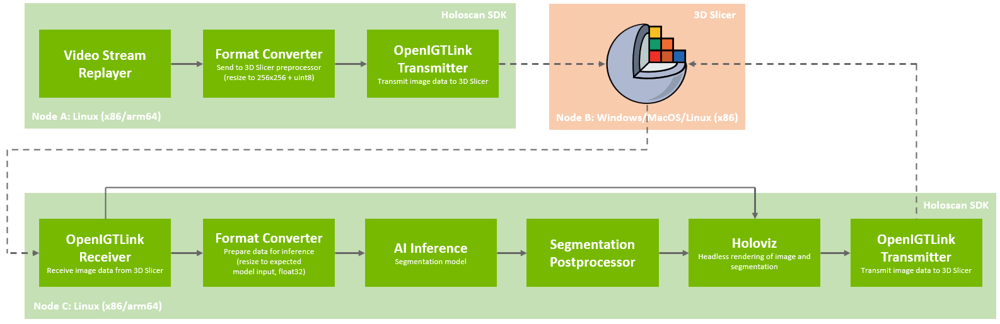
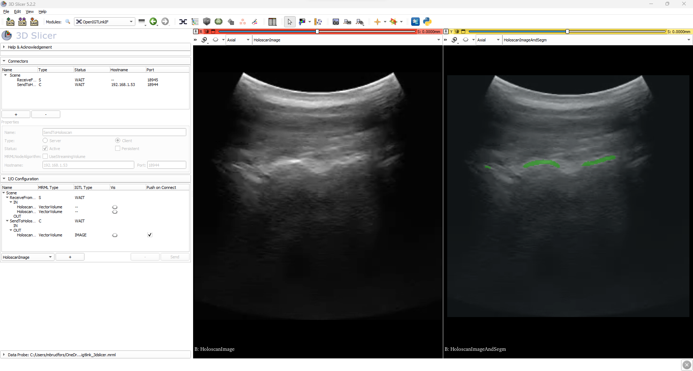
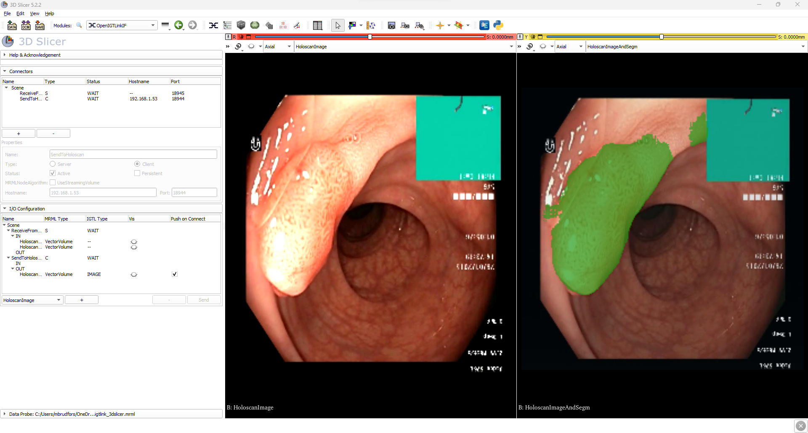

# Holoscan SDK as an Inference Backend for 3D Slicer

This application demonstrates how to interface Holoscan SDK with [3D Slicer](https://www.slicer.org/), using the [OpenIGTLink protocol](http://openigtlink.org/). The application is shown the in application graph below.



In summary, the `openigtlink` transmit and receive operators are used in conjunction with an AI segmentation pipeline to:

1. Send Holoscan sample video data from a node running Holoscan SDK, using `OpenIGTLinkTxOp`, to 3D Slicer running on a different node (simulating a video source connected to 3D Slicer):
    * For `cpp` application, the ultrasound sample data is sent.
    * For `python` application, the colonoscopy sample data is sent.
2. Transmit the video data back to Holoscan SDK using OpenIGTLinkIF Module, and receive the data with the `OpenIGTLinkRxOp` operator.
3. Perform an AI segmentation pipeline in Holoscan:
    * For `cpp` application, the ultrasound segmentation model is deployed.
    * For `python` application, the colonoscopy segmentation model is deployed.
4. Use Holoviz in `headless` mode to render image and segmentation and then send the data back to 3D Slicer using the `OpenIGTLinkTxOp` operator.

This workflow allows for sending image data from 3D Slicer over network to Holoscan SDK (running on either `x86` or `arm`), do some compute task (e.g., AI inference), and send the results back to 3D Slicer for visualization. Nodes can run distributed; for example, Holoscan SDK can run on an IGX Orin (Node A) sending the video data, 3D Slicer on a Windows laptop (Node B) and the AI inference pipeline on yet another machine (Node C). Also, note that the `openigtlink` operators can connect to any software/library that supports the OpenIGTLink protocol; here, 3D Slicer is used as it is a popular open source software package for image analysis and scientific visualization.

For the `cpp` application, which does ultrasound segmentations the results look like



and for the `python` application, which does colonoscopy segmentation, the results look like



where the image data before Holoscan processing is shown in the left slice view, and the image data with segmentation overlay (after Holoscan processing) is shown in the right slice view.

## Run Instructions

### Machine running 3D Slicer

On the machine running 3D Slicer do:
1. In 3D Slicer, open the Extensions Manager and install the `SlicerOpenIGTLink` extension.
2. Next, load the scene `openigtlink_3dslicer/scene/openigtlink_3dslicer.mrb` into 3D Slicer.
3. Go to the `OpenIGTLinkIF` module and make sure that the `SendToHoloscan` connector has the IP address of the machine running Holoscan SDK in the *Hostname* input box (under *Properties*).
4. Then activate the two connectors `ReceiveFromHoloscan` and `SendToHoloscan` (click *Active* check box under *Properties*).

### Machine running Holoscan SDK

On the machine running Holoscan SDK do the below steps.

First, ensure that the `host_name` parameters of the two `OpenIGTLinkRxOp` operators (`openigtlink_tx_slicer_img` and `openigtlink_tx_slicer_holoscan`) have the IP address of the machine running 3D Slicer.

Next, the application requires [OpenIGTLink](http://openigtlink.org/). For simplicity a DockerFile is available. To generate the container run:
```sh
./dev_container build --docker_file ./applications/openigtlink_3dslicer/Dockerfile --img holohub:openigtlink
```

The application can then be built by launching this container and using the provided `run` script:
```sh
./dev_container launch --img holohub:openigtlink
./run build openigtlink_3dslicer
```

Then, to run the `python` application do:
```sh
./run launch openigtlink_3dslicer python
```
and to run the `cpp` application do:
```sh
./run launch openigtlink_3dslicer cpp
```